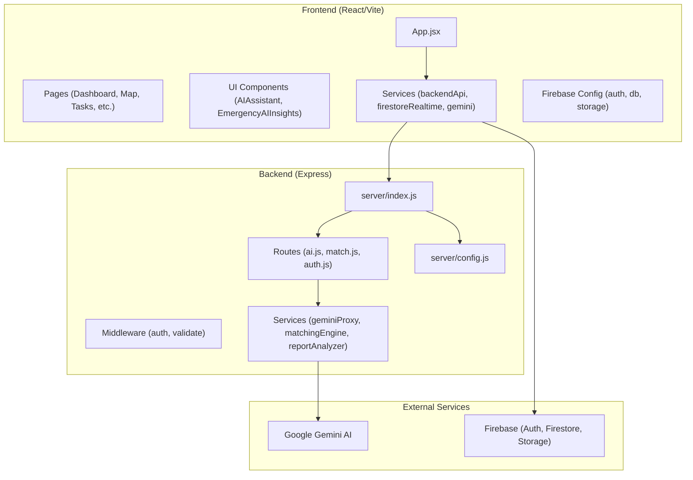
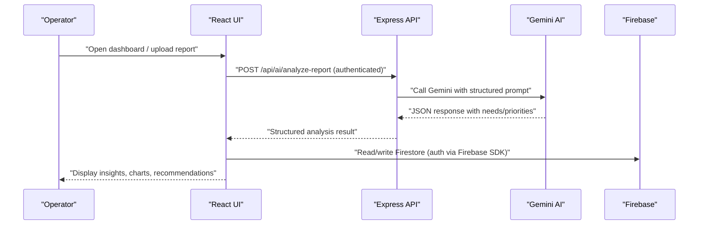
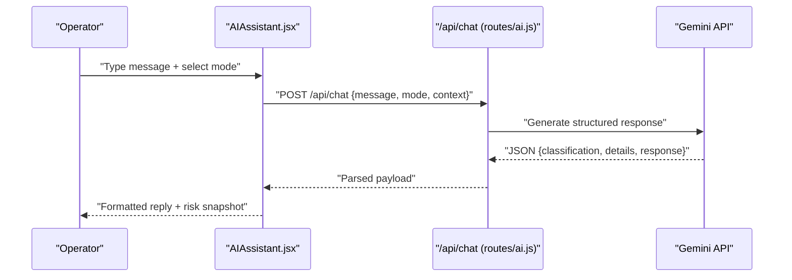
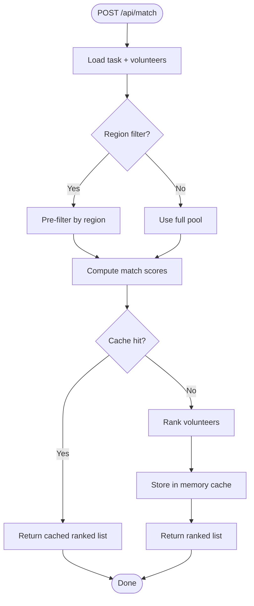
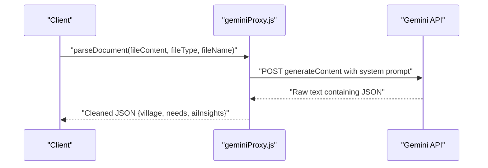
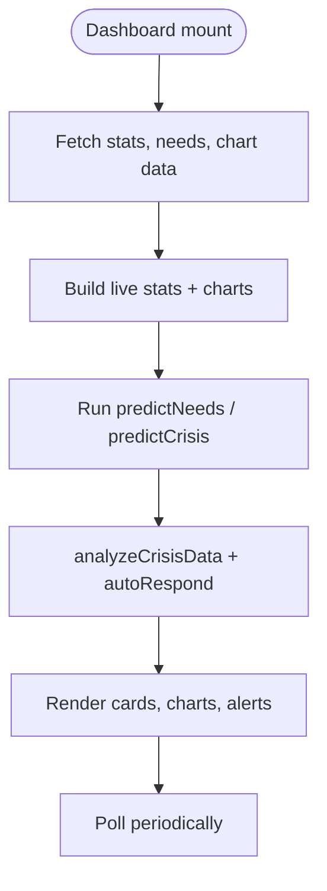
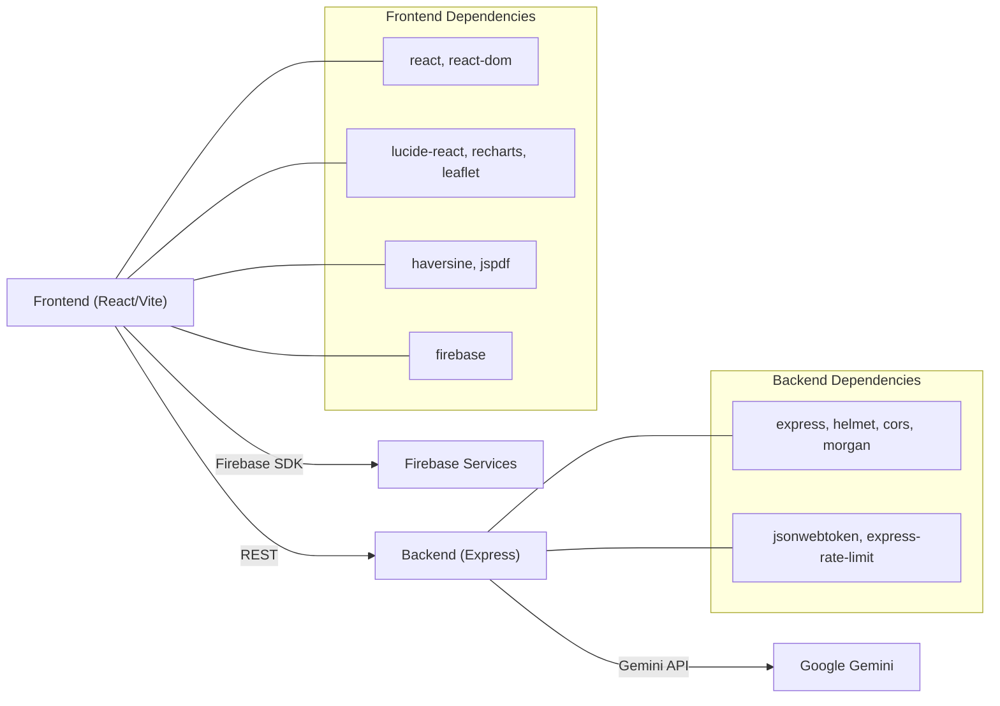

# Project Overview

<cite>
**Referenced Files in This Document**
- [README.md](file://README.md)
- [package.json](file://package.json)
- [server/package.json](file://server/package.json)
- [src/firebase.js](file://src/firebase.js)
- [server/index.js](file://server/index.js)
- [server/config.js](file://server/config.js)
- [server/routes/ai.js](file://server/routes/ai.js)
- [server/routes/match.js](file://server/routes/match.js)
- [server/services/geminiProxy.js](file://server/services/geminiProxy.js)
- [server/services/matchingEngine.js](file://server/services/matchingEngine.js)
- [src/App.jsx](file://src/App.jsx)
- [src/pages/Dashboard.jsx](file://src/pages/Dashboard.jsx)
- [src/components/EmergencyAIInsights.jsx](file://src/components/EmergencyAIInsights.jsx)
- [src/components/AIAssistant.jsx](file://src/components/AIAssistant.jsx)
- [src/services/gemini.js](file://src/services/gemini.js)
</cite>

## Table of Contents
1. [Introduction](#introduction)
2. [Project Structure](#project-structure)
3. [Core Components](#core-components)
4. [Architecture Overview](#architecture-overview)
5. [Detailed Component Analysis](#detailed-component-analysis)
6. [Dependency Analysis](#dependency-analysis)
7. [Performance Considerations](#performance-considerations)
8. [Troubleshooting Guide](#troubleshooting-guide)
9. [Conclusion](#conclusion)

## Introduction
Echo5 is an AI-powered humanitarian aid coordination platform designed to streamline emergency response operations for NGOs and emergency responders. Its mission is to deliver intelligent automation across real-time monitoring, intelligent volunteer matching, predictive analytics, and emergency response capabilities. The platform combines a modern React/Vite frontend with an Express backend, integrates Firebase for identity and data services, and leverages Google Gemini AI for document parsing, incident analysis, and conversational assistance.

Target audience:
- NGOs coordinating relief efforts
- Emergency responders managing field operations
- Command center operators requiring situational awareness and automated insights

Key features:
- Real-time monitoring dashboards and risk modeling
- Intelligent volunteer matching with geospatial scoring and availability
- Predictive analytics for incident clustering and response time forecasting
- Emergency mode activation with automatic task prioritization and volunteer notification
- AI-powered document parsing and report analysis via Gemini

## Project Structure
The repository follows a split architecture:
- Frontend (React/Vite): src/ contains UI components, pages, services, and utilities
- Backend (Express): server/ contains routes, middleware, services, and configuration
- Shared integrations: Firebase SDK initialization and environment-driven configuration

**Diagram sources**
- [src/App.jsx:29-285](file://src/App.jsx#L29-L285)
- [server/index.js:1-118](file://server/index.js#L1-L118)
- [server/routes/ai.js:1-348](file://server/routes/ai.js#L1-L348)
- [server/routes/match.js:1-120](file://server/routes/match.js#L1-L120)
- [server/services/geminiProxy.js:1-104](file://server/services/geminiProxy.js#L1-L104)
- [server/services/matchingEngine.js:1-212](file://server/services/matchingEngine.js#L1-L212)
- [src/firebase.js:1-35](file://src/firebase.js#L1-L35)
- [server/config.js:1-35](file://server/config.js#L1-L35)

**Section sources**
- [README.md:1-17](file://README.md#L1-L17)
- [package.json:1-43](file://package.json#L1-L43)
- [server/package.json:1-18](file://server/package.json#L1-L18)
- [src/firebase.js:1-35](file://src/firebase.js#L1-L35)
- [server/index.js:1-118](file://server/index.js#L1-L118)

## Core Components
- Frontend application shell and navigation: App.jsx orchestrates routing, authentication, offline sync, and real-time risk evaluation.
- Real-time dashboards: Dashboard.jsx aggregates live statistics, charts, and AI insights for situational awareness.
- Emergency mode: EmergencyAIInsights.jsx enables one-click emergency activation and displays AI-generated summaries.
- AI assistant: AIAssistant.jsx provides contextual chat with Gemini, supporting multiple operator modes (coordinator, responder, citizen).
- Backend API server: server/index.js exposes secure endpoints for authentication, AI analysis, and volunteer matching.
- AI services: server/routes/ai.js and server/services/geminiProxy.js integrate with Gemini for document parsing and conversational analysis.
- Matching engine: server/routes/match.js and server/services/matchingEngine.js compute volunteer-task matches using geospatial and skill-based scoring.
- Firebase integration: src/firebase.js initializes authentication, Firestore, and storage for client-side data operations.

Practical use cases:
- Upload and parse community survey data to extract structured needs and priorities
- Analyze incident reports to classify urgency and recommend actions
- Match volunteers to tasks considering skills, distance, availability, and performance
- Activate emergency mode to auto-prioritize tasks and notify nearby volunteers
- Monitor real-time risk trends and receive AI-driven operational insights

**Section sources**
- [src/App.jsx:29-285](file://src/App.jsx#L29-L285)
- [src/pages/Dashboard.jsx:58-530](file://src/pages/Dashboard.jsx#L58-L530)
- [src/components/EmergencyAIInsights.jsx:49-600](file://src/components/EmergencyAIInsights.jsx#L49-L600)
- [src/components/AIAssistant.jsx:7-311](file://src/components/AIAssistant.jsx#L7-L311)
- [server/index.js:1-118](file://server/index.js#L1-L118)
- [server/routes/ai.js:1-348](file://server/routes/ai.js#L1-L348)
- [server/routes/match.js:1-120](file://server/routes/match.js#L1-L120)
- [server/services/geminiProxy.js:1-104](file://server/services/geminiProxy.js#L1-L104)
- [server/services/matchingEngine.js:1-212](file://server/services/matchingEngine.js#L1-L212)
- [src/firebase.js:1-35](file://src/firebase.js#L1-L35)

## Architecture Overview
The system separates concerns across client and server:
- Client handles UI, offline caching, real-time subscriptions, and user interactions
- Server enforces security, rate limits, and performs expensive AI computations
- Both sides communicate via REST endpoints with JWT-based authentication
- AI workloads are proxied through the backend to keep API keys private

**Diagram sources**
- [server/routes/ai.js:262-290](file://server/routes/ai.js#L262-L290)
- [server/services/geminiProxy.js:53-103](file://server/services/geminiProxy.js#L53-L103)
- [src/firebase.js:1-35](file://src/firebase.js#L1-L35)

**Section sources**
- [server/index.js:16-118](file://server/index.js#L16-L118)
- [server/config.js:8-35](file://server/config.js#L8-L35)
- [src/services/gemini.js:11-13](file://src/services/gemini.js#L11-L13)

## Detailed Component Analysis

### AI Assistant and Emergency Insights
The AI Assistant provides contextual chat with Gemini, classifying messages and returning structured guidance. Emergency Insights offers a one-click emergency activation flow with AI-generated summaries and notifications.

**Diagram sources**
- [src/components/AIAssistant.jsx:30-79](file://src/components/AIAssistant.jsx#L30-L79)
- [server/routes/ai.js:78-178](file://server/routes/ai.js#L78-L178)

**Section sources**
- [src/components/AIAssistant.jsx:7-311](file://src/components/AIAssistant.jsx#L7-L311)
- [src/components/EmergencyAIInsights.jsx:67-87](file://src/components/EmergencyAIInsights.jsx#L67-L87)
- [server/routes/ai.js:11-178](file://server/routes/ai.js#L11-L178)

### Volunteer Matching Engine
The matching engine computes a composite score for each volunteer against a task, factoring skills, distance, availability, experience, and performance. Results are cached to improve responsiveness.

**Diagram sources**
- [server/routes/match.js:23-77](file://server/routes/match.js#L23-L77)
- [server/services/matchingEngine.js:166-182](file://server/services/matchingEngine.js#L166-L182)

**Section sources**
- [server/routes/match.js:1-120](file://server/routes/match.js#L1-L120)
- [server/services/matchingEngine.js:1-212](file://server/services/matchingEngine.js#L1-L212)

### Document Parsing via Gemini Proxy
The backend securely proxies document parsing to Gemini, extracting structured community needs from text or image-based inputs.

**Diagram sources**
- [src/services/gemini.js:11-13](file://src/services/gemini.js#L11-L13)
- [server/services/geminiProxy.js:53-103](file://server/services/geminiProxy.js#L53-L103)

**Section sources**
- [src/services/gemini.js:1-38](file://src/services/gemini.js#L1-L38)
- [server/services/geminiProxy.js:1-104](file://server/services/geminiProxy.js#L1-L104)

### Real-Time Dashboard and Risk Modeling
The dashboard aggregates live data, computes risk metrics, and surfaces AI insights for strategic decision-making.

**Diagram sources**
- [src/pages/Dashboard.jsx:64-83](file://src/pages/Dashboard.jsx#L64-L83)
- [src/pages/Dashboard.jsx:90-122](file://src/pages/Dashboard.jsx#L90-L122)

**Section sources**
- [src/pages/Dashboard.jsx:58-530](file://src/pages/Dashboard.jsx#L58-L530)

### Conceptual Overview
- Mission: Streamline emergency response through intelligent automation
- Target audience: NGOs and emergency responders
- Technology: React/Vite frontend, Express backend, Firebase, Gemini AI
- Capabilities: Real-time monitoring, intelligent matching, predictive analytics, emergency response

[No sources needed since this section doesn't analyze specific files]

## Dependency Analysis
Frontend dependencies include React, TailwindCSS, Framer Motion, Leaflet, and Firebase. Backend depends on Express, Helmet, CORS, Morgan, and rate-limiting middleware. Configuration is environment-driven to avoid leaking secrets.

**Diagram sources**
- [package.json:12-30](file://package.json#L12-L30)
- [server/package.json:9-16](file://server/package.json#L9-L16)
- [src/firebase.js:3-30](file://src/firebase.js#L3-L30)

**Section sources**
- [package.json:1-43](file://package.json#L1-L43)
- [server/package.json:1-18](file://server/package.json#L1-L18)
- [src/firebase.js:1-35](file://src/firebase.js#L1-L35)
- [server/config.js:8-35](file://server/config.js#L8-L35)

## Performance Considerations
- Rate limiting: Global and stricter limits for AI endpoints to protect resources
- Caching: Memory cache for matching results with TTL and size controls
- Body limits: Increased payload sizes for AI routes to support file uploads
- Client-server separation: AI inference runs on the backend to keep the frontend responsive

[No sources needed since this section provides general guidance]

## Troubleshooting Guide
Common issues and remedies:
- Missing Gemini API key: Ensure GEMINI_API_KEY is set in environment; otherwise AI endpoints will fail
- Authentication errors: Verify JWT secret and expiration; confirm login flow succeeds
- CORS failures: Confirm CORS origin matches the frontend URL
- Rate limit exceeded: Reduce request frequency or adjust rate limit configuration
- Cache misses: Monitor cache stats endpoint and tune TTL/max size

**Section sources**
- [server/config.js:11-24](file://server/config.js#L11-L24)
- [server/index.js:38-43](file://server/index.js#L38-L43)
- [server/routes/match.js:108-117](file://server/routes/match.js#L108-L117)

## Conclusion
Echo5 delivers a cohesive, production-ready platform for humanitarian coordination by combining a reactive frontend with a secure, rate-limited backend and powerful AI services. Its focus on intelligent automation—real-time monitoring, predictive analytics, and volunteer matching—enables NGOs and emergency responders to act quickly and effectively during crises.

[No sources needed since this section summarizes without analyzing specific files]