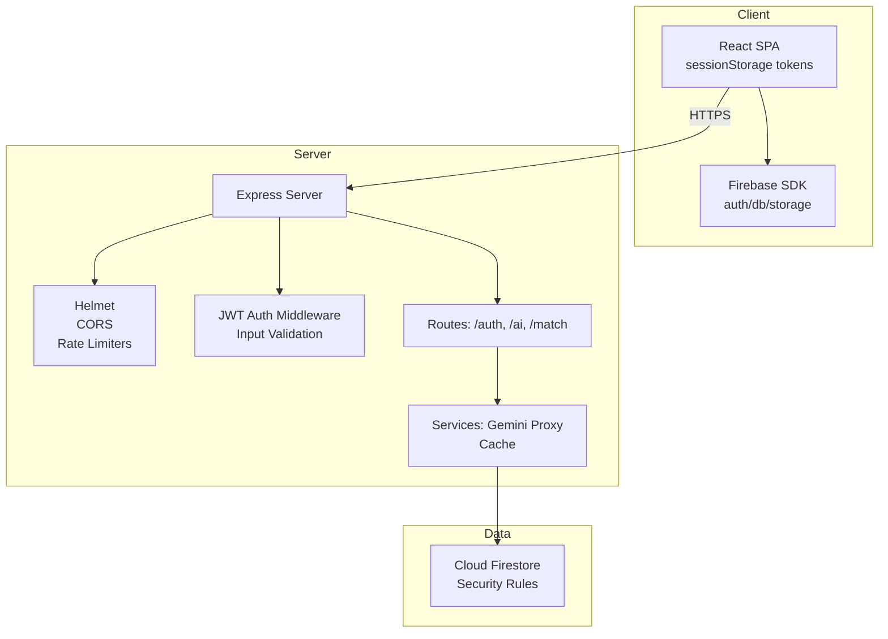
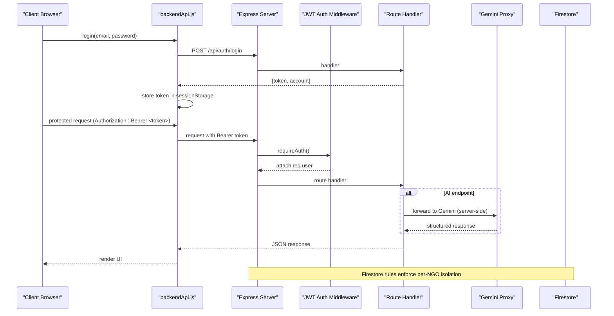
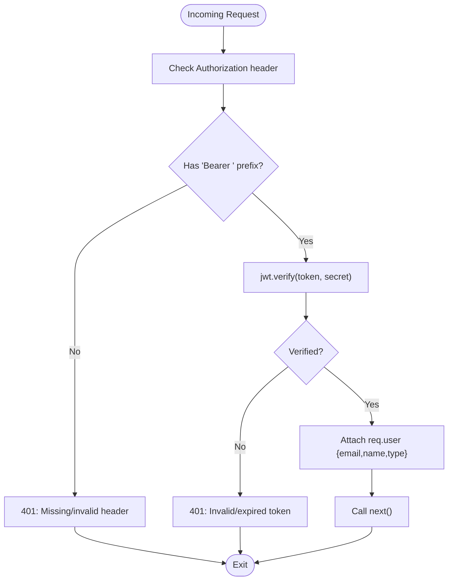
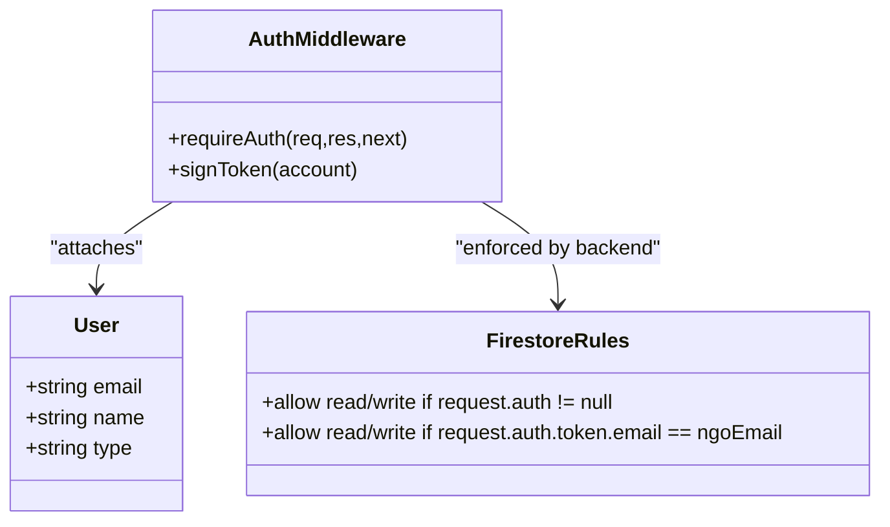
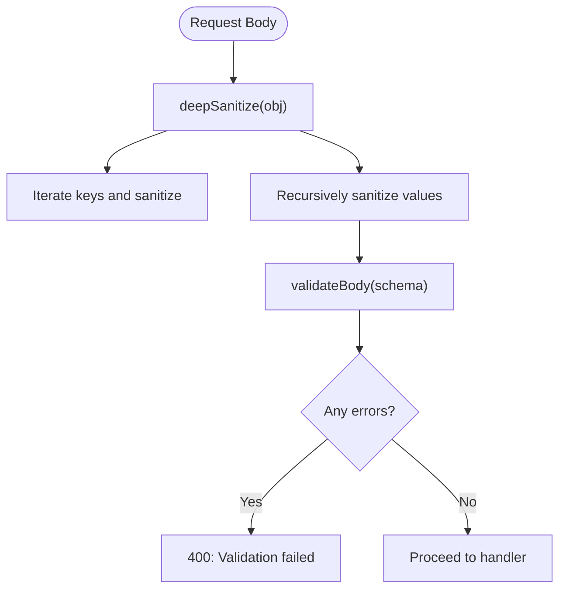
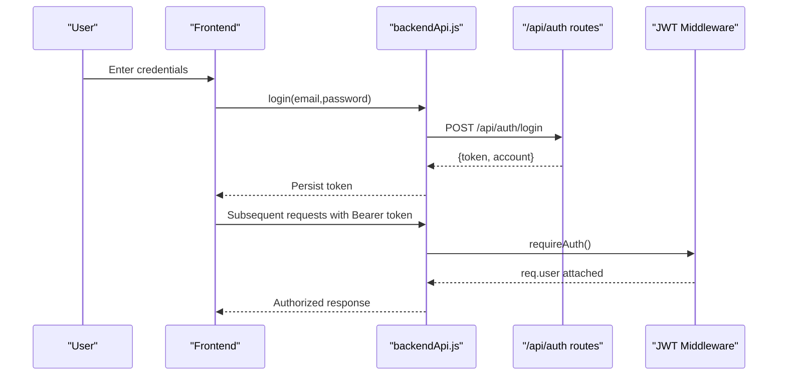
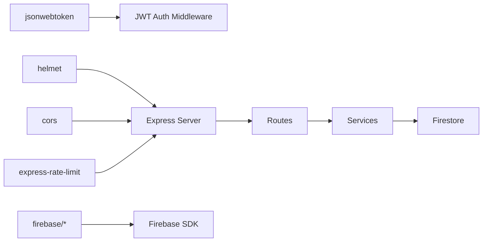

# Security Considerations

<cite>
**Referenced Files in This Document**
- [server/index.js](file://server/index.js)
- [server/config.js](file://server/config.js)
- [server/middleware/auth.js](file://server/middleware/auth.js)
- [server/middleware/validate.js](file://server/middleware/validate.js)
- [server/routes/auth.js](file://server/routes/auth.js)
- [server/routes/ai.js](file://server/routes/ai.js)
- [server/routes/match.js](file://server/routes/match.js)
- [server/services/geminiProxy.js](file://server/services/geminiProxy.js)
- [server/services/cache.js](file://server/services/cache.js)
- [src/services/backendApi.js](file://src/services/backendApi.js)
- [src/utils/validation.js](file://src/utils/validation.js)
- [src/services/firestoreRealtime.js](file://src/services/firestoreRealtime.js)
- [src/firebase.js](file://src/firebase.js)
- [firestore.rules](file://firestore.rules)
- [README.md](file://README.md)
</cite>

## Table of Contents
1. [Introduction](#introduction)
2. [Project Structure](#project-structure)
3. [Core Components](#core-components)
4. [Architecture Overview](#architecture-overview)
5. [Detailed Component Analysis](#detailed-component-analysis)
6. [Dependency Analysis](#dependency-analysis)
7. [Performance Considerations](#performance-considerations)
8. [Troubleshooting Guide](#troubleshooting-guide)
9. [Conclusion](#conclusion)
10. [Appendices](#appendices)

## Introduction
This document details the Echo5 platform’s security architecture and protective measures. It covers authentication and authorization, input validation and sanitization, session/token management, API protection, Firebase integration, encryption practices, security middleware, audit/logging, vulnerability assessment, incident response, compliance considerations, monitoring, and secure deployment practices. The goal is to provide a clear understanding of how the platform secures data, protects user identities, and maintains integrity across client-server interactions.

## Project Structure
The security posture spans both frontend and backend layers:
- Frontend: React SPA with local token persistence in sessionStorage and Firebase integration for auth and Firestore.
- Backend: Express server with Helmet, CORS, rate limiting, JWT middleware, input sanitization/validation, and route-level protections.
- Database: Firestore with strict security rules enforcing per-account isolation and authentication.

**Diagram sources**
- [server/index.js:1-118](file://server/index.js#L1-L118)
- [src/services/backendApi.js:1-164](file://src/services/backendApi.js#L1-L164)
- [src/firebase.js:1-35](file://src/firebase.js#L1-L35)
- [firestore.rules:1-19](file://firestore.rules#L1-L19)

**Section sources**
- [server/index.js:1-118](file://server/index.js#L1-L118)
- [src/services/backendApi.js:1-164](file://src/services/backendApi.js#L1-L164)
- [src/firebase.js:1-35](file://src/firebase.js#L1-L35)
- [firestore.rules:1-19](file://firestore.rules#L1-L19)

## Core Components
- JWT-based authentication middleware validates bearer tokens and attaches user identity to requests.
- Input sanitization and schema-based validation protect against injection and malformed payloads.
- Rate limiting and secure headers mitigate abuse and common web attacks.
- Firebase Authentication and Firestore rules enforce per-user data isolation.
- Gemini proxy ensures API keys remain server-side and never reach the client.

**Section sources**
- [server/middleware/auth.js:1-49](file://server/middleware/auth.js#L1-L49)
- [server/middleware/validate.js:1-80](file://server/middleware/validate.js#L1-L80)
- [server/index.js:28-71](file://server/index.js#L28-L71)
- [src/services/backendApi.js:19-54](file://src/services/backendApi.js#L19-L54)
- [src/firebase.js:1-35](file://src/firebase.js#L1-L35)
- [firestore.rules:1-19](file://firestore.rules#L1-L19)
- [server/services/geminiProxy.js:1-104](file://server/services/geminiProxy.js#L1-L104)

## Architecture Overview
The platform enforces layered security:
- Transport security via HTTPS and secure headers.
- Identity and access control via JWT middleware and Firebase rules.
- Data protection via input sanitization, schema validation, and server-side API key management.
- Operational resilience via rate limiting and cache monitoring.

**Diagram sources**
- [src/services/backendApi.js:63-71](file://src/services/backendApi.js#L63-L71)
- [server/routes/auth.js:34-52](file://server/routes/auth.js#L34-L52)
- [server/middleware/auth.js:14-37](file://server/middleware/auth.js#L14-L37)
- [server/routes/ai.js:30-50](file://server/routes/ai.js#L30-L50)
- [server/services/geminiProxy.js:53-103](file://server/services/geminiProxy.js#L53-L103)
- [firestore.rules:9-16](file://firestore.rules#L9-L16)

## Detailed Component Analysis

### JWT Token Implementation
- Token signing and verification use a shared secret from environment configuration.
- The middleware extracts the Authorization header, verifies the token, and attaches user identity to the request.
- Tokens carry minimal claims: email, name, and type. Expiration is configurable.

**Diagram sources**
- [server/middleware/auth.js:14-37](file://server/middleware/auth.js#L14-L37)
- [server/config.js:18-19](file://server/config.js#L18-L19)

**Section sources**
- [server/middleware/auth.js:14-48](file://server/middleware/auth.js#L14-L48)
- [server/config.js:18-19](file://server/config.js#L18-L19)

### Role-Based Access Control
- The platform defines roles via the account type field (e.g., Relief NGO, Health NGO, Disaster Relief, Super Admin).
- Authentication middleware attaches the user type to the request; route handlers can enforce role-specific logic as needed.
- Firestore rules enforce per-NGO isolation by binding writes/read to the authenticated user’s email claim.

**Diagram sources**
- [server/middleware/auth.js:14-48](file://server/middleware/auth.js#L14-L48)
- [firestore.rules:9-16](file://firestore.rules#L9-L16)

**Section sources**
- [server/routes/auth.js:11-16](file://server/routes/auth.js#L11-L16)
- [firestore.rules:9-16](file://firestore.rules#L9-L16)

### Session Management Strategies
- The client persists the JWT in sessionStorage to maintain login state across page reloads within a tab session.
- Tokens are included on every protected request via the Authorization header.
- No server-side session stores are used; stateless JWTs are preferred.

**Section sources**
- [src/services/backendApi.js:19-31](file://src/services/backendApi.js#L19-L31)
- [src/services/backendApi.js:33-54](file://src/services/backendApi.js#L33-L54)

### Input Validation Systems
- Server-side sanitization strips control characters and common XSS vectors from all request bodies.
- Schema-based validators enforce presence, types, lengths, and formats for request payloads.
- Client-side validation complements server-side checks to prevent malformed data from reaching the backend.

**Diagram sources**
- [server/middleware/validate.js:11-62](file://server/middleware/validate.js#L11-L62)
- [src/utils/validation.js:30-80](file://src/utils/validation.js#L30-L80)

**Section sources**
- [server/middleware/validate.js:11-80](file://server/middleware/validate.js#L11-L80)
- [src/utils/validation.js:8-123](file://src/utils/validation.js#L8-L123)

### XSS Protection Mechanisms
- Server-side sanitization removes control characters and common HTML/script delimiters from all string inputs.
- Client-side sanitization in forms and data utilities further reduces stored XSS risks.
- Content-Type headers and secure headers minimize vector exposure.

**Section sources**
- [server/middleware/validate.js:11-17](file://server/middleware/validate.js#L11-L17)
- [src/utils/validation.js:8-16](file://src/utils/validation.js#L8-L16)
- [server/index.js:29-31](file://server/index.js#L29-L31)

### Data Encryption Practices
- Transport encryption: HTTPS enforced by Helmet and CORS configuration.
- At-rest encryption: Managed by Firebase services (Firestore, Authentication, Storage).
- Secrets management: All secrets and configuration are loaded from environment variables.

**Section sources**
- [server/index.js:29-43](file://server/index.js#L29-L43)
- [server/config.js:6-32](file://server/config.js#L6-L32)
- [src/firebase.js:10-19](file://src/firebase.js#L10-L19)

### Authentication Flow
- Login: Client submits credentials; server validates and returns a signed JWT.
- Registration: Client posts registration data; server validates uniqueness and returns a JWT.
- Protected requests: Client includes Authorization: Bearer <token>.

**Diagram sources**
- [server/routes/auth.js:34-52](file://server/routes/auth.js#L34-L52)
- [src/services/backendApi.js:63-71](file://src/services/backendApi.js#L63-L71)
- [server/middleware/auth.js:14-37](file://server/middleware/auth.js#L14-L37)

**Section sources**
- [server/routes/auth.js:34-80](file://server/routes/auth.js#L34-L80)
- [src/services/backendApi.js:63-82](file://src/services/backendApi.js#L63-L82)

### Authorization Patterns
- Route-level enforcement: requireAuth is applied to all protected endpoints (/api/ai, /api/match).
- Per-resource isolation: Firestore rules bind reads/writes to the authenticated user’s email.
- Principle of least privilege: Only authenticated users can access protected routes; data access is scoped to their NGO.

**Section sources**
- [server/routes/ai.js:30-36](file://server/routes/ai.js#L30-L36)
- [server/routes/match.js:33-38](file://server/routes/match.js#L33-L38)
- [firestore.rules:9-16](file://firestore.rules#L9-L16)

### Security Middleware Implementation
- Helmet: Sets 15+ security headers to mitigate XSS, clickjacking, MIME sniffing, and other attacks.
- CORS: Whitelists origins and credentials; restricts allowed headers/methods.
- Rate Limiting: Global and stricter limits for AI endpoints; keyed by IP.
- Logging: Morgan logs requests with timing and remote address for auditability.

**Section sources**
- [server/index.js:29-101](file://server/index.js#L29-L101)
- [server/config.js:22-27](file://server/config.js#L22-L27)

### Firebase Integration Security Configuration
- Environment variables store Firebase configuration and keys; client code loads from Vite env.
- Firestore rules deny all by default and explicitly allow access only for authenticated users bound to their NGO email.
- Realtime listeners and CRUD operations are scoped to the authenticated user’s NGO namespace.

**Section sources**
- [src/firebase.js:10-33](file://src/firebase.js#L10-L33)
- [firestore.rules:4-16](file://firestore.rules#L4-L16)
- [src/services/firestoreRealtime.js:19-188](file://src/services/firestoreRealtime.js#L19-L188)

### API Protection Measures
- All AI endpoints require authentication and apply body size limits appropriate for document uploads.
- Gemini proxy runs server-side; API keys are never exposed to clients.
- Input sanitization and schema validation precede all route handlers.

**Section sources**
- [server/routes/ai.js:30-50](file://server/routes/ai.js#L30-L50)
- [server/services/geminiProxy.js:53-103](file://server/services/geminiProxy.js#L53-L103)
- [server/middleware/validate.js:48-62](file://server/middleware/validate.js#L48-L62)

### Sensitive Data Handling
- JWT tokens are stored in sessionStorage on the client; cleared on logout.
- Server logs include request metadata but exclude sensitive payloads.
- Firestore writes are validated and sanitized before persistence.

**Section sources**
- [src/services/backendApi.js:23-29](file://src/services/backendApi.js#L23-L29)
- [src/services/firestoreRealtime.js:132-156](file://src/services/firestoreRealtime.js#L132-L156)

### Security Audit Procedures
- Request logging: Morgan captures method, path, status, response time, and client IP.
- Endpoint health: Public /api/health endpoint exposes server status and configuration indicators.
- Cache monitoring: Match engine exposes cache statistics for performance and correctness auditing.

**Section sources**
- [server/index.js:35-87](file://server/index.js#L35-L87)
- [server/routes/match.js:111-117](file://server/routes/match.js#L111-L117)

### Vulnerability Assessment Strategies
- Static analysis: ESLint configuration included in the project.
- Runtime protections: Helmet headers, CORS restrictions, rate limiting.
- Input hygiene: Deep sanitization and strict schema validation.
- Dependency hygiene: Keep dependencies updated; monitor for known vulnerabilities.

**Section sources**
- [eslint.config.js](file://eslint.config.js)
- [server/index.js:29-71](file://server/index.js#L29-L71)
- [server/middleware/validate.js:11-62](file://server/middleware/validate.js#L11-L62)

### Incident Response Protocols
- Centralized error handling logs fatal errors and returns generic messages to clients.
- Rate limiting acts as a first line of defense against abuse.
- Health endpoint and cache stats enable rapid diagnostics during incidents.

**Section sources**
- [server/index.js:95-101](file://server/index.js#L95-L101)
- [server/index.js:50-68](file://server/index.js#L50-L68)
- [server/routes/match.js:111-117](file://server/routes/match.js#L111-L117)

### Compliance Requirements
- Data isolation: Firestore rules enforce per-user/per-NGO data boundaries.
- Minimal data retention: Tokens are short-lived; cache TTLs are bounded.
- Secure defaults: CORS origin whitelisting, strict headers, and environment-driven secrets.

**Section sources**
- [firestore.rules:4-16](file://firestore.rules#L4-L16)
- [server/config.js:18-19](file://server/config.js#L18-L19)
- [server/services/cache.js:10-18](file://server/services/cache.js#L10-L18)

### Security Monitoring
- Request logs: Morgan combined format includes IP, method, path, status, and response time.
- Health and cache metrics: Exposed via public and authenticated endpoints respectively.
- Observability: Consider integrating structured logging and metrics for production deployments.

**Section sources**
- [server/index.js:35-35](file://server/index.js#L35-L35)
- [server/index.js:79-87](file://server/index.js#L79-L87)
- [server/routes/match.js:111-117](file://server/routes/match.js#L111-L117)

### Secure Deployment Practices
- Secrets management: Load all secrets from environment variables; avoid embedding in client bundles.
- Origin control: Configure CORS origin to match the production frontend domain.
- Rate limits: Tune window and max values according to expected load.
- Transport security: Ensure HTTPS termination at the edge and consistent header policies.

**Section sources**
- [server/config.js:6-32](file://server/config.js#L6-L32)
- [server/index.js:38-43](file://server/index.js#L38-L43)
- [server/index.js:50-68](file://server/index.js#L50-L68)

## Dependency Analysis
The security-critical dependencies and their roles:
- jsonwebtoken: JWT signing/verification for stateless authentication.
- helmet: Security headers to mitigate common web vulnerabilities.
- cors: Controlled cross-origin access with credential support.
- express-rate-limit: Request throttling to prevent abuse.
- firebase/*: Authentication, Firestore, and Storage SDKs with environment-driven configuration.

**Diagram sources**
- [server/middleware/auth.js:1-2](file://server/middleware/auth.js#L1-L2)
- [server/index.js:17-21](file://server/index.js#L17-L21)
- [src/firebase.js:3-6](file://src/firebase.js#L3-L6)

**Section sources**
- [server/middleware/auth.js:1-2](file://server/middleware/auth.js#L1-L2)
- [server/index.js:17-21](file://server/index.js#L17-L21)
- [src/firebase.js:3-6](file://src/firebase.js#L3-L6)

## Performance Considerations
- Cache: MemoryCache with TTL and LRU eviction improves matching performance; monitor hit rates.
- Rate limits: Separate limits for AI endpoints reduce cost and latency spikes.
- Body size limits: Increased limits for AI routes accommodate larger payloads.

**Section sources**
- [server/services/cache.js:10-66](file://server/services/cache.js#L10-L66)
- [server/index.js:60-71](file://server/index.js#L60-L71)
- [server/routes/ai.js:70-71](file://server/routes/ai.js#L70-L71)

## Troubleshooting Guide
- Authentication failures: Verify Authorization header format and token validity; check expiration.
- Validation errors: Review 400 responses with details for missing or invalid fields.
- Rate limiting: Confirm IP-based key and adjust window/max values if needed.
- Gemini errors: Ensure GEMINI_API_KEY is configured; check endpoint responses for upstream errors.
- Firestore access denied: Confirm user is authenticated and that the NGO email matches the document path.

**Section sources**
- [server/middleware/auth.js:17-36](file://server/middleware/auth.js#L17-L36)
- [server/middleware/validate.js:57-61](file://server/middleware/validate.js#L57-L61)
- [server/index.js:50-68](file://server/index.js#L50-L68)
- [server/routes/ai.js:92-94](file://server/routes/ai.js#L92-L94)
- [firestore.rules:9-16](file://firestore.rules#L9-L16)

## Conclusion
Echo5 employs a layered security model combining JWT-based authentication, strict input sanitization, robust CORS and rate limiting, Firebase-backed per-user data isolation, and server-side API key management. Together, these controls provide strong protection for user identities, sensitive data, and operational integrity. For production hardening, consider integrating centralized logging, metrics, secrets rotation, and periodic penetration testing aligned with organizational compliance requirements.

## Appendices
- Environment variables: PORT, JWT_SECRET, JWT_EXPIRES_IN, GEMINI_API_KEY, OPENAI_API_KEY, CORS_ORIGIN, RATE LIMIT tunables, and Firebase config.
- Health endpoint: GET /api/health for liveness and configuration checks.
- Cache stats: GET /api/match/cache-stats for monitoring.

**Section sources**
- [server/config.js:6-32](file://server/config.js#L6-L32)
- [server/index.js:79-87](file://server/index.js#L79-L87)
- [server/routes/match.js:111-117](file://server/routes/match.js#L111-L117)