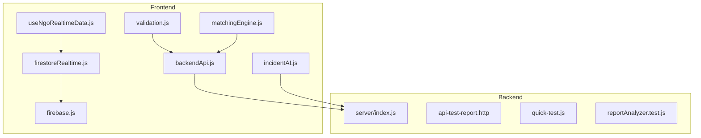
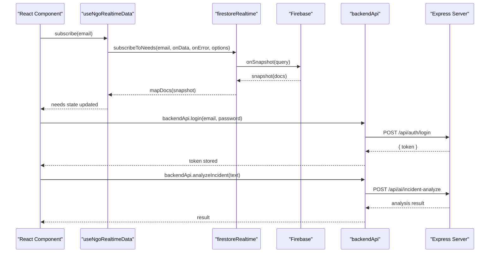
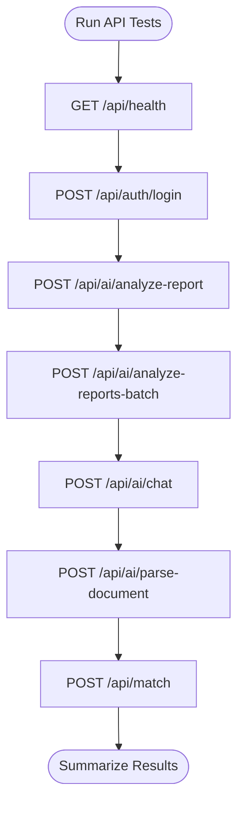
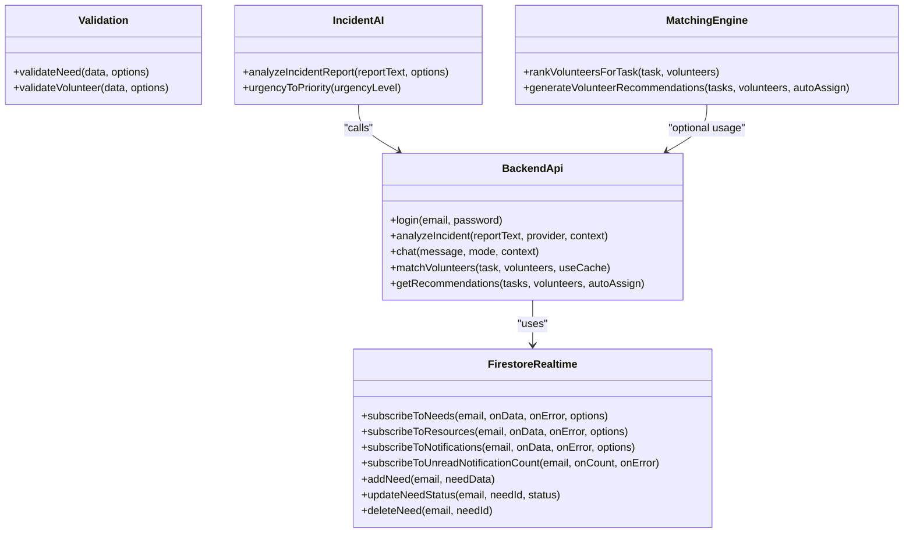
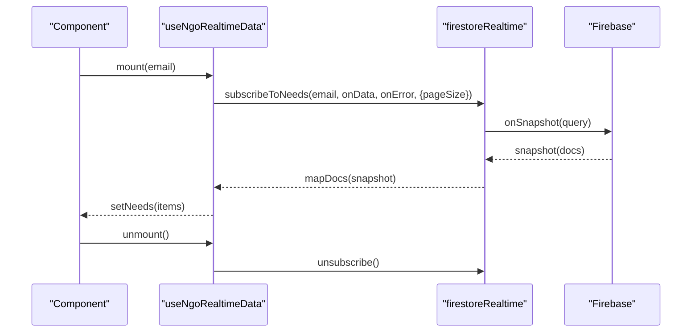
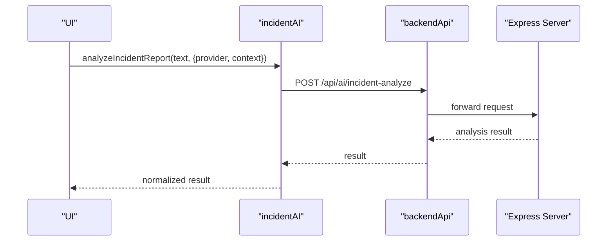
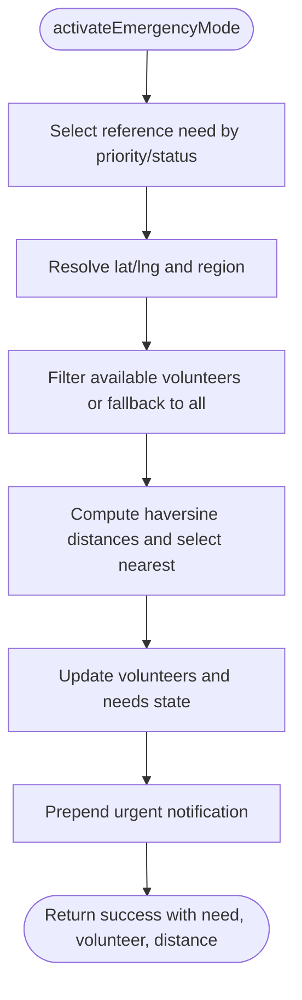
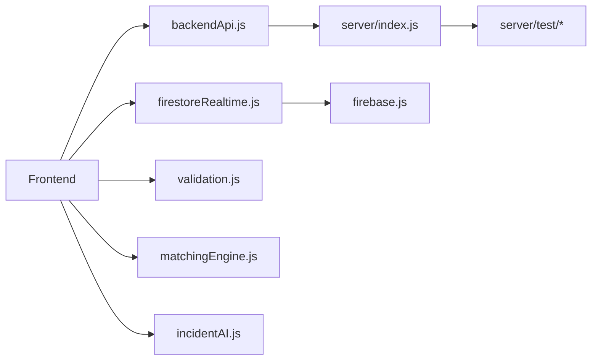

# Testing Strategy

<cite>
**Referenced Files in This Document**
- [package.json](file://package.json)
- [vite.config.js](file://vite.config.js)
- [README.md](file://README.md)
- [server/index.js](file://server/index.js)
- [server/package.json](file://server/package.json)
- [server/test/api-test-report.http](file://server/test/api-test-report.http)
- [server/test/quick-test.js](file://server/test/quick-test.js)
- [server/test/reportAnalyzer.test.js](file://server/test/reportAnalyzer.test.js)
- [src/services/backendApi.js](file://src/services/backendApi.js)
- [src/services/api.js](file://src/services/api.js)
- [src/services/firestoreRealtime.js](file://src/services/firestoreRealtime.js)
- [src/hooks/useNgoRealtimeData.js](file://src/hooks/useNgoRealtimeData.js)
- [src/utils/validation.js](file://src/utils/validation.js)
- [src/engine/matchingEngine.js](file://src/engine/matchingEngine.js)
- [src/services/incidentAI.js](file://src/services/incidentAI.js)
- [src/firebase.js](file://src/firebase.js)
</cite>

## Table of Contents
1. [Introduction](#introduction)
2. [Project Structure](#project-structure)
3. [Core Components](#core-components)
4. [Architecture Overview](#architecture-overview)
5. [Detailed Component Analysis](#detailed-component-analysis)
6. [Dependency Analysis](#dependency-analysis)
7. [Performance Considerations](#performance-considerations)
8. [Troubleshooting Guide](#troubleshooting-guide)
9. [Conclusion](#conclusion)
10. [Appendices](#appendices)

## Introduction
This document defines the comprehensive testing strategy for the Echo5 platform. It covers unit testing for React components and utility functions, API testing procedures, integration testing methodologies, test coverage expectations, mock data management, automated testing pipelines, and quality gates. It also details testing patterns for real-time data synchronization, Firebase integration, and AI service interactions, along with guidelines for emergency response scenarios, performance and load testing, CI setup, debugging techniques, and test maintenance.

## Project Structure
The project is split into:
- Frontend (React + Vite): UI components, services, hooks, utilities, and Firebase integration.
- Backend (Node.js + Express): API server, routes, middleware, and AI/report analysis services.

Key testing-related artifacts:
- Backend test scripts and HTTP collections for manual API verification.
- Frontend services and hooks that encapsulate network and persistence logic suitable for unit testing.
- Utility modules for validation and matching engines suitable for focused unit tests.

**Diagram sources**
- [src/services/backendApi.js](file://src/services/backendApi.js)
- [src/services/firestoreRealtime.js](file://src/services/firestoreRealtime.js)
- [src/hooks/useNgoRealtimeData.js](file://src/hooks/useNgoRealtimeData.js)
- [src/utils/validation.js](file://src/utils/validation.js)
- [src/engine/matchingEngine.js](file://src/engine/matchingEngine.js)
- [src/services/incidentAI.js](file://src/services/incidentAI.js)
- [src/firebase.js](file://src/firebase.js)
- [server/index.js](file://server/index.js)
- [server/test/api-test-report.http](file://server/test/api-test-report.http)
- [server/test/quick-test.js](file://server/test/quick-test.js)
- [server/test/reportAnalyzer.test.js](file://server/test/reportAnalyzer.test.js)

**Section sources**
- [package.json](file://package.json)
- [vite.config.js](file://vite.config.js)
- [README.md](file://README.md)

## Core Components
- Backend API server with security middleware, CORS, rate limiting, and health endpoint.
- Authentication and AI/report analysis endpoints.
- Frontend HTTP client wrapper for backend APIs with token management.
- Real-time Firestore subscriptions and offline fallback logic.
- Validation utilities for sanitization and input constraints.
- Matching engine scoring and recommendation generation.
- Incident AI analysis service for report parsing and urgency mapping.
- Firebase initialization and environment-driven configuration.

**Section sources**
- [server/index.js](file://server/index.js)
- [src/services/backendApi.js](file://src/services/backendApi.js)
- [src/services/firestoreRealtime.js](file://src/services/firestoreRealtime.js)
- [src/hooks/useNgoRealtimeData.js](file://src/hooks/useNgoRealtimeData.js)
- [src/utils/validation.js](file://src/utils/validation.js)
- [src/engine/matchingEngine.js](file://src/engine/matchingEngine.js)
- [src/services/incidentAI.js](file://src/services/incidentAI.js)
- [src/firebase.js](file://src/firebase.js)

## Architecture Overview
The testing strategy spans three layers:
- Unit tests for pure functions and small modules (validation, matching engine, utilities).
- API tests for backend endpoints using HTTP collections and programmatic clients.
- Integration tests covering frontend-to-backend flows and Firebase real-time synchronization.

**Diagram sources**
- [src/hooks/useNgoRealtimeData.js](file://src/hooks/useNgoRealtimeData.js)
- [src/services/firestoreRealtime.js](file://src/services/firestoreRealtime.js)
- [src/firebase.js](file://src/firebase.js)
- [src/services/backendApi.js](file://src/services/backendApi.js)
- [server/index.js](file://server/index.js)

## Detailed Component Analysis

### Backend API Testing
- Manual verification via HTTP collection for health, login, and AI/report analysis endpoints.
- Programmatic smoke tests for authentication and batch analysis flows.
- Unit-style tests for report analyzer logic validating structure, urgency, and error handling.

Recommended test coverage:
- Endpoint coverage: health, auth login, AI analyze single/batch, AI explain match, AI chat, AI parse document, matching engine endpoints.
- Error scenarios: empty input, invalid payload, rate limit exceeded, unauthorized access.
- Security checks: CORS, rate limits, header validation.

**Diagram sources**
- [server/test/api-test-report.http](file://server/test/api-test-report.http)
- [server/test/quick-test.js](file://server/test/quick-test.js)
- [server/index.js](file://server/index.js)

**Section sources**
- [server/test/api-test-report.http](file://server/test/api-test-report.http)
- [server/test/quick-test.js](file://server/test/quick-test.js)
- [server/test/reportAnalyzer.test.js](file://server/test/reportAnalyzer.test.js)
- [server/index.js](file://server/index.js)

### Frontend Unit Testing Patterns
- Pure functions: validation utilities, matching engine scoring, and urgency mapping.
- Encapsulated services: backend API client, Firestore real-time subscriptions, and AI analysis wrappers.
- Hooks: real-time data hook with memoization and snapshot fingerprinting.

Recommended test coverage:
- Validation: positive/negative cases for need/volunteer schemas, XSS sanitization, numeric bounds.
- Matching engine: skill overlap, distance thresholds, availability, experience, performance weights.
- Hooks: subscription lifecycle, unsubscribe behavior, state updates, and deduplication logic.
- Services: token handling, error propagation, request shaping, and fallbacks.

**Diagram sources**
- [src/utils/validation.js](file://src/utils/validation.js)
- [src/engine/matchingEngine.js](file://src/engine/matchingEngine.js)
- [src/services/backendApi.js](file://src/services/backendApi.js)
- [src/services/firestoreRealtime.js](file://src/services/firestoreRealtime.js)
- [src/services/incidentAI.js](file://src/services/incidentAI.js)

**Section sources**
- [src/utils/validation.js](file://src/utils/validation.js)
- [src/engine/matchingEngine.js](file://src/engine/matchingEngine.js)
- [src/services/backendApi.js](file://src/services/backendApi.js)
- [src/services/firestoreRealtime.js](file://src/services/firestoreRealtime.js)
- [src/services/incidentAI.js](file://src/services/incidentAI.js)

### Real-Time Data Synchronization Testing
Focus areas:
- Subscription lifecycle: creation, updates, and cleanup.
- Deduplication: fingerprint comparison to avoid redundant renders.
- Offline fallback: graceful degradation when Firestore is unavailable.
- Cursor pagination: unread counts and paginated notification retrieval.

**Diagram sources**
- [src/hooks/useNgoRealtimeData.js](file://src/hooks/useNgoRealtimeData.js)
- [src/services/firestoreRealtime.js](file://src/services/firestoreRealtime.js)
- [src/firebase.js](file://src/firebase.js)

**Section sources**
- [src/hooks/useNgoRealtimeData.js](file://src/hooks/useNgoRealtimeData.js)
- [src/services/firestoreRealtime.js](file://src/services/firestoreRealtime.js)
- [src/firebase.js](file://src/firebase.js)

### Firebase Integration Testing
Guidelines:
- Environment separation: use Vite environment variables for Firebase config in tests.
- Emulator/local mode: configure Firebase to point to local emulators for deterministic testing.
- Token/session isolation: clear session storage between tests to avoid cross-test contamination.
- Real-time listeners: stub or wrap onSnapshot to control event emissions and verify handlers.

**Section sources**
- [src/firebase.js](file://src/firebase.js)
- [src/services/firestoreRealtime.js](file://src/services/firestoreRealtime.js)
- [src/services/backendApi.js](file://src/services/backendApi.js)

### AI Service Interactions Testing
Coverage:
- Endpoint contract: request shape, response structure, and error handling.
- Provider selection and context injection.
- Urgency-to-priority mapping for downstream processing.

**Diagram sources**
- [src/services/incidentAI.js](file://src/services/incidentAI.js)
- [src/services/backendApi.js](file://src/services/backendApi.js)
- [server/index.js](file://server/index.js)

**Section sources**
- [src/services/incidentAI.js](file://src/services/incidentAI.js)
- [src/services/backendApi.js](file://src/services/backendApi.js)
- [server/index.js](file://server/index.js)

### Emergency Response Scenarios Testing
Coverage:
- Emergency mode activation: urgent need creation, nearest volunteer selection, auto-assignment, and notification prepending.
- Simulation of incidents: randomized critical alerts with appropriate urgency and notifications.
- Edge cases: missing volunteer coordinates, insufficient volunteers, and coordinate normalization.

**Diagram sources**
- [src/services/api.js](file://src/services/api.js)

**Section sources**
- [src/services/api.js](file://src/services/api.js)

## Dependency Analysis
- Frontend depends on backend APIs for authentication and AI/report analysis.
- Real-time data depends on Firestore subscriptions and local caching.
- Validation and matching engines are standalone units suitable for unit tests.
- Backend depends on configuration for rate limits, CORS, and Gemini API key presence.

**Diagram sources**
- [src/services/backendApi.js](file://src/services/backendApi.js)
- [server/index.js](file://server/index.js)
- [src/services/firestoreRealtime.js](file://src/services/firestoreRealtime.js)
- [src/firebase.js](file://src/firebase.js)
- [src/utils/validation.js](file://src/utils/validation.js)
- [src/engine/matchingEngine.js](file://src/engine/matchingEngine.js)
- [src/services/incidentAI.js](file://src/services/incidentAI.js)
- [server/test/api-test-report.http](file://server/test/api-test-report.http)
- [server/test/quick-test.js](file://server/test/quick-test.js)
- [server/test/reportAnalyzer.test.js](file://server/test/reportAnalyzer.test.js)

**Section sources**
- [src/services/backendApi.js](file://src/services/backendApi.js)
- [server/index.js](file://server/index.js)
- [src/services/firestoreRealtime.js](file://src/services/firestoreRealtime.js)
- [src/utils/validation.js](file://src/utils/validation.js)
- [src/engine/matchingEngine.js](file://src/engine/matchingEngine.js)
- [src/services/incidentAI.js](file://src/services/incidentAI.js)
- [server/test/api-test-report.http](file://server/test/api-test-report.http)
- [server/test/quick-test.js](file://server/test/quick-test.js)
- [server/test/reportAnalyzer.test.js](file://server/test/reportAnalyzer.test.js)

## Performance Considerations
- Rate limiting: backend enforces global and AI-specific rate limits; tests should validate throttling behavior.
- Body size limits: increased limits for AI routes; tests should cover boundary conditions.
- Real-time listeners: pagination options and snapshot fingerprinting to minimize re-renders.
- Caching: server-side cache statistics endpoint for matching engine; tests should verify cache hits/misses.

**Section sources**
- [server/index.js](file://server/index.js)
- [src/services/backendApi.js](file://src/services/backendApi.js)

## Troubleshooting Guide
Common issues and remedies:
- Authentication failures: verify token storage and expiration; ensure session storage isolation between tests.
- Real-time listener errors: confirm email guardrails and error callbacks; test unsubscribe behavior.
- Validation errors: assert sanitized outputs and error messages for invalid inputs.
- AI analysis failures: handle non-OK responses and propagate meaningful errors to UI.
- CORS/rate limit errors: adjust test environment to match backend configuration.

**Section sources**
- [src/services/backendApi.js](file://src/services/backendApi.js)
- [src/services/firestoreRealtime.js](file://src/services/firestoreRealtime.js)
- [src/utils/validation.js](file://src/utils/validation.js)
- [src/services/incidentAI.js](file://src/services/incidentAI.js)
- [server/index.js](file://server/index.js)

## Conclusion
The Echo5 testing strategy emphasizes layered testing: unit tests for pure logic, API tests for backend contracts, and integration tests for real-time and Firebase flows. By focusing on validation, matching, real-time subscriptions, and AI interactions, teams can maintain reliability and responsiveness. Automated pipelines should enforce coverage, security, and performance criteria, with clear quality gates before deployment.

## Appendices

### Test Coverage Requirements
- Unit tests: >80% for validation, matching engine, and utilities.
- Integration tests: end-to-end flows for authentication, real-time subscriptions, and emergency mode.
- API tests: exhaustive coverage of endpoints with error and boundary cases.
- Firebase tests: emulator/local mode, listener lifecycle, and offline fallback.

### Mock Data Management
- Use deterministic seed data per account for predictable outcomes.
- Maintain separate datasets for different environments (dev/staging/prod).
- Snapshot and replay strategies for AI analysis and matching engine outputs.

### Automated Testing Pipelines
- Frontend: run unit tests via Vite-compatible runner; lint and type-check in CI.
- Backend: execute HTTP collections and Node-based tests; validate health and rate limits.
- Firebase: run against local emulators; validate listener behavior and error paths.

### Quality Gates
- Pass all unit and integration tests.
- Meet coverage thresholds for critical modules.
- Verify backend health, rate limits, and CORS configuration.
- Confirm real-time synchronization and emergency mode behavior.