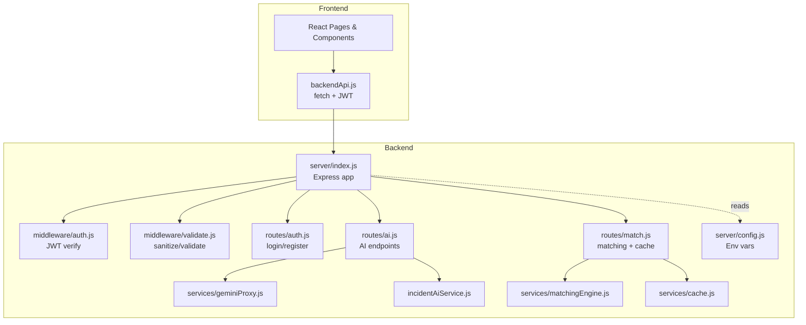
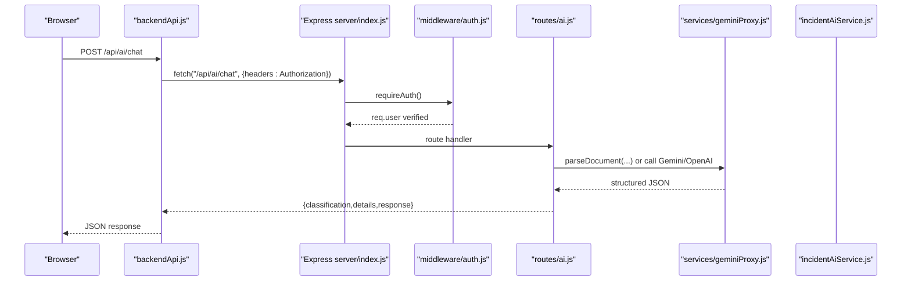
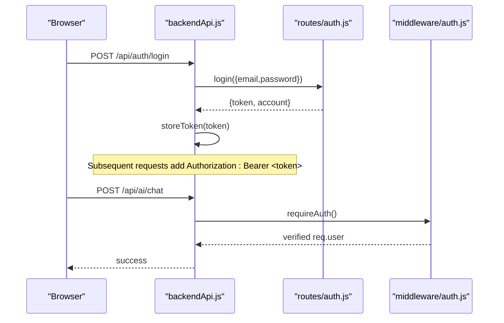
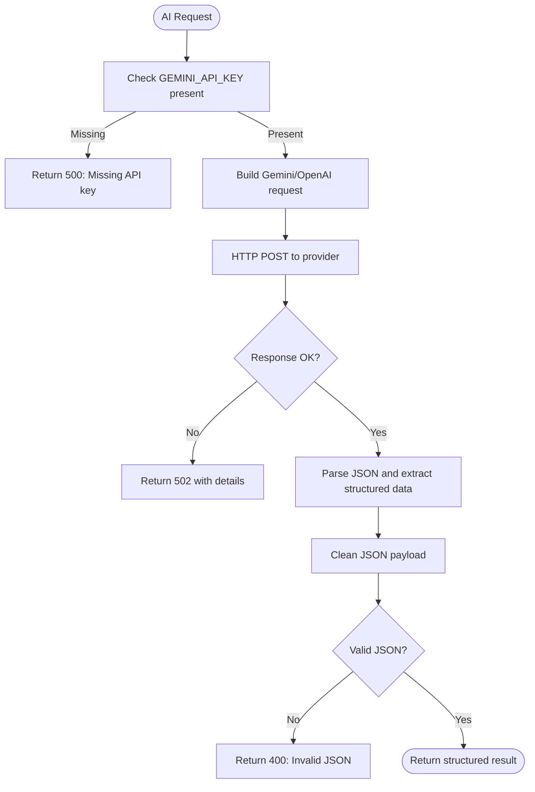
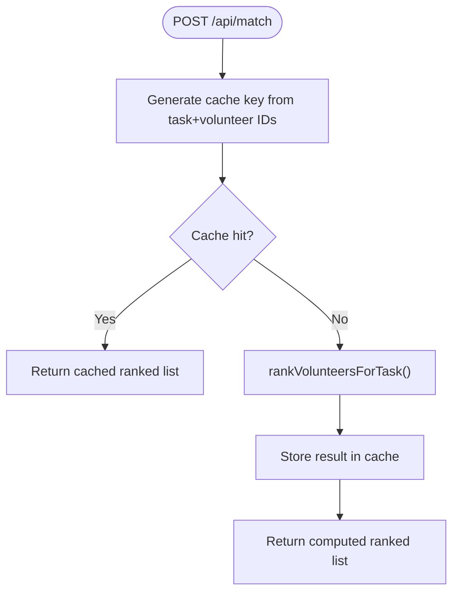
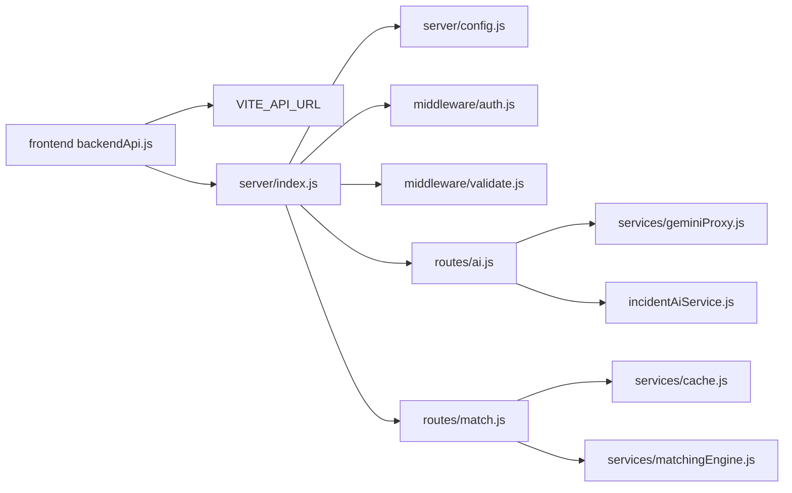

# Troubleshooting and FAQ

<cite>
**Referenced Files in This Document**
- [server/index.js](file://server/index.js)
- [server/config.js](file://server/config.js)
- [server/middleware/auth.js](file://server/middleware/auth.js)
- [server/middleware/validate.js](file://server/middleware/validate.js)
- [server/routes/auth.js](file://server/routes/auth.js)
- [server/routes/ai.js](file://server/routes/ai.js)
- [server/routes/match.js](file://server/routes/match.js)
- [server/services/geminiProxy.js](file://server/services/geminiProxy.js)
- [server/services/matchingEngine.js](file://server/services/matchingEngine.js)
- [server/services/cache.js](file://server/services/cache.js)
- [server/incidentAiService.js](file://server/incidentAiService.js)
- [src/services/backendApi.js](file://src/services/backendApi.js)
- [src/services/api.js](file://src/services/api.js)
- [src/utils/validation.js](file://src/utils/validation.js)
- [package.json](file://package.json)
</cite>

## Table of Contents
1. [Introduction](#introduction)
2. [Project Structure](#project-structure)
3. [Core Components](#core-components)
4. [Architecture Overview](#architecture-overview)
5. [Detailed Component Analysis](#detailed-component-analysis)
6. [Dependency Analysis](#dependency-analysis)
7. [Performance Considerations](#performance-considerations)
8. [Troubleshooting Guide](#troubleshooting-guide)
9. [FAQ](#faq)
10. [Conclusion](#conclusion)
11. [Appendices](#appendices)

## Introduction
This document provides comprehensive troubleshooting and FAQ guidance for the Echo5 platform. It focuses on diagnosing and resolving common issues related to authentication, API connectivity, performance bottlenecks, and database-related concerns. It also covers debugging techniques for both frontend and backend, network diagnostics, performance profiling, environment configuration, and escalation procedures.

## Project Structure
Echo5 consists of:
- Frontend (React/Vite): Client-side UI and API client.
- Backend (Node/Express): REST API with JWT authentication, rate limiting, CORS, and route handlers for authentication, AI, and matching.
- Services: AI proxies, matching engine, caching, and incident analysis.

**Diagram sources**
- [server/index.js:1-118](file://server/index.js#L1-L118)
- [server/config.js:1-35](file://server/config.js#L1-L35)
- [server/middleware/auth.js:1-49](file://server/middleware/auth.js#L1-L49)
- [server/middleware/validate.js:1-80](file://server/middleware/validate.js#L1-L80)
- [server/routes/auth.js:1-83](file://server/routes/auth.js#L1-L83)
- [server/routes/ai.js:1-348](file://server/routes/ai.js#L1-L348)
- [server/routes/match.js:1-120](file://server/routes/match.js#L1-L120)
- [server/services/geminiProxy.js:1-104](file://server/services/geminiProxy.js#L1-L104)
- [server/services/matchingEngine.js:1-212](file://server/services/matchingEngine.js#L1-L212)
- [server/services/cache.js:1-66](file://server/services/cache.js#L1-L66)
- [server/incidentAiService.js:1-189](file://server/incidentAiService.js#L1-L189)
- [src/services/backendApi.js:1-164](file://src/services/backendApi.js#L1-L164)

**Section sources**
- [server/index.js:1-118](file://server/index.js#L1-L118)
- [server/config.js:1-35](file://server/config.js#L1-L35)
- [src/services/backendApi.js:1-164](file://src/services/backendApi.js#L1-L164)

## Core Components
- Authentication: JWT-based login/register with middleware to verify tokens.
- API routing: Authenticated endpoints for AI document parsing, incident analysis, chat, match ranking, and recommendations.
- Matching engine: Server-side volunteer-task scoring with caching.
- AI services: Secure proxies to Gemini/OpenAI with fallback heuristics.
- Validation: Input sanitization and schema validation for request bodies.
- Configuration: Environment-driven settings for ports, keys, rate limits, and cache.

**Section sources**
- [server/middleware/auth.js:1-49](file://server/middleware/auth.js#L1-L49)
- [server/routes/auth.js:1-83](file://server/routes/auth.js#L1-L83)
- [server/routes/ai.js:1-348](file://server/routes/ai.js#L1-L348)
- [server/routes/match.js:1-120](file://server/routes/match.js#L1-L120)
- [server/services/matchingEngine.js:1-212](file://server/services/matchingEngine.js#L1-L212)
- [server/services/geminiProxy.js:1-104](file://server/services/geminiProxy.js#L1-L104)
- [server/middleware/validate.js:1-80](file://server/middleware/validate.js#L1-L80)
- [server/config.js:1-35](file://server/config.js#L1-L35)

## Architecture Overview
The platform enforces:
- Secure headers, request logging, CORS, rate limiting, and JSON body parsing.
- Route protection via JWT middleware for AI and matching endpoints.
- AI endpoints proxy to Gemini/OpenAI with strict JSON output expectations.
- Matching engine computes scores and caches results for performance.

**Diagram sources**
- [server/index.js:74-76](file://server/index.js#L74-L76)
- [server/middleware/auth.js:14-37](file://server/middleware/auth.js#L14-L37)
- [server/routes/ai.js:78-178](file://server/routes/ai.js#L78-L178)
- [server/services/geminiProxy.js:53-103](file://server/services/geminiProxy.js#L53-L103)
- [server/incidentAiService.js:170-188](file://server/incidentAiService.js#L170-L188)
- [src/services/backendApi.js:33-54](file://src/services/backendApi.js#L33-L54)

## Detailed Component Analysis

### Authentication Flow
Common issues:
- Missing or invalid Authorization header.
- Expired or incorrect JWT secret.
- Login failures due to wrong credentials.

Resolution steps:
- Verify Authorization header format and token presence.
- Confirm JWT secret matches backend configuration.
- Ensure login credentials match the demo accounts list.

**Diagram sources**
- [server/routes/auth.js:34-52](file://server/routes/auth.js#L34-L52)
- [server/middleware/auth.js:14-37](file://server/middleware/auth.js#L14-L37)
- [src/services/backendApi.js:63-82](file://src/services/backendApi.js#L63-L82)

**Section sources**
- [server/middleware/auth.js:14-37](file://server/middleware/auth.js#L14-L37)
- [server/routes/auth.js:34-52](file://server/routes/auth.js#L34-L52)
- [src/services/backendApi.js:63-82](file://src/services/backendApi.js#L63-L82)

### AI Endpoints and Gemini Proxy
Common issues:
- Missing GEMINI_API_KEY.
- Gemini/OpenAI request failures.
- Malformed JSON responses from LLM.

Resolution steps:
- Set GEMINI_API_KEY in environment.
- Validate model name and endpoint reachability.
- Ensure request payloads conform to schema.

**Diagram sources**
- [server/routes/ai.js:92-178](file://server/routes/ai.js#L92-L178)
- [server/services/geminiProxy.js:53-103](file://server/services/geminiProxy.js#L53-L103)
- [server/incidentAiService.js:117-141](file://server/incidentAiService.js#L117-L141)

**Section sources**
- [server/routes/ai.js:92-178](file://server/routes/ai.js#L92-L178)
- [server/services/geminiProxy.js:53-103](file://server/services/geminiProxy.js#L53-L103)
- [server/incidentAiService.js:117-141](file://server/incidentAiService.js#L117-L141)

### Matching Engine and Cache
Common issues:
- Slow ranking for large volunteer lists.
- Cache misses causing repeated computations.
- Incorrect cache key generation.

Resolution steps:
- Enable cache and monitor cache-stats.
- Reduce dataset size or filter by region.
- Verify cache TTL and max size settings.

**Diagram sources**
- [server/routes/match.js:17-77](file://server/routes/match.js#L17-L77)
- [server/services/matchingEngine.js:166-182](file://server/services/matchingEngine.js#L166-L182)
- [server/services/cache.js:10-66](file://server/services/cache.js#L10-L66)

**Section sources**
- [server/routes/match.js:17-77](file://server/routes/match.js#L17-L77)
- [server/services/matchingEngine.js:166-182](file://server/services/matchingEngine.js#L166-L182)
- [server/services/cache.js:10-66](file://server/services/cache.js#L10-L66)

### Input Validation and Data Integrity
Common issues:
- Validation errors on add/update operations.
- Unexpected characters or XSS attempts in inputs.

Resolution steps:
- Review validation messages and adjust input length/format.
- Ensure numeric fields are finite numbers.
- Sanitize inputs before persistence.

**Section sources**
- [server/middleware/validate.js:48-62](file://server/middleware/validate.js#L48-L62)
- [src/utils/validation.js:30-80](file://src/utils/validation.js#L30-L80)
- [src/utils/validation.js:82-122](file://src/utils/validation.js#L82-L122)

## Dependency Analysis
- Frontend depends on environment variable VITE_API_URL for backend base URL.
- Backend depends on environment variables for API keys, rate limits, and CORS origin.
- AI endpoints depend on external providers (Gemini/OpenAI).
- Matching relies on in-memory cache with configurable TTL and size.

**Diagram sources**
- [src/services/backendApi.js:17](file://src/services/backendApi.js#L17)
- [server/index.js:26-101](file://server/index.js#L26-L101)
- [server/config.js:8-32](file://server/config.js#L8-L32)
- [server/routes/ai.js:1-8](file://server/routes/ai.js#L1-L8)
- [server/routes/match.js:1-7](file://server/routes/match.js#L1-L7)
- [server/services/geminiProxy.js:7](file://server/services/geminiProxy.js#L7)
- [server/services/matchingEngine.js:14-12](file://server/services/matchingEngine.js#L14-L12)
- [server/services/cache.js:10-18](file://server/services/cache.js#L10-L18)

**Section sources**
- [src/services/backendApi.js:17](file://src/services/backendApi.js#L17)
- [server/config.js:8-32](file://server/config.js#L8-L32)
- [server/index.js:26-101](file://server/index.js#L26-L101)

## Performance Considerations
- Rate limiting: Global and stricter limits for AI routes; tune windows and max values.
- Body size limits: Increased limit for AI routes; ensure clients respect upload sizes.
- Caching: Monitor cache stats and adjust TTL/max size for matching results.
- Logging: Morgan logs requests; enable debug logs for AI and matching for profiling.

Recommendations:
- Use cache-stats endpoint to track hit rates.
- Profile AI latency and adjust model or generation configs.
- Consider external cache (e.g., Redis) for production scaling.

**Section sources**
- [server/index.js:49-71](file://server/index.js#L49-L71)
- [server/routes/match.js:108-117](file://server/routes/match.js#L108-L117)
- [server/services/cache.js:52-64](file://server/services/cache.js#L52-L64)

## Troubleshooting Guide

### Authentication Problems
Symptoms:
- 401 Unauthorized on protected endpoints.
- “Authentication required” or “Invalid authentication token”.
- Login fails with invalid credentials.

Steps:
- Confirm Authorization header is present and formatted as Bearer <token>.
- Verify JWT secret and expiration align with server configuration.
- Check login credentials against the demo accounts list.

**Section sources**
- [server/middleware/auth.js:17-36](file://server/middleware/auth.js#L17-L36)
- [server/routes/auth.js:34-52](file://server/routes/auth.js#L34-L52)
- [src/services/backendApi.js:63-82](file://src/services/backendApi.js#L63-L82)

### API Connection Issues
Symptoms:
- 404 Not Found for /api/* routes.
- 429 Too Many Requests.
- 502 Bad Gateway from AI endpoints.

Steps:
- Verify backend is running and listening on configured port.
- Check CORS origin and credentials settings.
- Review rate limit windows and max values.
- Inspect AI provider API keys and quotas.

**Section sources**
- [server/index.js:79-92](file://server/index.js#L79-L92)
- [server/index.js:38-43](file://server/index.js#L38-L43)
- [server/index.js:49-68](file://server/index.js#L49-L68)
- [server/routes/ai.js:92-94](file://server/routes/ai.js#L92-L94)

### Performance Bottlenecks
Symptoms:
- Slow /api/match responses.
- High CPU usage or timeouts.

Steps:
- Use cache-stats to confirm cache effectiveness.
- Reduce dataset size or apply region filters.
- Tune cache TTL and max size.
- Investigate AI latency and model selection.

**Section sources**
- [server/routes/match.js:108-117](file://server/routes/match.js#L108-L117)
- [server/services/cache.js:52-64](file://server/services/cache.js#L52-L64)
- [server/services/matchingEngine.js:169-177](file://server/services/matchingEngine.js#L169-L177)

### Database and Real-Time Data Issues
Symptoms:
- Incidents not updating or reverting to cached data.
- Validation errors when adding needs/volunteers.

Steps:
- Confirm Firestore connectivity and permissions.
- Review validation rules and sanitized data.
- Fall back to cached data when realtime fetch fails.

**Section sources**
- [src/services/api.js:299-310](file://src/services/api.js#L299-L310)
- [src/utils/validation.js:30-80](file://src/utils/validation.js#L30-L80)
- [src/utils/validation.js:82-122](file://src/utils/validation.js#L82-L122)

### Network Debugging Approaches
- Frontend: Inspect XHR/Fetch requests in browser devtools; verify Authorization header and response payloads.
- Backend: Enable Morgan logs and review request/response timing.
- AI: Capture upstream provider responses and inspect error bodies.

**Section sources**
- [src/services/backendApi.js:33-54](file://src/services/backendApi.js#L33-L54)
- [server/index.js:35](file://server/index.js#L35)
- [server/routes/ai.js:155-158](file://server/routes/ai.js#L155-L158)

### Performance Profiling Methods
- Use cache-stats to measure hit rate and eviction frequency.
- Instrument AI endpoints to record latency and error rates.
- Monitor backend logs for slow endpoints and 5xx errors.

**Section sources**
- [server/routes/match.js:108-117](file://server/routes/match.js#L108-L117)
- [server/routes/ai.js:164](file://server/routes/ai.js#L164)

### Development Environment Troubleshooting
Common issues:
- VITE_API_URL not pointing to backend.
- Missing environment variables (JWT_SECRET, GEMINI_API_KEY).
- CORS mismatch between frontend and backend.

Steps:
- Set VITE_API_URL to backend origin in development.
- Export required environment variables locally.
- Align CORS origin with frontend host.

**Section sources**
- [src/services/backendApi.js:17](file://src/services/backendApi.js#L17)
- [server/config.js:18-27](file://server/config.js#L18-L27)
- [server/index.js:38-43](file://server/index.js#L38-L43)

### Common Configuration Issues
- Rate limit windows and max values too restrictive.
- Cache TTL too small or max size too low.
- JWT secret too weak or inconsistent across deployments.

Steps:
- Adjust RATE_LIMIT_WINDOW_MS, RATE_LIMIT_MAX, AI_RATE_LIMIT_MAX.
- Tune MATCH_CACHE_TTL_MS and MATCH_CACHE_MAX_SIZE.
- Change JWT_SECRET to a strong secret and keep it synchronized.

**Section sources**
- [server/config.js:22-32](file://server/config.js#L22-L32)
- [server/index.js:49-68](file://server/index.js#L49-L68)

### Dependency Conflicts and Environment-Specific Problems
- Mismatched React versions or incompatible packages.
- Missing peer dependencies for maps or charts.

Steps:
- Review package.json dependencies and resolve conflicts.
- Install missing peer dependencies as indicated by warnings.

**Section sources**
- [package.json:12-41](file://package.json#L12-L41)

## FAQ

Q1: Why am I getting “Authentication required”?
- Ensure Authorization header is present and includes a valid Bearer token.

Q2: Why does login fail?
- Verify credentials match the demo accounts list and required fields are provided.

Q3: How do I fix “Missing GEMINI_API_KEY”?
- Set GEMINI_API_KEY in your environment and restart the server.

Q4: Why is /api/match slow?
- Enable caching and monitor cache-stats; reduce dataset size or filter by region.

Q5: How can I increase upload sizes for AI endpoints?
- Body size is increased for AI routes; ensure client respects limits.

Q6: How do I check cache performance?
- Use the cache-stats endpoint to view hits, misses, and hit rate.

Q7: How do I diagnose AI provider errors?
- Inspect AI endpoint responses and upstream provider error bodies.

Q8: How do I configure CORS for local development?
- Set CORS_ORIGIN to match your frontend host.

Q9: How do I scale caching for production?
- Replace in-memory cache with a distributed cache (e.g., Redis) with the same API.

Q10: How do I escalate complex issues?
- Collect logs, reproduce steps, and contact support with environment details.

[No sources needed since this section aggregates general guidance]

## Conclusion
This guide outlined the primary areas of concern and step-by-step resolutions for Echo5. By validating authentication, ensuring proper configuration, leveraging caching, and instrumenting AI endpoints, most issues can be quickly identified and resolved. For persistent or complex problems, collect logs and escalate with environment details.

[No sources needed since this section summarizes without analyzing specific files]

## Appendices

### Endpoint Reference
- GET /api/health: Server health and configuration status.
- POST /api/auth/login: Authenticate and receive JWT.
- POST /api/auth/register: Register a new account.
- POST /api/ai/parse-document: Secure document parsing via Gemini proxy.
- POST /api/ai/incident-analyze: Analyze incident reports.
- POST /api/ai/chat: AI chat with mode-specific instructions.
- POST /api/ai/explain-match: Natural-language explanation of matches.
- POST /api/ai/analyze-report: Structured needs extraction.
- POST /api/ai/analyze-reports-batch: Batch report processing.
- POST /api/match: Rank volunteers for a task.
- POST /api/match/recommend: Batch recommendations.
- GET /api/match/cache-stats: Cache performance metrics.

**Section sources**
- [server/index.js:79-87](file://server/index.js#L79-L87)
- [server/routes/auth.js:34-80](file://server/routes/auth.js#L34-L80)
- [server/routes/ai.js:30-345](file://server/routes/ai.js#L30-L345)
- [server/routes/match.js:33-117](file://server/routes/match.js#L33-L117)