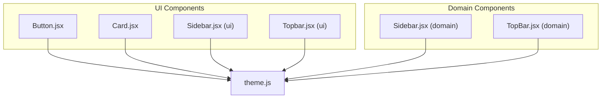
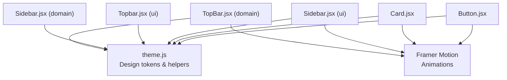
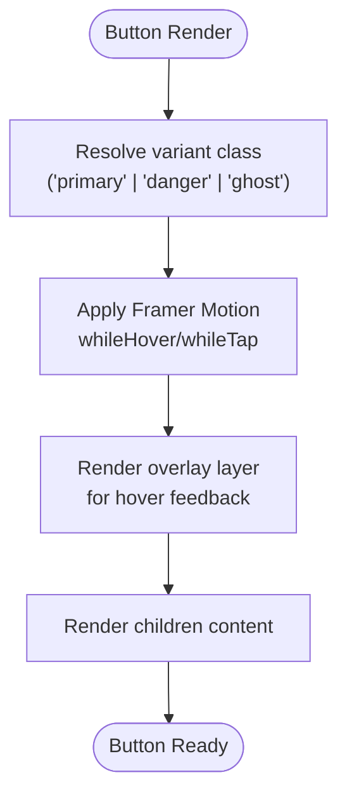
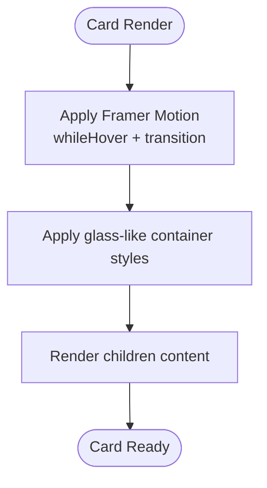
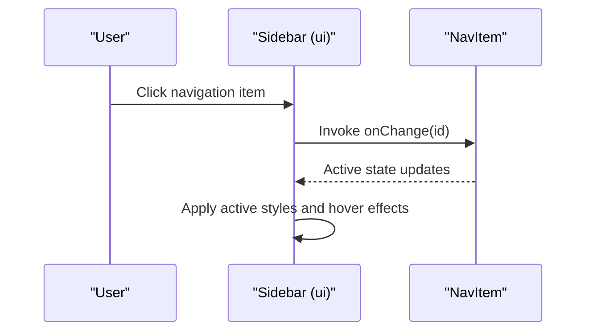
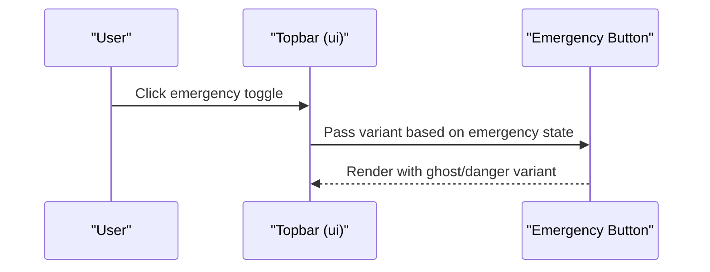
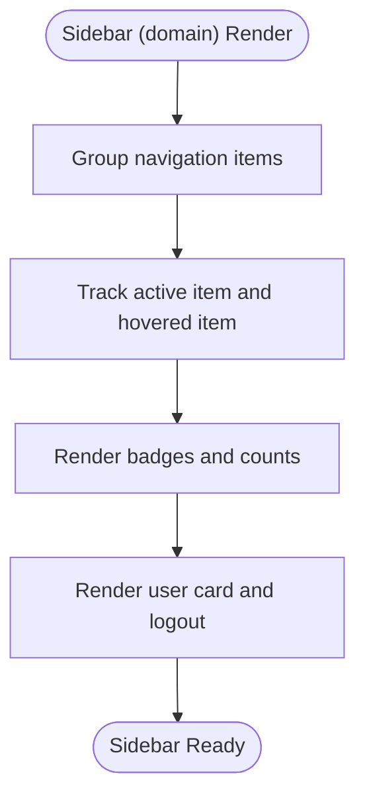
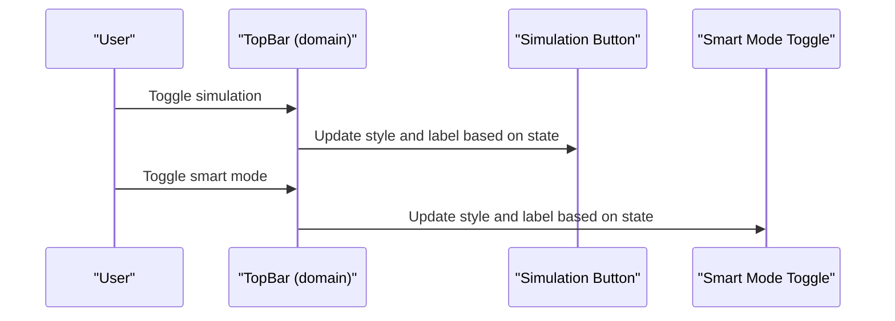
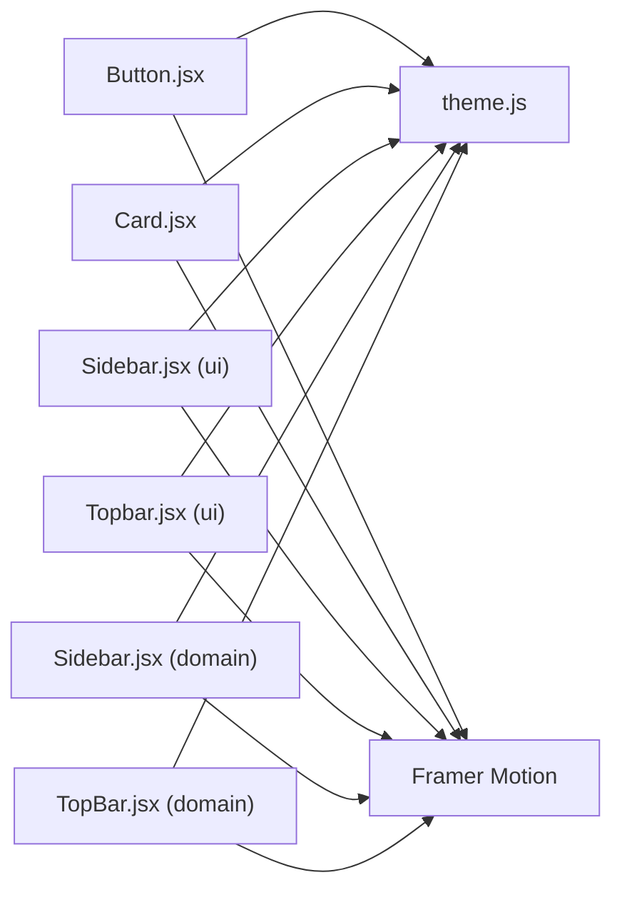

# Base UI Components

<cite>
**Referenced Files in This Document**
- [Button.jsx](file://src/components/ui/Button.jsx)
- [Card.jsx](file://src/components/ui/Card.jsx)
- [Sidebar.jsx](file://src/components/ui/Sidebar.jsx)
- [Topbar.jsx](file://src/components/ui/Topbar.jsx)
- [Sidebar.jsx](file://src/components/Sidebar.jsx)
- [TopBar.jsx](file://src/components/TopBar.jsx)
- [theme.js](file://src/styles/theme.js)
</cite>

## Table of Contents
1. [Introduction](#introduction)
2. [Project Structure](#project-structure)
3. [Core Components](#core-components)
4. [Architecture Overview](#architecture-overview)
5. [Detailed Component Analysis](#detailed-component-analysis)
6. [Dependency Analysis](#dependency-analysis)
7. [Performance Considerations](#performance-considerations)
8. [Troubleshooting Guide](#troubleshooting-guide)
9. [Conclusion](#conclusion)

## Introduction
This document describes the foundational UI components used across the application: Button, Card, Sidebar, and Topbar. It explains each component’s props, styling variants, customization options, composition patterns, motion animations via Framer Motion, responsive design, gradient button variants, card layouts, sidebar navigation structure, and topbar functionality. It also covers integration with the theming system, accessibility considerations, state management, event handling, and performance optimization techniques.

## Project Structure
The UI components are organized under a dedicated ui folder alongside other domain-specific components. Styling and design tokens are centralized in a theme module. Motion animations leverage Framer Motion.

**Diagram sources**
- [Button.jsx:1-22](file://src/components/ui/Button.jsx#L1-L22)
- [Card.jsx:1-15](file://src/components/ui/Card.jsx#L1-L15)
- [Sidebar.jsx:1-46](file://src/components/ui/Sidebar.jsx#L1-L46)
- [Topbar.jsx:1-33](file://src/components/ui/Topbar.jsx#L1-L33)
- [Sidebar.jsx:1-124](file://src/components/Sidebar.jsx#L1-L124)
- [TopBar.jsx:1-141](file://src/components/TopBar.jsx#L1-L141)
- [theme.js:1-57](file://src/styles/theme.js#L1-L57)

**Section sources**
- [Button.jsx:1-22](file://src/components/ui/Button.jsx#L1-L22)
- [Card.jsx:1-15](file://src/components/ui/Card.jsx#L1-L15)
- [Sidebar.jsx:1-46](file://src/components/ui/Sidebar.jsx#L1-L46)
- [Topbar.jsx:1-33](file://src/components/ui/Topbar.jsx#L1-L33)
- [Sidebar.jsx:1-124](file://src/components/Sidebar.jsx#L1-L124)
- [TopBar.jsx:1-141](file://src/components/TopBar.jsx#L1-L141)
- [theme.js:1-57](file://src/styles/theme.js#L1-L57)

## Core Components
This section documents the props, variants, styling, and customization for each foundational component.

- Button
  - Purpose: Interactive action element with gradient backgrounds and hover/tap feedback.
  - Props:
    - children: Node
    - variant: "primary" | "danger" | "ghost"
    - className: string (optional)
    - Additional button attributes (e.g., onClick) are forwarded.
  - Variants:
    - primary: gradient from a blue-like hue to a cyan-like hue with light text.
    - danger: gradient from a red-like hue to a pink-like hue with light text.
    - ghost: semi-transparent dark slate gradient with subdued text.
  - Styling and customization:
    - Uses Tailwind-style utility classes for rounded corners, padding, and shadows.
    - Hover and tap animations via Framer Motion.
    - Optional className allows stacking custom styles.
  - Accessibility:
    - Inherits native button semantics; ensure meaningful labels and visible focus states.
  - Integration with theming:
    - Gradient colors are defined per variant; can be aligned with theme tokens if desired.

- Card
  - Purpose: Container with elevated presentation and subtle hover animation.
  - Props:
    - children: Node
    - className: string (optional)
  - Styling and customization:
    - Glass-like appearance with rounded corners and padding.
    - Hover animation with slight lift and 3D rotation for depth perception.
    - Optional className enables further customization.
  - Accessibility:
    - Ensure sufficient contrast against background; maintain readable text sizes.

- Sidebar (ui)
  - Purpose: Navigation sidebar with animated selection indicator and emergency highlight.
  - Props:
    - active: string (active navigation id)
    - onChange: function (id) -> void
    - emergency: boolean (optional)
  - Styling and customization:
    - Fixed-position sidebar with glass-like container and subtle border.
    - Emergency mode adds a pulsing red glow effect.
    - Navigation items render icons and labels with hover and active states.
  - Accessibility:
    - Keyboard navigable; ensure focus indicators and ARIA roles if extended.

- Topbar (ui)
  - Purpose: Header bar with search, notifications, emergency toggle, and user avatar.
  - Props:
    - emergency: boolean
    - setEmergency: function (prev -> next)
  - Styling and customization:
    - Glass-like header with rounded corners.
    - Emergency toggle switches between ghost and danger variants.
    - Search input adjusts visuals on focus.
  - Accessibility:
    - Ensure focus order and keyboard operability for interactive elements.

- Sidebar (domain)
  - Purpose: Full-featured navigation with grouped sections, badges, and user profile.
  - Props:
    - active: string
    - onNav: function (id) -> void
    - ngo: object (optional)
    - onLogout: function () -> void
    - unreadCount: number (default: 0)
  - Styling and customization:
    - Gradient background with ambient radial glows.
    - Grouped navigation sections with badges and active indicators.
    - User card with initials and logout button.
  - Accessibility:
    - Prefer semantic links/buttons; ensure labels and keyboard navigation.

- TopBar (domain)
  - Purpose: Advanced header with live status, search, simulation controls, smart mode toggle, notifications, and avatar.
  - Props:
    - page: string
    - onNav: function (id) -> void
    - ngo: object (optional)
    - unreadCount: number (default: 0)
    - smartMode: boolean
    - onToggleSmartMode: function () -> void
    - realtimeSimEnabled: boolean
    - onToggleRealtimeSimulation: function () -> void
  - Styling and customization:
    - Glass-like backdrop with blur and saturation.
    - Live and simulation indicators with dynamic colors.
    - Animated search input with focus effects.
    - Smart mode toggle with gradient background and color transitions.
    - Notification badge with counter.
  - Accessibility:
    - Ensure ARIA labels and keyboard operability for toggles and buttons.

**Section sources**
- [Button.jsx:3-7](file://src/components/ui/Button.jsx#L3-L7)
- [Button.jsx:9-21](file://src/components/ui/Button.jsx#L9-L21)
- [Card.jsx:3-13](file://src/components/ui/Card.jsx#L3-L13)
- [Sidebar.jsx:12-43](file://src/components/ui/Sidebar.jsx#L12-L43)
- [Topbar.jsx:4-30](file://src/components/ui/Topbar.jsx#L4-L30)
- [Sidebar.jsx:18-120](file://src/components/Sidebar.jsx#L18-L120)
- [TopBar.jsx:5-14](file://src/components/TopBar.jsx#L5-L14)
- [theme.js:30-56](file://src/styles/theme.js#L30-L56)

## Architecture Overview
The UI components integrate with the theming system and motion library to deliver a cohesive, accessible, and performant interface. The theming module centralizes design tokens and reusable CSS helpers, while Framer Motion provides smooth micro-interactions.

**Diagram sources**
- [theme.js:1-57](file://src/styles/theme.js#L1-L57)
- [Button.jsx:1-22](file://src/components/ui/Button.jsx#L1-L22)
- [Card.jsx:1-15](file://src/components/ui/Card.jsx#L1-L15)
- [Sidebar.jsx:1-46](file://src/components/ui/Sidebar.jsx#L1-L46)
- [Topbar.jsx:1-33](file://src/components/ui/Topbar.jsx#L1-L33)
- [Sidebar.jsx:1-124](file://src/components/Sidebar.jsx#L1-L124)
- [TopBar.jsx:1-141](file://src/components/TopBar.jsx#L1-L141)

## Detailed Component Analysis

### Button
- Composition pattern:
  - Renders a motion-enhanced button with layered pseudo-elements for ripple-like hover feedback.
  - Variant mapping defines gradient stops and text color per variant.
- Motion animations:
  - whileHover: scale and soft glow shadow.
  - whileTap: slight scale reduction for tactile feedback.
- Responsive design:
  - Padding and typography scales adapt to screen sizes via utility classes.
- Theming integration:
  - Gradient colors are defined per variant; can be aligned with theme tokens for consistency.
- Accessibility:
  - Use aria-label or child text for meaningful labeling; ensure sufficient color contrast.

**Diagram sources**
- [Button.jsx:3-7](file://src/components/ui/Button.jsx#L3-L7)
- [Button.jsx:11-19](file://src/components/ui/Button.jsx#L11-L19)

**Section sources**
- [Button.jsx:3-7](file://src/components/ui/Button.jsx#L3-L7)
- [Button.jsx:9-21](file://src/components/ui/Button.jsx#L9-L21)

### Card
- Composition pattern:
  - Article container with motion-driven hover elevation and subtle 3D transforms.
- Motion animations:
  - whileHover: vertical lift and slight rotation for depth perception.
  - transition: spring physics for natural feel.
- Styling variants:
  - Glass-like container with rounded corners and internal padding.
- Theming integration:
  - Can adopt theme tokens for background, borders, and shadows.
- Accessibility:
  - Ensure sufficient contrast and readable text sizes.

**Diagram sources**
- [Card.jsx:5-9](file://src/components/ui/Card.jsx#L5-L9)
- [Card.jsx:11-12](file://src/components/ui/Card.jsx#L11-L12)

**Section sources**
- [Card.jsx:3-13](file://src/components/ui/Card.jsx#L3-L13)

### Sidebar (ui)
- Composition pattern:
  - Fixed-position container with brand header, navigation list, and optional emergency highlight.
  - Navigation items render icons and labels with hover and active states.
- Motion animations:
  - whileHover: horizontal push for affordance.
  - Active state uses a layoutId-based animated indicator for smooth transitions.
- Navigation structure:
  - Predefined items with labels and Lucide icons.
- Theming integration:
  - Uses glass-like container and border tokens.
- Accessibility:
  - Ensure keyboard navigation and focus visibility.

**Diagram sources**
- [Sidebar.jsx:27-42](file://src/components/ui/Sidebar.jsx#L27-L42)

**Section sources**
- [Sidebar.jsx:12-43](file://src/components/ui/Sidebar.jsx#L12-L43)

### Topbar (ui)
- Composition pattern:
  - Header with search input, notification bell, emergency toggle, and avatar.
  - Emergency toggle switches variant based on state.
- Motion animations:
  - Button hover effects and ripple-like feedback.
- Theming integration:
  - Uses theme tokens for colors and borders.
- Accessibility:
  - Ensure focus order and keyboard operability.

**Diagram sources**
- [Topbar.jsx:18-25](file://src/components/ui/Topbar.jsx#L18-L25)

**Section sources**
- [Topbar.jsx:4-30](file://src/components/ui/Topbar.jsx#L4-L30)

### Sidebar (domain)
- Composition pattern:
  - Gradient background with ambient radial glows, grouped navigation sections, badges, and user profile.
- Motion animations:
  - Animated active indicator using layoutId for smooth transitions.
- Theming integration:
  - Uses theme tokens for gradients, borders, and backgrounds.
- Accessibility:
  - Prefer semantic links/buttons; ensure labels and keyboard navigation.

**Diagram sources**
- [Sidebar.jsx:50-89](file://src/components/Sidebar.jsx#L50-L89)
- [Sidebar.jsx:70-74](file://src/components/Sidebar.jsx#L70-L74)

**Section sources**
- [Sidebar.jsx:18-120](file://src/components/Sidebar.jsx#L18-L120)

### TopBar (domain)
- Composition pattern:
  - Header with live status indicators, search input, simulation controls, smart mode toggle, notifications, and avatar.
- Motion animations:
  - Animated search focus, notification hover, and avatar hover.
- Theming integration:
  - Uses theme tokens for colors, borders, and gradients.
- Accessibility:
  - Ensure ARIA labels and keyboard operability for toggles and buttons.

**Diagram sources**
- [TopBar.jsx:73-87](file://src/components/TopBar.jsx#L73-L87)
- [TopBar.jsx:89-102](file://src/components/TopBar.jsx#L89-L102)

**Section sources**
- [TopBar.jsx:5-14](file://src/components/TopBar.jsx#L5-L14)
- [TopBar.jsx:57-70](file://src/components/TopBar.jsx#L57-L70)
- [TopBar.jsx:72-102](file://src/components/TopBar.jsx#L72-L102)
- [TopBar.jsx:104-122](file://src/components/TopBar.jsx#L104-L122)
- [TopBar.jsx:124-137](file://src/components/TopBar.jsx#L124-L137)

## Dependency Analysis
- Theming:
  - All UI components rely on design tokens and helpers from the theme module for consistent colors, borders, and shadows.
- Motion:
  - Framer Motion is used to animate interactive states and transitions across components.
- Composition:
  - Domain components (Sidebar and TopBar) extend the UI counterparts with richer navigation and controls.

**Diagram sources**
- [theme.js:1-57](file://src/styles/theme.js#L1-L57)
- [Button.jsx:1-22](file://src/components/ui/Button.jsx#L1-L22)
- [Card.jsx:1-15](file://src/components/ui/Card.jsx#L1-L15)
- [Sidebar.jsx:1-46](file://src/components/ui/Sidebar.jsx#L1-L46)
- [Topbar.jsx:1-33](file://src/components/ui/Topbar.jsx#L1-L33)
- [Sidebar.jsx:1-124](file://src/components/Sidebar.jsx#L1-L124)
- [TopBar.jsx:1-141](file://src/components/TopBar.jsx#L1-L141)

**Section sources**
- [theme.js:1-57](file://src/styles/theme.js#L1-L57)
- [Button.jsx:1-22](file://src/components/ui/Button.jsx#L1-L22)
- [Card.jsx:1-15](file://src/components/ui/Card.jsx#L1-L15)
- [Sidebar.jsx:1-46](file://src/components/ui/Sidebar.jsx#L1-L46)
- [Topbar.jsx:1-33](file://src/components/ui/Topbar.jsx#L1-L33)
- [Sidebar.jsx:1-124](file://src/components/Sidebar.jsx#L1-L124)
- [TopBar.jsx:1-141](file://src/components/TopBar.jsx#L1-L141)

## Performance Considerations
- Prefer CSS transforms and opacity for animations to avoid layout thrashing.
- Use motion variants and layoutId sparingly to minimize re-renders.
- Keep hover effects lightweight; avoid heavy filters or shadows on many elements.
- Consolidate theme tokens to reduce repeated style recomputation.
- Defer non-critical animations until after initial render.

## Troubleshooting Guide
- Motion not triggering:
  - Ensure Framer Motion is installed and imported correctly.
  - Verify that interactive props (onClick) are passed to the motion component.
- Gradient colors appear inconsistent:
  - Align variant definitions with theme tokens for consistent color usage.
- Accessibility issues:
  - Add aria-labels and ensure keyboard navigation.
  - Provide visible focus states and sufficient color contrast.
- Layout shifts:
  - Use layoutId for animated indicators and reserve layout changes for user-initiated actions.

## Conclusion
The foundational UI components provide a consistent, accessible, and performant interface. By leveraging the theming system and Framer Motion, they deliver polished interactions and a cohesive design language. Extending these patterns ensures scalability and maintainability across the application.