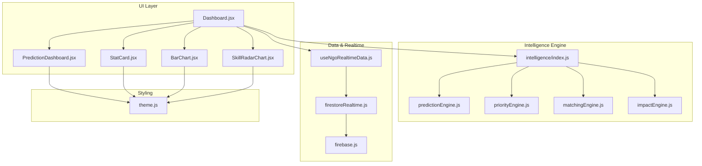
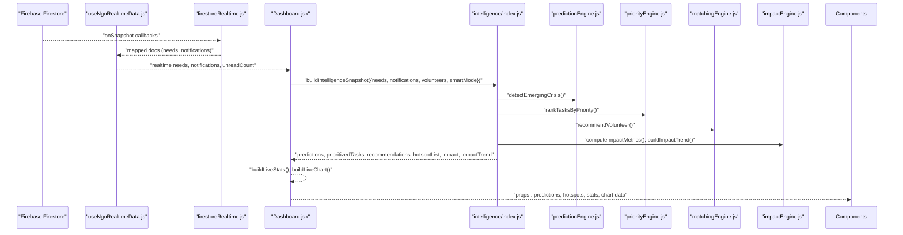
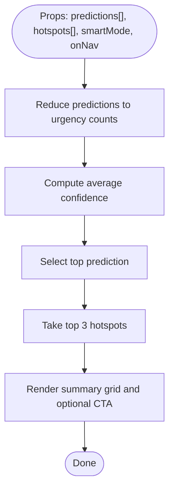
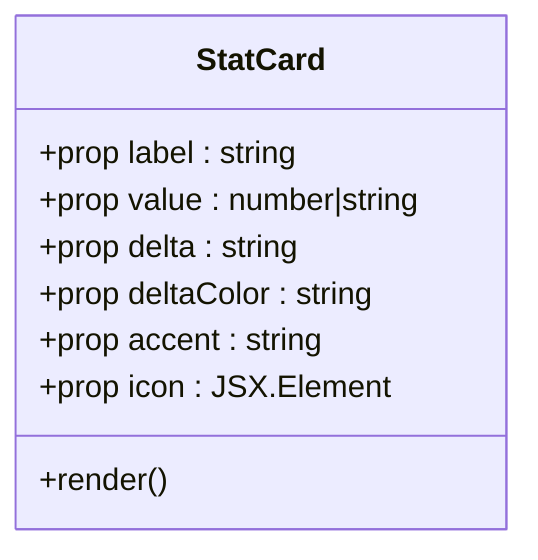
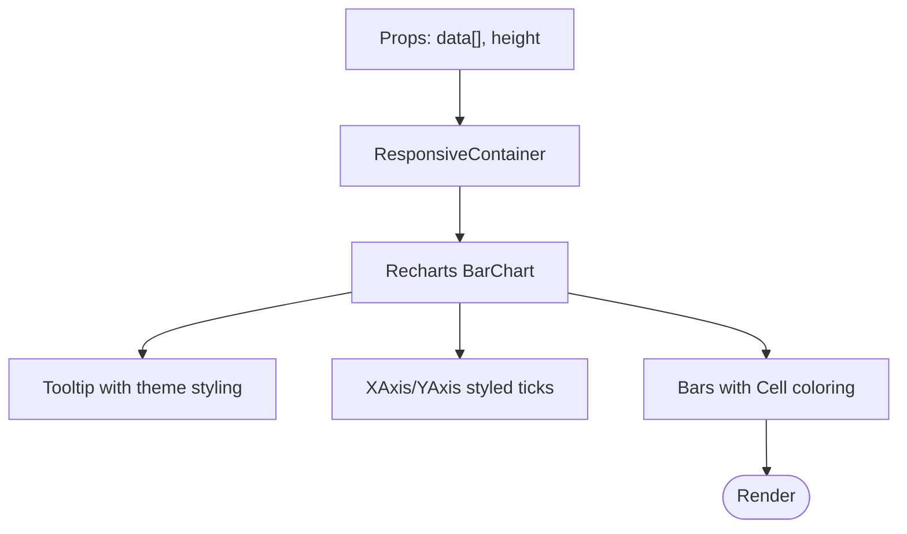
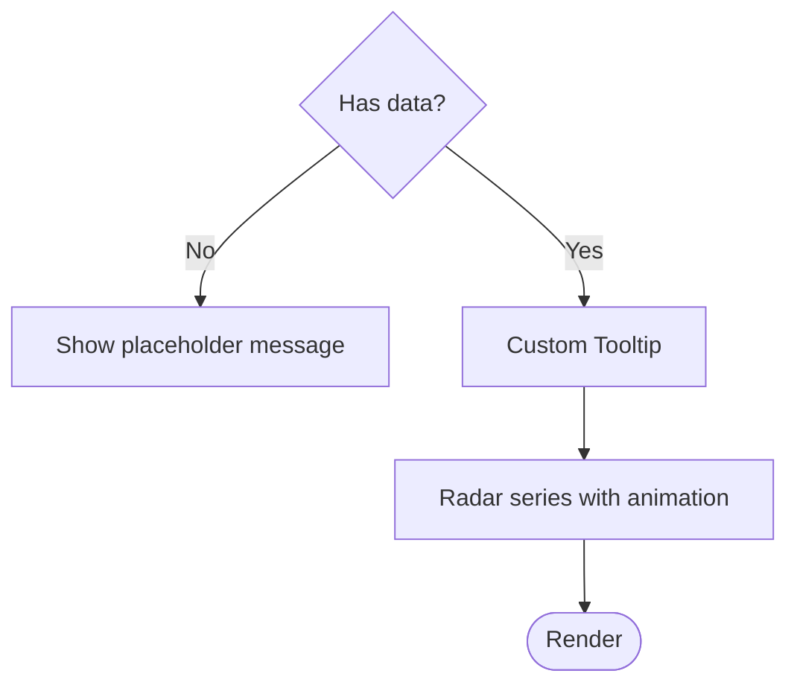
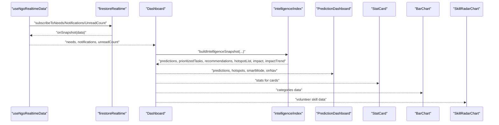
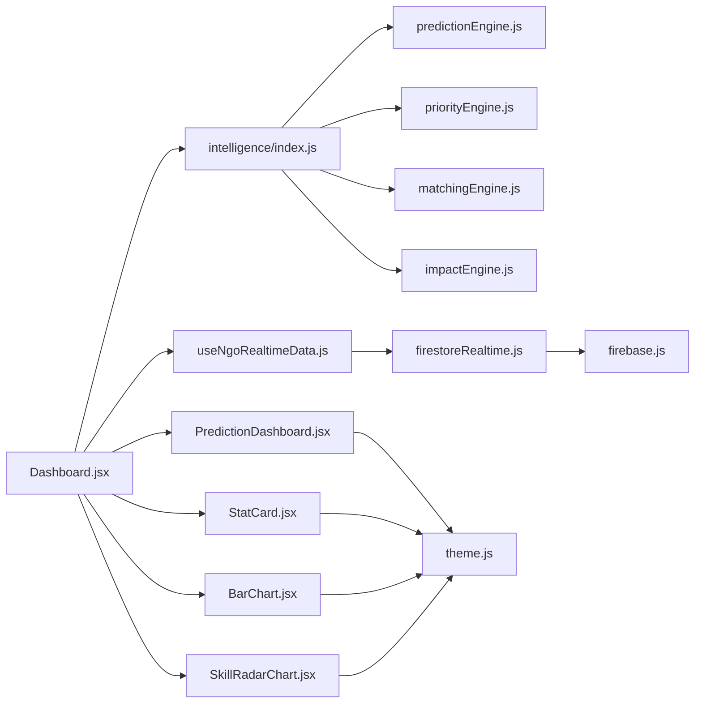

# Dashboard Components

<cite>
**Referenced Files in This Document**
- [PredictionDashboard.jsx](file://src/components/PredictionDashboard.jsx)
- [StatCard.jsx](file://src/components/StatCard.jsx)
- [BarChart.jsx](file://src/components/BarChart.jsx)
- [SkillRadarChart.jsx](file://src/components/SkillRadarChart.jsx)
- [Dashboard.jsx](file://src/pages/Dashboard.jsx)
- [useNgoRealtimeData.js](file://src/hooks/useNgoRealtimeData.js)
- [firestoreRealtime.js](file://src/services/firestoreRealtime.js)
- [intelligence/index.js](file://src/services/intelligence/index.js)
- [predictionEngine.js](file://src/services/intelligence/predictionEngine.js)
- [priorityEngine.js](file://src/services/intelligence/priorityEngine.js)
- [matchingEngine.js](file://src/services/intelligence/matchingEngine.js)
- [impactEngine.js](file://src/services/intelligence/impactEngine.js)
- [theme.js](file://src/styles/theme.js)
- [firebase.js](file://src/firebase.js)
- [VolunteerCard.jsx](file://src/components/volunteers/VolunteerCard.jsx)
</cite>

## Table of Contents
1. [Introduction](#introduction)
2. [Project Structure](#project-structure)
3. [Core Components](#core-components)
4. [Architecture Overview](#architecture-overview)
5. [Detailed Component Analysis](#detailed-component-analysis)
6. [Dependency Analysis](#dependency-analysis)
7. [Performance Considerations](#performance-considerations)
8. [Accessibility Compliance](#accessibility-compliance)
9. [Troubleshooting Guide](#troubleshooting-guide)
10. [Conclusion](#conclusion)

## Introduction
This document provides comprehensive technical and practical documentation for the analytics and visualization components used in the dashboard. It focuses on:
- PredictionDashboard for forecasting summaries and hotspot insights
- StatCard for key metrics display
- BarChart for categorical trend analysis
- SkillRadarChart for volunteer skill assessment

It explains chart configurations, data binding patterns, interactivity, integration with the intelligence engine, and Firebase real-time updates. It also covers performance optimization for large datasets and accessibility considerations for data visualization.

## Project Structure
The dashboard integrates React components with reusable visualization primitives and a modular intelligence engine. Real-time data is sourced via Firebase listeners and transformed into dashboard-ready structures.

**Diagram sources**
- [Dashboard.jsx:1-530](file://src/pages/Dashboard.jsx#L1-L530)
- [PredictionDashboard.jsx:1-134](file://src/components/PredictionDashboard.jsx#L1-L134)
- [StatCard.jsx:1-50](file://src/components/StatCard.jsx#L1-L50)
- [BarChart.jsx:1-26](file://src/components/BarChart.jsx#L1-L26)
- [SkillRadarChart.jsx:1-55](file://src/components/SkillRadarChart.jsx#L1-L55)
- [intelligence/index.js:1-43](file://src/services/intelligence/index.js#L1-L43)
- [predictionEngine.js:1-66](file://src/services/intelligence/predictionEngine.js#L1-L66)
- [priorityEngine.js:1-52](file://src/services/intelligence/priorityEngine.js#L1-L52)
- [matchingEngine.js:1-59](file://src/services/intelligence/matchingEngine.js#L1-L59)
- [impactEngine.js:1-44](file://src/services/intelligence/impactEngine.js#L1-L44)
- [useNgoRealtimeData.js:1-83](file://src/hooks/useNgoRealtimeData.js#L1-L83)
- [firestoreRealtime.js:1-212](file://src/services/firestoreRealtime.js#L1-L212)
- [firebase.js:1-35](file://src/firebase.js#L1-L35)
- [theme.js:1-57](file://src/styles/theme.js#L1-L57)

**Section sources**
- [Dashboard.jsx:1-530](file://src/pages/Dashboard.jsx#L1-L530)
- [PredictionDashboard.jsx:1-134](file://src/components/PredictionDashboard.jsx#L1-L134)
- [StatCard.jsx:1-50](file://src/components/StatCard.jsx#L1-L50)
- [BarChart.jsx:1-26](file://src/components/BarChart.jsx#L1-L26)
- [SkillRadarChart.jsx:1-55](file://src/components/SkillRadarChart.jsx#L1-L55)
- [intelligence/index.js:1-43](file://src/services/intelligence/index.js#L1-L43)
- [predictionEngine.js:1-66](file://src/services/intelligence/predictionEngine.js#L1-L66)
- [priorityEngine.js:1-52](file://src/services/intelligence/priorityEngine.js#L1-L52)
- [matchingEngine.js:1-59](file://src/services/intelligence/matchingEngine.js#L1-L59)
- [impactEngine.js:1-44](file://src/services/intelligence/impactEngine.js#L1-L44)
- [useNgoRealtimeData.js:1-83](file://src/hooks/useNgoRealtimeData.js#L1-L83)
- [firestoreRealtime.js:1-212](file://src/services/firestoreRealtime.js#L1-L212)
- [firebase.js:1-35](file://src/firebase.js#L1-L35)
- [theme.js:1-57](file://src/styles/theme.js#L1-L57)

## Core Components
This section documents the four primary visualization components and their roles in the dashboard.

- PredictionDashboard: Aggregates and displays AI-generated predictions, urgency mix, and top hotspots. It computes counts, averages, and top items from incoming prediction arrays and renders a structured summary card.
- StatCard: Presents KPIs with animated accents, icons, and delta indicators. It supports positive/negative deltas and hover animations.
- BarChart: Renders responsive bar charts using Recharts with tooltips, styled axes, and per-bar coloring.
- SkillRadarChart: Visualizes volunteer skill profiles as radar charts with custom tooltips and smooth animations.

**Section sources**
- [PredictionDashboard.jsx:11-134](file://src/components/PredictionDashboard.jsx#L11-L134)
- [StatCard.jsx:5-50](file://src/components/StatCard.jsx#L5-L50)
- [BarChart.jsx:4-26](file://src/components/BarChart.jsx#L4-L26)
- [SkillRadarChart.jsx:4-55](file://src/components/SkillRadarChart.jsx#L4-L55)

## Architecture Overview
The dashboard composes multiple visualization components around a central Dashboard page. Data flows from Firebase listeners into the Dashboard, which orchestrates intelligence computations and passes derived props to child components.

**Diagram sources**
- [useNgoRealtimeData.js:26-82](file://src/hooks/useNgoRealtimeData.js#L26-L82)
- [firestoreRealtime.js:61-116](file://src/services/firestoreRealtime.js#L61-L116)
- [Dashboard.jsx:58-122](file://src/pages/Dashboard.jsx#L58-L122)
- [intelligence/index.js:6-42](file://src/services/intelligence/index.js#L6-L42)
- [predictionEngine.js:15-65](file://src/services/intelligence/predictionEngine.js#L15-L65)
- [priorityEngine.js:47-51](file://src/services/intelligence/priorityEngine.js#L47-L51)
- [matchingEngine.js:51-58](file://src/services/intelligence/matchingEngine.js#L51-L58)
- [impactEngine.js:3-43](file://src/services/intelligence/impactEngine.js#L3-L43)

## Detailed Component Analysis

### PredictionDashboard
- Purpose: Summarize AI predictions, urgency distribution, and top hotspots; provide navigation to priority tasks.
- Data processing:
  - Computes urgency counts by level and average confidence from prediction array.
  - Selects top prediction and top three hotspots for display.
- Rendering:
  - Uses theme tokens for borders, backgrounds, and typography.
  - Provides a call-to-action button to navigate to tasks when a top prediction exists.

**Diagram sources**
- [PredictionDashboard.jsx:11-28](file://src/components/PredictionDashboard.jsx#L11-L28)

**Section sources**
- [PredictionDashboard.jsx:11-134](file://src/components/PredictionDashboard.jsx#L11-L134)
- [theme.js:3-28](file://src/styles/theme.js#L3-L28)

### StatCard
- Purpose: Display a single metric with icon, label, value, and delta indicator.
- Interactions:
  - Hover animation with subtle lift and shadow.
  - Delta color adapts based on positivity.
- Styling:
  - Uses gradient accents and decorative background circles.

**Diagram sources**
- [StatCard.jsx:5-49](file://src/components/StatCard.jsx#L5-L49)

**Section sources**
- [StatCard.jsx:5-50](file://src/components/StatCard.jsx#L5-L50)
- [theme.js:3-28](file://src/styles/theme.js#L3-L28)

### BarChart
- Purpose: Visualize categorical distributions with bars and tooltips.
- Configuration:
  - Responsive container ensures fluid sizing.
  - Styled X and Y axes with minimal lines and readable ticks.
  - Bars with rounded corners and per-item coloring.
- Interaction:
  - Tooltip with themed styling and item-specific text.

**Diagram sources**
- [BarChart.jsx:4-25](file://src/components/BarChart.jsx#L4-L25)

**Section sources**
- [BarChart.jsx:4-26](file://src/components/BarChart.jsx#L4-L26)
- [theme.js:3-28](file://src/styles/theme.js#L3-L28)

### SkillRadarChart
- Purpose: Render a radar chart for skill assessment with custom tooltip and animation.
- Data format:
  - Expects array of entries with subject and A (score) fields.
- Rendering:
  - Polar grid and axes configured with theme colors.
  - Custom tooltip displays subject and score.
  - Smooth radar animation on mount.

**Diagram sources**
- [SkillRadarChart.jsx:4-54](file://src/components/SkillRadarChart.jsx#L4-L54)

**Section sources**
- [SkillRadarChart.jsx:4-55](file://src/components/SkillRadarChart.jsx#L4-L55)
- [theme.js:3-28](file://src/styles/theme.js#L3-L28)

### Integration with Intelligence Engine and Real-Time Data
- Intelligence pipeline:
  - Prediction generation aggregates active needs and notifications to produce urgency-labeled forecasts with confidence scores.
  - Task prioritization computes priority scores and ranks tasks.
  - Matching engine ranks volunteers per task considering proximity, availability, skills, and performance.
  - Impact metrics compute operational KPIs and build monthly trends.
- Real-time data:
  - Firebase listeners subscribe to needs, notifications, and unread counts.
  - A memoized hook deduplicates updates and maintains stable references for efficient re-renders.
- Dashboard orchestration:
  - Builds live stats and charts from raw data.
  - Calls intelligence snapshot builder to derive predictions, hotspots, and recommendations.
  - Passes derived data to child components.

**Diagram sources**
- [useNgoRealtimeData.js:26-82](file://src/hooks/useNgoRealtimeData.js#L26-L82)
- [firestoreRealtime.js:61-116](file://src/services/firestoreRealtime.js#L61-L116)
- [Dashboard.jsx:58-122](file://src/pages/Dashboard.jsx#L58-L122)
- [intelligence/index.js:6-42](file://src/services/intelligence/index.js#L6-L42)
- [predictionEngine.js:15-65](file://src/services/intelligence/predictionEngine.js#L15-L65)
- [priorityEngine.js:47-51](file://src/services/intelligence/priorityEngine.js#L47-L51)
- [matchingEngine.js:51-58](file://src/services/intelligence/matchingEngine.js#L51-L58)
- [impactEngine.js:3-43](file://src/services/intelligence/impactEngine.js#L3-L43)

**Section sources**
- [Dashboard.jsx:58-122](file://src/pages/Dashboard.jsx#L58-L122)
- [intelligence/index.js:6-42](file://src/services/intelligence/index.js#L6-L42)
- [predictionEngine.js:15-65](file://src/services/intelligence/predictionEngine.js#L15-L65)
- [priorityEngine.js:47-51](file://src/services/intelligence/priorityEngine.js#L47-L51)
- [matchingEngine.js:51-58](file://src/services/intelligence/matchingEngine.js#L51-L58)
- [impactEngine.js:3-43](file://src/services/intelligence/impactEngine.js#L3-L43)
- [useNgoRealtimeData.js:26-82](file://src/hooks/useNgoRealtimeData.js#L26-L82)
- [firestoreRealtime.js:61-116](file://src/services/firestoreRealtime.js#L61-L116)

## Dependency Analysis
- Component dependencies:
  - Dashboard composes PredictionDashboard, StatCard, BarChart, and SkillRadarChart.
  - PredictionDashboard depends on theme tokens for styling.
  - BarChart and SkillRadarChart depend on Recharts and theme tokens.
- Intelligence engine modules are cohesive and focused:
  - predictionEngine: Crisis detection from needs and notifications.
  - priorityEngine: Task scoring and ranking.
  - matchingEngine: Volunteer recommendation per task.
  - impactEngine: Metrics and trend computation.
- Real-time data:
  - useNgoRealtimeData encapsulates subscription lifecycles and de-duplication.
  - firestoreRealtime abstracts Firestore queries and snapshots.

**Diagram sources**
- [Dashboard.jsx:1-530](file://src/pages/Dashboard.jsx#L1-L530)
- [PredictionDashboard.jsx:1-134](file://src/components/PredictionDashboard.jsx#L1-L134)
- [StatCard.jsx:1-50](file://src/components/StatCard.jsx#L1-L50)
- [BarChart.jsx:1-26](file://src/components/BarChart.jsx#L1-L26)
- [SkillRadarChart.jsx:1-55](file://src/components/SkillRadarChart.jsx#L1-L55)
- [intelligence/index.js:1-43](file://src/services/intelligence/index.js#L1-L43)
- [predictionEngine.js:1-66](file://src/services/intelligence/predictionEngine.js#L1-L66)
- [priorityEngine.js:1-52](file://src/services/intelligence/priorityEngine.js#L1-L52)
- [matchingEngine.js:1-59](file://src/services/intelligence/matchingEngine.js#L1-L59)
- [impactEngine.js:1-44](file://src/services/intelligence/impactEngine.js#L1-L44)
- [useNgoRealtimeData.js:1-83](file://src/hooks/useNgoRealtimeData.js#L1-L83)
- [firestoreRealtime.js:1-212](file://src/services/firestoreRealtime.js#L1-L212)
- [firebase.js:1-35](file://src/firebase.js#L1-L35)
- [theme.js:1-57](file://src/styles/theme.js#L1-L57)

**Section sources**
- [Dashboard.jsx:1-530](file://src/pages/Dashboard.jsx#L1-L530)
- [intelligence/index.js:1-43](file://src/services/intelligence/index.js#L1-L43)
- [firestoreRealtime.js:1-212](file://src/services/firestoreRealtime.js#L1-L212)
- [useNgoRealtimeData.js:1-83](file://src/hooks/useNgoRealtimeData.js#L1-L83)
- [theme.js:1-57](file://src/styles/theme.js#L1-L57)

## Performance Considerations
- Efficient real-time updates:
  - useNgoRealtimeData compares previous and current lists using a fingerprint function to avoid unnecessary re-renders.
  - Subscriptions are cleaned up on unmount to prevent memory leaks.
- Data transformations:
  - Dashboard builds live stats and charts using memoized computations to minimize recomputation on rerenders.
- Chart rendering:
  - Recharts components are wrapped in ResponsiveContainer to adapt to container size without manual resize handlers.
  - Per-bar Cell coloring avoids heavy custom renderers.
- Large dataset handling:
  - Firestore queries use ordering and limits to constrain result sets.
  - Deduplication reduces redundant prop updates to visualization components.
- Recommendations:
  - For very large datasets, consider virtualizing tables and charts, debouncing real-time updates, and paginating Firestore queries.
  - Memoize derived data and use shallow comparisons for prop passing.

**Section sources**
- [useNgoRealtimeData.js:8-24](file://src/hooks/useNgoRealtimeData.js#L8-L24)
- [useNgoRealtimeData.js:41-72](file://src/hooks/useNgoRealtimeData.js#L41-L72)
- [Dashboard.jsx:31-56](file://src/pages/Dashboard.jsx#L31-L56)
- [firestoreRealtime.js:29-59](file://src/services/firestoreRealtime.js#L29-L59)

## Accessibility Compliance
- Contrast and readability:
  - Theme tokens define accessible foreground/background pairs and tints for text and borders.
- Interactive elements:
  - Buttons and tags use clear focus styles via CSS; ensure keyboard navigation is supported by adding tabIndex and key handlers where needed.
- Charts:
  - Recharts tooltips and legends rely on semantic text; ensure labels and titles are descriptive.
  - Consider adding aria-labels to chart containers and series for screen reader support.
- Color usage:
  - Avoid conveying information solely by color; pair icons and text with color-coded labels.
- Motion:
  - Respect reduced motion preferences; consider disabling animations for users who prefer reduced motion.

**Section sources**
- [theme.js:3-28](file://src/styles/theme.js#L3-L28)
- [BarChart.jsx:9-13](file://src/components/BarChart.jsx#L9-L13)
- [SkillRadarChart.jsx:11-21](file://src/components/SkillRadarChart.jsx#L11-L21)

## Troubleshooting Guide
- Real-time data not updating:
  - Verify email is present when subscribing; subscriptions return early if email is missing.
  - Check Firestore rules and permissions for the collections.
  - Confirm onSnapshot callbacks are invoked and errors are logged.
- Duplicate renders:
  - useNgoRealtimeData’s fingerprint comparison prevents updates when items are unchanged; ensure data shape stability.
- Charts not resizing:
  - Ensure parent containers have explicit height and width; ResponsiveContainer requires a sized parent.
- PredictionDashboard empty state:
  - When predictions or hotspots are empty, the component renders placeholders; confirm intelligence pipeline is returning data.
- SkillRadarChart blank:
  - The component returns a message when data is missing; ensure the data array is populated with subject and A fields.

**Section sources**
- [useNgoRealtimeData.js:33-72](file://src/hooks/useNgoRealtimeData.js#L33-L72)
- [firestoreRealtime.js:61-116](file://src/services/firestoreRealtime.js#L61-L116)
- [PredictionDashboard.jsx:7-9](file://src/components/PredictionDashboard.jsx#L7-L9)
- [SkillRadarChart.jsx:7-9](file://src/components/SkillRadarChart.jsx#L7-L9)

## Conclusion
The dashboard’s analytics and visualization stack combines modular components with a robust intelligence engine and real-time data pipeline. PredictionDashboard, StatCard, BarChart, and SkillRadarChart collectively deliver actionable insights, responsive visuals, and maintainable performance. Integrating with the intelligence engine and Firebase enables dynamic, real-time dashboards suitable for crisis and community operations. Applying the performance and accessibility recommendations ensures scalability and inclusivity across diverse user needs.