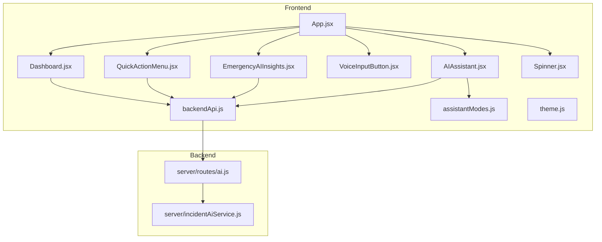
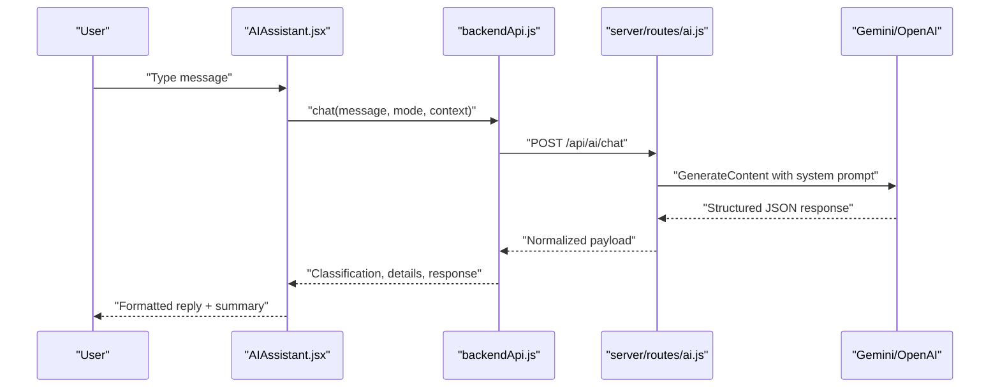
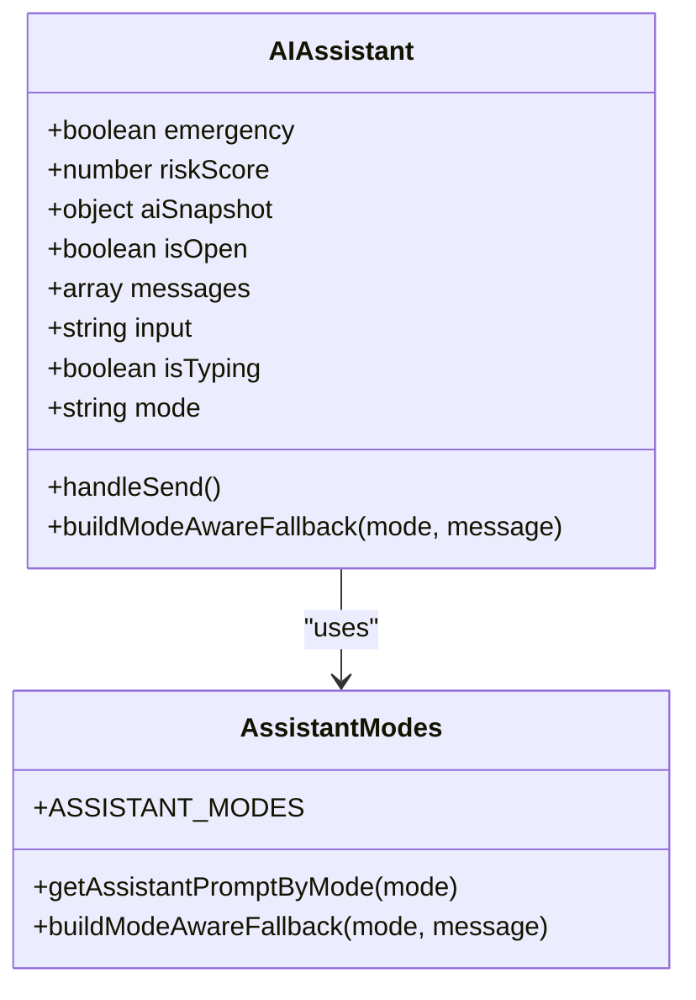
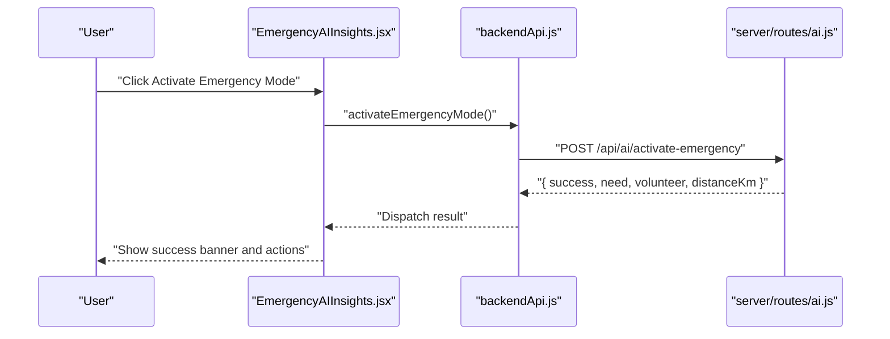
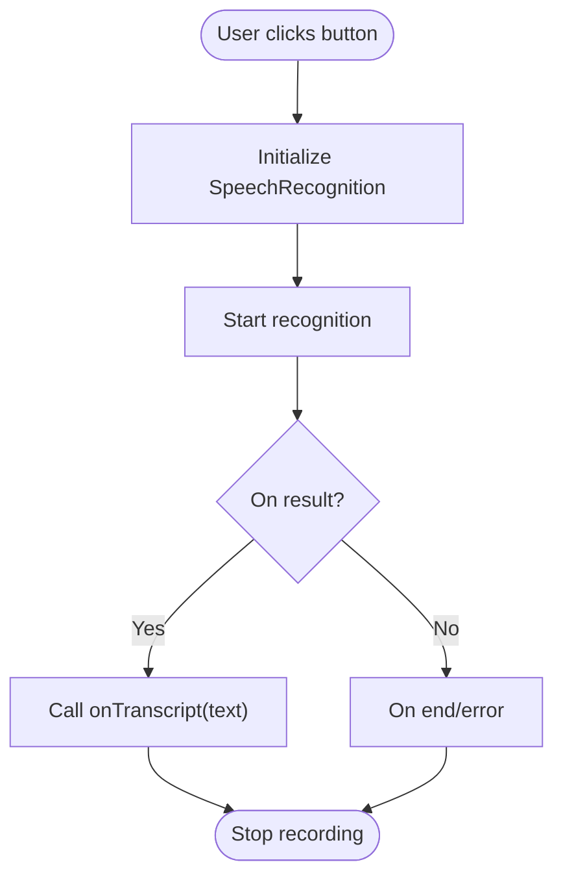
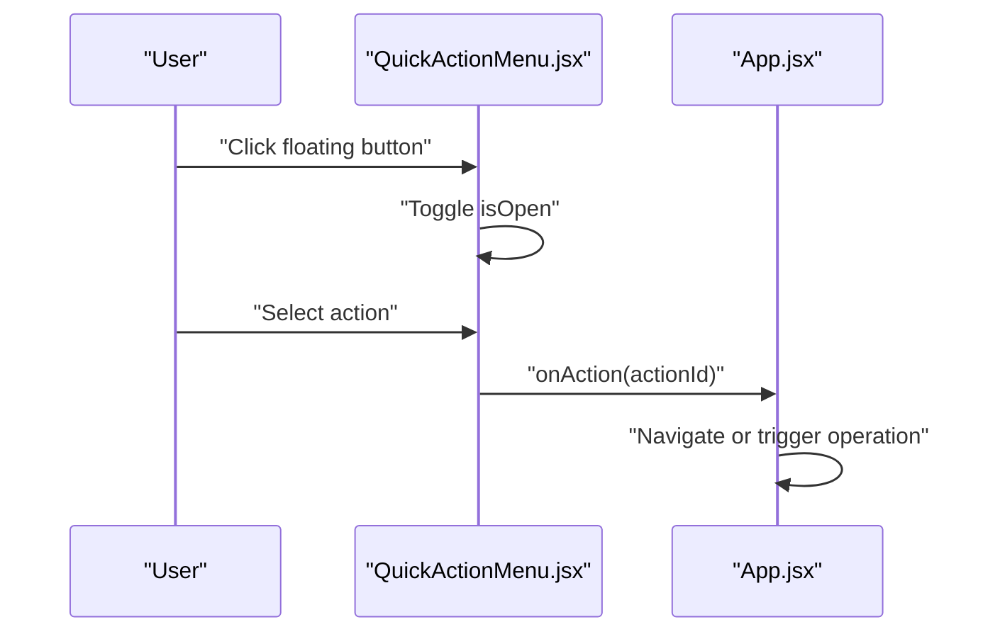
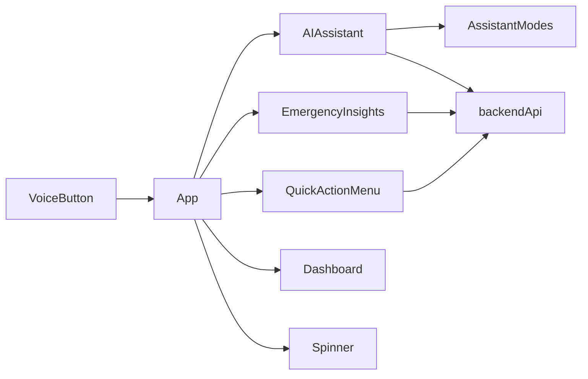

# Specialized Components

<cite>
**Referenced Files in This Document**
- [AIAssistant.jsx](file://src/components/AIAssistant.jsx)
- [EmergencyAIInsights.jsx](file://src/components/EmergencyAIInsights.jsx)
- [VoiceInputButton.jsx](file://src/components/VoiceInputButton.jsx)
- [QuickActionMenu.jsx](file://src/components/QuickActionMenu.jsx)
- [Spinner.jsx](file://src/components/Spinner.jsx)
- [assistantModes.js](file://src/services/assistantModes.js)
- [api.js](file://src/services/api.js)
- [incidentAI.js](file://src/services/incidentAI.js)
- [gemini.js](file://src/services/gemini.js)
- [backendApi.js](file://src/services/backendApi.js)
- [aiLogic.js](file://src/utils/aiLogic.js)
- [theme.js](file://src/styles/theme.js)
- [App.jsx](file://src/App.jsx)
- [Dashboard.jsx](file://src/pages/Dashboard.jsx)
- [ai.js](file://server/routes/ai.js)
- [incidentAiService.js](file://server/incidentAiService.js)
</cite>

## Table of Contents
1. [Introduction](#introduction)
2. [Project Structure](#project-structure)
3. [Core Components](#core-components)
4. [Architecture Overview](#architecture-overview)
5. [Detailed Component Analysis](#detailed-component-analysis)
6. [Dependency Analysis](#dependency-analysis)
7. [Performance Considerations](#performance-considerations)
8. [Troubleshooting Guide](#troubleshooting-guide)
9. [Conclusion](#conclusion)
10. [Appendices](#appendices)

## Introduction
This document focuses on five specialized components that power conversational AI, emergency insights, voice-enabled input, quick action workflows, and loading states. It explains how these components integrate with the backend AI pipeline, emergency triggers, voice recognition, and quick action configuration. It also covers real-time AI processing, emergency response workflows, and accessibility considerations for specialized input methods.

## Project Structure
These components are part of a React frontend with a Node.js Express backend. The frontend communicates with the backend via a thin HTTP client, while the backend proxies AI requests to external providers and orchestrates emergency workflows.

**Diagram sources**
- [App.jsx:227-284](file://src/App.jsx#L227-L284)
- [AIAssistant.jsx:1-311](file://src/components/AIAssistant.jsx#L1-L311)
- [EmergencyAIInsights.jsx:1-600](file://src/components/EmergencyAIInsights.jsx#L1-L600)
- [VoiceInputButton.jsx:1-35](file://src/components/VoiceInputButton.jsx#L1-L35)
- [QuickActionMenu.jsx:1-81](file://src/components/QuickActionMenu.jsx#L1-L81)
- [Spinner.jsx:1-11](file://src/components/Spinner.jsx#L1-L11)
- [backendApi.js:1-164](file://src/services/backendApi.js#L1-L164)
- [assistantModes.js:1-36](file://src/services/assistantModes.js#L1-L36)
- [theme.js:1-57](file://src/styles/theme.js#L1-L57)
- [ai.js:1-348](file://server/routes/ai.js#L1-L348)
- [incidentAiService.js:1-189](file://server/incidentAiService.js#L1-L189)

**Section sources**
- [App.jsx:227-284](file://src/App.jsx#L227-L284)
- [ai.js:1-348](file://server/routes/ai.js#L1-L348)

## Core Components
- AIAssistant: A floating chat interface that integrates with a backend AI chat endpoint, supports multiple assistant modes, and displays live AI telemetry summaries.
- EmergencyAIInsights: A panel that surfaces emergency activation controls, displays AI summaries, and manages emergency dispatch states.
- VoiceInputButton: A button that starts speech recognition using the browser’s Web Speech API and emits transcripts.
- QuickActionMenu: A floating menu that provides rapid access to common operations like emergency activation, smart assignment, task creation, volunteer onboarding, and data upload.
- Spinner: A lightweight loader component used to indicate asynchronous operations.

**Section sources**
- [AIAssistant.jsx:7-311](file://src/components/AIAssistant.jsx#L7-L311)
- [EmergencyAIInsights.jsx:49-600](file://src/components/EmergencyAIInsights.jsx#L49-L600)
- [VoiceInputButton.jsx:3-35](file://src/components/VoiceInputButton.jsx#L3-L35)
- [QuickActionMenu.jsx:5-81](file://src/components/QuickActionMenu.jsx#L5-L81)
- [Spinner.jsx:3-11](file://src/components/Spinner.jsx#L3-L11)

## Architecture Overview
The specialized components interact with a backend AI pipeline that:
- Accepts chat messages and assistant mode context.
- Calls an LLM (via Gemini/OpenAI) to classify and respond to user queries.
- Returns structured outputs suitable for display in the assistant UI.
- Powers emergency workflows by creating urgent tasks and assigning nearby volunteers.

**Diagram sources**
- [AIAssistant.jsx:30-79](file://src/components/AIAssistant.jsx#L30-L79)
- [backendApi.js:110-115](file://src/services/backendApi.js#L110-L115)
- [ai.js:81-178](file://server/routes/ai.js#L81-L178)
- [incidentAiService.js:170-189](file://server/incidentAiService.js#L170-L189)

## Detailed Component Analysis

### AIAssistant
AIAssistant provides a floating chat experience with:
- Modes: Coordinator, Responder, Citizen, each with tailored instructions and fallback guidance.
- Live telemetry: Displays risk score, lead/deploy messages derived from AI insights.
- Real-time chat: Sends user messages to the backend chat endpoint with emergency and risk context.
- Typing indicators and suggestions for quick prompts.

**Diagram sources**
- [AIAssistant.jsx:7-311](file://src/components/AIAssistant.jsx#L7-L311)
- [assistantModes.js:1-36](file://src/services/assistantModes.js#L1-L36)

**Section sources**
- [AIAssistant.jsx:30-79](file://src/components/AIAssistant.jsx#L30-L79)
- [assistantModes.js:22-35](file://src/services/assistantModes.js#L22-L35)

### EmergencyAIInsights
EmergencyAIInsights enables:
- Emergency activation with a single click, invoking backend emergency mode.
- Display of AI summary with animated terminal-style output.
- Success/failure states with copyable text and navigation actions.

**Diagram sources**
- [EmergencyAIInsights.jsx:67-87](file://src/components/EmergencyAIInsights.jsx#L67-L87)
- [api.js:428-517](file://src/services/api.js#L428-L517)
- [ai.js:81-178](file://server/routes/ai.js#L81-L178)

**Section sources**
- [EmergencyAIInsights.jsx:67-87](file://src/components/EmergencyAIInsights.jsx#L67-L87)
- [api.js:428-517](file://src/services/api.js#L428-L517)

### VoiceInputButton
VoiceInputButton wraps browser speech recognition:
- Uses SpeechRecognition (or webkit variant) to capture audio and emit transcript text.
- Provides visual feedback via recording state and button styling.
- Integrates with higher-level components by emitting transcripts via a callback.

**Diagram sources**
- [VoiceInputButton.jsx:7-23](file://src/components/VoiceInputButton.jsx#L7-L23)

**Section sources**
- [VoiceInputButton.jsx:3-35](file://src/components/VoiceInputButton.jsx#L3-L35)

### QuickActionMenu
QuickActionMenu offers rapid task execution:
- Floating menu with spring animations and overlay background.
- Actions include Emergency Mode, Smart Assign, New Task, Add Volunteer, Upload Data.
- onAction handler routes actions to navigation or backend operations.

**Diagram sources**
- [QuickActionMenu.jsx:18-78](file://src/components/QuickActionMenu.jsx#L18-L78)
- [App.jsx:252-264](file://src/App.jsx#L252-L264)

**Section sources**
- [QuickActionMenu.jsx:5-81](file://src/components/QuickActionMenu.jsx#L5-L81)
- [App.jsx:252-264](file://src/App.jsx#L252-L264)

### Spinner
Spinner is a minimal loader component:
- Renders a centered rotating indicator using theme colors.
- Suitable for async operations across the app.

**Section sources**
- [Spinner.jsx:3-11](file://src/components/Spinner.jsx#L3-L11)
- [theme.js:3-28](file://src/styles/theme.js#L3-L28)

## Dependency Analysis
- AIAssistant depends on assistant modes and backend chat API.
- EmergencyAIInsights depends on backend emergency activation and API utilities.
- VoiceInputButton depends on browser APIs and emits transcripts.
- QuickActionMenu depends on navigation and backend operations.
- Spinner is a standalone UI indicator.

**Diagram sources**
- [AIAssistant.jsx:5-6](file://src/components/AIAssistant.jsx#L5-L6)
- [assistantModes.js:1-36](file://src/services/assistantModes.js#L1-L36)
- [backendApi.js:56-163](file://src/services/backendApi.js#L56-L163)
- [EmergencyAIInsights.jsx:15-87](file://src/components/EmergencyAIInsights.jsx#L15-L87)
- [QuickActionMenu.jsx:1-2](file://src/components/QuickActionMenu.jsx#L1-L2)
- [VoiceInputButton.jsx:1-1](file://src/components/VoiceInputButton.jsx#L1-L1)
- [App.jsx:250-272](file://src/App.jsx#L250-L272)

**Section sources**
- [App.jsx:250-272](file://src/App.jsx#L250-L272)
- [backendApi.js:56-163](file://src/services/backendApi.js#L56-L163)

## Performance Considerations
- AI chat requests: Debounce user input and disable send while typing to reduce network load.
- Emergency activation: Guard against concurrent dispatch attempts; show loading states and clear error messages promptly.
- Voice recognition: Stop recognition on error and avoid overlapping sessions.
- Rendering: Use memoization for expensive computations (e.g., risk scoring) and keep message lists virtualized if needed.
- Caching: Reuse backend tokens and avoid redundant re-authentication.

[No sources needed since this section provides general guidance]

## Troubleshooting Guide
Common issues and remedies:
- AI chat fails: Verify backend token presence and Gemini API key configuration. Check normalized JSON parsing and error propagation.
- Emergency activation fails: Ensure volunteer coordinates exist and backend route returns success payload.
- Voice recognition unsupported: Detect lack of SpeechRecognition and provide fallback instructions.
- Loading states: Use Spinner consistently and ensure proper cleanup of intervals and listeners.

**Section sources**
- [ai.js:92-94](file://server/routes/ai.js#L92-L94)
- [ai.js:155-158](file://server/routes/ai.js#L155-L158)
- [EmergencyAIInsights.jsx:82-86](file://src/components/EmergencyAIInsights.jsx#L82-L86)
- [VoiceInputButton.jsx:8-9](file://src/components/VoiceInputButton.jsx#L8-L9)

## Conclusion
These specialized components form a cohesive system for conversational AI, emergency response, voice-enabled input, quick actions, and loading states. They integrate tightly with backend AI services and emergency workflows, enabling efficient crisis operations with real-time insights and responsive user interactions.

[No sources needed since this section summarizes without analyzing specific files]

## Appendices

### AI Integration Patterns
- Chat endpoint: Structured JSON classification, details, and response returned to the assistant UI.
- Assistant modes: Mode-aware prompts and fallback guidance for resilient UX.
- Risk scoring and insights: Live telemetry displayed alongside chat for situational awareness.

**Section sources**
- [ai.js:111-170](file://server/routes/ai.js#L111-L170)
- [assistantModes.js:22-35](file://src/services/assistantModes.js#L22-L35)
- [aiLogic.js:39-64](file://src/utils/aiLogic.js#L39-L64)

### Emergency Response Workflows
- Trigger mechanisms: Automatic emergency activation based on risk scoring and manual deactivation with pause timers.
- Dispatch logic: Creates urgent need, selects nearest available volunteer, updates state and notifications.

**Section sources**
- [App.jsx:64-91](file://src/App.jsx#L64-L91)
- [App.jsx:195-198](file://src/App.jsx#L195-L198)
- [api.js:428-517](file://src/services/api.js#L428-L517)

### Voice Command Handling
- Recognition setup: Configures language, interim results, and alternative counts.
- Transcript emission: Invokes callback with recognized text; handles errors by stopping recording.

**Section sources**
- [VoiceInputButton.jsx:7-23](file://src/components/VoiceInputButton.jsx#L7-L23)

### Quick Action Configuration
- Action list: Extensible set of actions with icons, colors, and labels.
- Navigation routing: Translates actions into navigation targets or backend operations.

**Section sources**
- [QuickActionMenu.jsx:10-16](file://src/components/QuickActionMenu.jsx#L10-L16)
- [App.jsx:252-264](file://src/App.jsx#L252-L264)

### Loading State Management
- Spinner component: Centralized loader with theme-based styling.
- Dashboard loading: Uses Spinner while fetching stats, needs, and charts.

**Section sources**
- [Spinner.jsx:3-11](file://src/components/Spinner.jsx#L3-L11)
- [Dashboard.jsx:141](file://src/pages/Dashboard.jsx#L141)