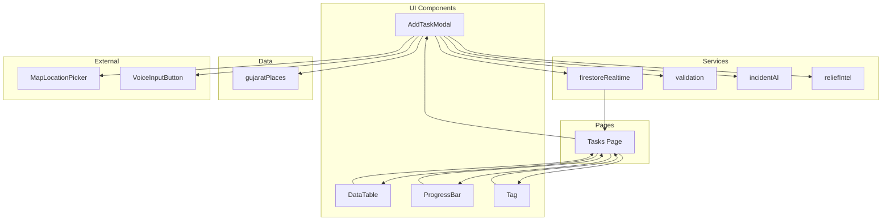
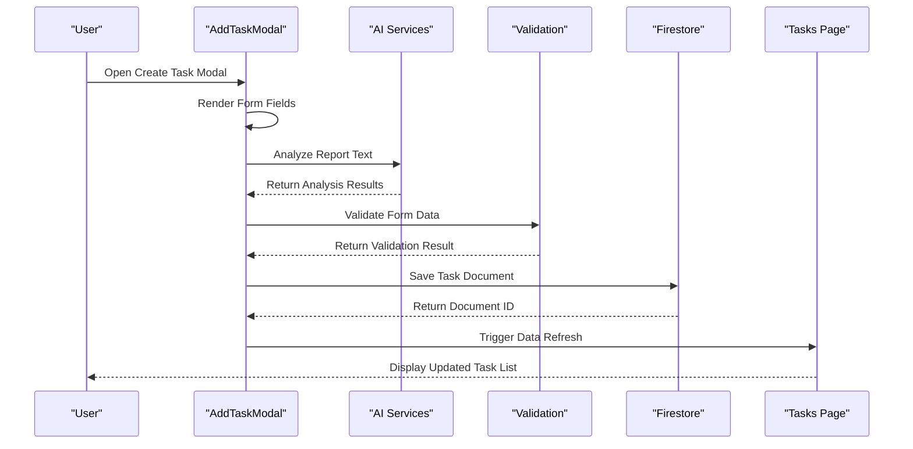
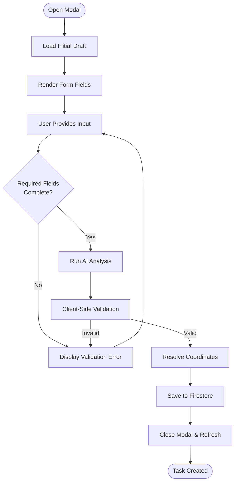
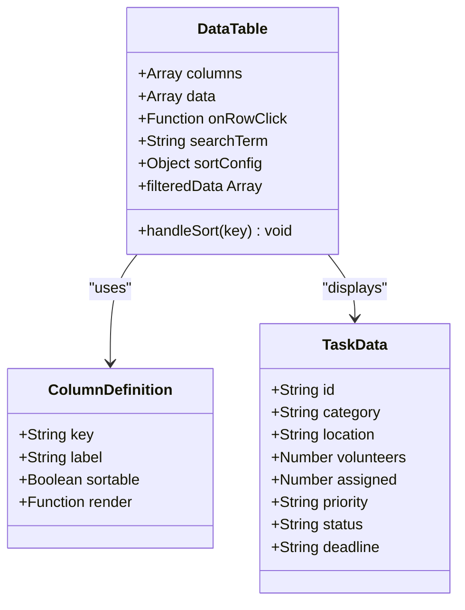
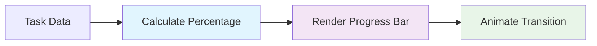
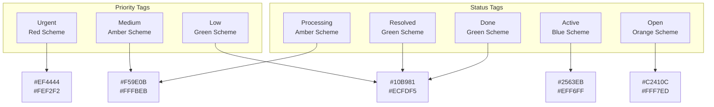
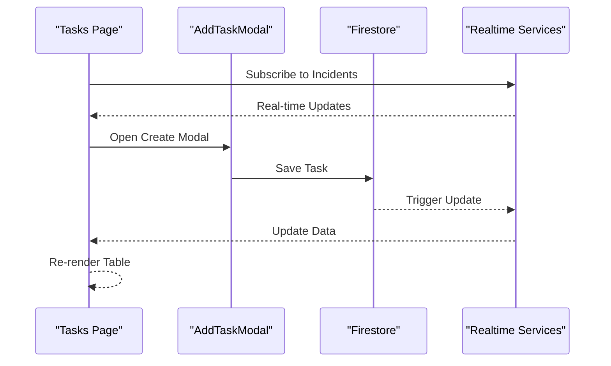
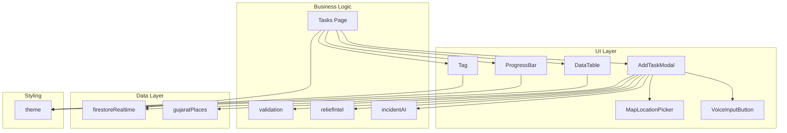

# Task Management Components

<cite>
**Referenced Files in This Document**
- [AddTaskModal.jsx](file://src/components/AddTaskModal.jsx)
- [DataTable.jsx](file://src/components/DataTable.jsx)
- [ProgressBar.jsx](file://src/components/ProgressBar.jsx)
- [Tag.jsx](file://src/components/Tag.jsx)
- [Tasks.jsx](file://src/pages/Tasks.jsx)
- [firestoreRealtime.js](file://src/services/firestoreRealtime.js)
- [validation.js](file://src/utils/validation.js)
- [theme.js](file://src/styles/theme.js)
- [gujaratPlaces.js](file://src/data/gujaratPlaces.js)
- [reliefIntel.js](file://src/utils/reliefIntel.js)
- [incidentAI.js](file://src/services/incidentAI.js)
- [MapLocationPicker.jsx](file://src/components/MapLocationPicker.jsx)
- [VoiceInputButton.jsx](file://src/components/VoiceInputButton.jsx)
</cite>

## Table of Contents
1. [Introduction](#introduction)
2. [Project Structure](#project-structure)
3. [Core Components](#core-components)
4. [Architecture Overview](#architecture-overview)
5. [Detailed Component Analysis](#detailed-component-analysis)
6. [Dependency Analysis](#dependency-analysis)
7. [Performance Considerations](#performance-considerations)
8. [Troubleshooting Guide](#troubleshooting-guide)
9. [Conclusion](#conclusion)

## Introduction
This document provides comprehensive documentation for the task management interface components in the emergency relief coordination platform. It covers the AddTaskModal for task creation, DataTable for task listing and management, ProgressBar for progress tracking, and Tag for status indicators. The documentation explains modal workflows, form validation patterns, table sorting and filtering capabilities, progress calculation logic, and tag styling variants. It also details integration with task data models, real-time updates, and user interaction patterns, including examples of task CRUD operations, progress monitoring, and status management.

## Project Structure
The task management functionality is organized around four primary UI components and supporting services:

- **AddTaskModal**: Modal dialog for creating new tasks with AI-powered analysis and location selection
- **DataTable**: Generic table component with search, sort, and filter capabilities
- **ProgressBar**: Progress visualization component for volunteer assignment tracking
- **Tag**: Status indicator component with variant styling
- **Tasks Page**: Main page orchestrating task listing, filtering, and actions
- **Services**: Firestore integration, validation utilities, and AI analysis services
- **Data**: Gujarat region location data and coordinate resolution

**Diagram sources**
- [AddTaskModal.jsx:1-590](file://src/components/AddTaskModal.jsx#L1-L590)
- [DataTable.jsx:1-114](file://src/components/DataTable.jsx#L1-L114)
- [ProgressBar.jsx:1-17](file://src/components/ProgressBar.jsx#L1-L17)
- [Tag.jsx:1-13](file://src/components/Tag.jsx#L1-L13)
- [Tasks.jsx:1-367](file://src/pages/Tasks.jsx#L1-L367)
- [firestoreRealtime.js:1-212](file://src/services/firestoreRealtime.js#L1-L212)
- [validation.js:1-123](file://src/utils/validation.js#L1-L123)
- [incidentAI.js:1-24](file://src/services/incidentAI.js#L1-L24)
- [reliefIntel.js:1-47](file://src/utils/reliefIntel.js#L1-L47)
- [gujaratPlaces.js:1-116](file://src/data/gujaratPlaces.js#L1-L116)
- [MapLocationPicker.jsx:1-94](file://src/components/MapLocationPicker.jsx#L1-L94)
- [VoiceInputButton.jsx:1-35](file://src/components/VoiceInputButton.jsx#L1-L35)

**Section sources**
- [AddTaskModal.jsx:1-590](file://src/components/AddTaskModal.jsx#L1-L590)
- [DataTable.jsx:1-114](file://src/components/DataTable.jsx#L1-L114)
- [ProgressBar.jsx:1-17](file://src/components/ProgressBar.jsx#L1-L17)
- [Tag.jsx:1-13](file://src/components/Tag.jsx#L1-L13)
- [Tasks.jsx:1-367](file://src/pages/Tasks.jsx#L1-L367)

## Core Components

### AddTaskModal Component
The AddTaskModal provides a comprehensive form for creating new tasks with integrated AI analysis and location selection capabilities.

Key features:
- **Dual Location Input Modes**: Place suggestions dropdown and interactive map picker
- **AI-Powered Analysis**: Automatic categorization and urgency scoring from incident reports
- **Real-time Validation**: Client-side validation before Firestore writes
- **Coordinate Resolution**: Automatic geolocation fallback based on region and location
- **Voice Input Integration**: Speech-to-text transcription for report entry

**Section sources**
- [AddTaskModal.jsx:26-590](file://src/components/AddTaskModal.jsx#L26-L590)

### DataTable Component
A flexible table component with built-in search, sorting, and animation capabilities.

Key features:
- **Universal Search**: Case-insensitive filtering across all data columns
- **Multi-column Sorting**: Toggle between ascending and descending order
- **Animated Transitions**: Smooth entry/exit animations for table rows
- **Custom Rendering**: Column-level rendering functions for complex data display
- **Responsive Design**: Horizontal scrolling for small screens

**Section sources**
- [DataTable.jsx:6-114](file://src/components/DataTable.jsx#L6-L114)

### ProgressBar Component
A lightweight progress visualization component for displaying completion percentages.

Key features:
- **Dynamic Percentage Calculation**: Automatic percentage computation from value/max
- **Color-coded Indicators**: Gradient color transitions based on progress
- **Compact Layout**: Minimal styling with label and value display
- **Smooth Animations**: CSS transitions for progress updates

**Section sources**
- [ProgressBar.jsx:3-17](file://src/components/ProgressBar.jsx#L3-L17)

### Tag Component
A versatile status indicator component with predefined styling variants.

Key features:
- **Priority Variants**: Urgent, Medium, Low with corresponding color schemes
- **Status Variants**: Active, Resolved, Open, Processing, Done
- **Consistent Styling**: Uniform typography and spacing across variants
- **Theme Integration**: Uses global design tokens for consistent appearance

**Section sources**
- [Tag.jsx:3-13](file://src/components/Tag.jsx#L3-L13)

## Architecture Overview

The task management system follows a modular architecture with clear separation of concerns:

**Diagram sources**
- [AddTaskModal.jsx:84-133](file://src/components/AddTaskModal.jsx#L84-L133)
- [firestoreRealtime.js:132-156](file://src/services/firestoreRealtime.js#L132-L156)
- [validation.js:30-80](file://src/utils/validation.js#L30-L80)
- [incidentAI.js:1-16](file://src/services/incidentAI.js#L1-L16)
- [Tasks.jsx:109-115](file://src/pages/Tasks.jsx#L109-L115)

The architecture integrates multiple data sources and services:
- **Real-time Firestore Integration**: Bidirectional sync with Firebase Realtime Database
- **AI-Powered Analysis**: Gemini-based incident analysis and categorization
- **Geographic Intelligence**: Coordinate resolution and region-based suggestions
- **Voice Recognition**: Browser speech-to-text integration for hands-free input

## Detailed Component Analysis

### AddTaskModal Workflow Analysis

The modal implements a sophisticated multi-step workflow for task creation:

**Diagram sources**
- [AddTaskModal.jsx:45-133](file://src/components/AddTaskModal.jsx#L45-L133)
- [validation.js:30-80](file://src/utils/validation.js#L30-L80)
- [gujaratPlaces.js:92-115](file://src/data/gujaratPlaces.js#L92-L115)

#### Form Validation Patterns
The modal implements comprehensive client-side validation before attempting Firestore writes:

**Validation Categories:**
- **Required Fields**: Category and location are mandatory
- **Format Validation**: Email normalization and sanitization
- **Range Validation**: Volunteers count (1-1000), assigned count bounds
- **Geographic Validation**: Latitude (-90 to 90), longitude (-180 to 180)
- **Priority Validation**: Restricted to urgent, medium, low

**Section sources**
- [AddTaskModal.jsx:84-133](file://src/components/AddTaskModal.jsx#L84-L133)
- [validation.js:30-80](file://src/utils/validation.js#L30-L80)

#### AI Integration and Analysis
The modal integrates with AI services for intelligent task analysis:

**Analysis Capabilities:**
- **Automatic Categorization**: Food, Medical, Shelter detection from text
- **Urgency Scoring**: 0-100 scale with randomization for realistic variation
- **Priority Assignment**: Dynamic priority based on urgency level
- **Location Extraction**: Geotagging from incident descriptions
- **Risk Assessment**: Comprehensive risk scoring and tagging

**Section sources**
- [AddTaskModal.jsx:135-174](file://src/components/AddTaskModal.jsx#L135-L174)
- [reliefIntel.js:8-26](file://src/utils/reliefIntel.js#L8-L26)
- [incidentAI.js:1-24](file://src/services/incidentAI.js#L1-L24)

### DataTable Component Implementation

The DataTable component provides a robust foundation for displaying tabular task data:

**Diagram sources**
- [DataTable.jsx:6-33](file://src/components/DataTable.jsx#L6-L33)

#### Search and Filtering Mechanisms
The component implements universal search across all data fields with case-insensitive matching and debounced filtering.

**Search Features:**
- **Multi-field Matching**: Searches across all object properties
- **Debounced Updates**: Prevents excessive re-renders during typing
- **Empty State Handling**: Clear messaging when no results found
- **Column-level Control**: Sortable columns with visual indicators

**Section sources**
- [DataTable.jsx:16-33](file://src/components/DataTable.jsx#L16-L33)

### Progress Tracking Implementation

The ProgressBar component provides visual feedback for volunteer assignment progress:

**Diagram sources**
- [ProgressBar.jsx:3-16](file://src/components/ProgressBar.jsx#L3-L16)

#### Progress Calculation Logic
The component calculates progress as a percentage of assigned volunteers against total needed volunteers, with automatic percentage rounding and smooth CSS transitions.

**Progress Features:**
- **Dynamic Width Calculation**: Responsive width based on value/max ratio
- **Gradient Color Effects**: Blue gradient with alpha transparency
- **Value Display**: Current/maximum value with contextual formatting
- **Transition Animations**: 1-second ease-in-out width transitions

**Section sources**
- [ProgressBar.jsx:3-16](file://src/components/ProgressBar.jsx#L3-L16)

### Tag Styling Variants

The Tag component implements a comprehensive color scheme for status and priority indicators:

**Diagram sources**
- [Tag.jsx:4-10](file://src/components/Tag.jsx#L4-L10)
- [theme.js:3-28](file://src/styles/theme.js#L3-L28)

#### Tag Styling System
Each tag variant uses a two-tone color scheme with light background and darker text for optimal contrast and visual hierarchy.

**Styling Features:**
- **Consistent Typography**: 11px font size with 700 font weight
- **Rounded Corners**: 100px border radius for pill-shaped tags
- **Uniform Spacing**: 4px vertical padding, 12px horizontal padding
- **Flex Layout**: Inline-flex with 4px gap for tag stacking

**Section sources**
- [Tag.jsx:3-12](file://src/components/Tag.jsx#L3-L12)
- [theme.js:40-43](file://src/styles/theme.js#L40-L43)

### Tasks Page Integration

The Tasks page orchestrates all task management functionality with real-time data synchronization:

**Diagram sources**
- [Tasks.jsx:8-34](file://src/pages/Tasks.jsx#L8-L34)
- [Tasks.jsx:109-115](file://src/pages/Tasks.jsx#L109-L115)
- [firestoreRealtime.js:61-73](file://src/services/firestoreRealtime.js#L61-L73)

#### Task CRUD Operations
The page implements full CRUD functionality with proper error handling and user feedback:

**Create Operation:**
- Modal-based form submission with AI integration
- Client-side validation before Firestore write
- Real-time data refresh after successful creation

**Read Operation:**
- Real-time subscription to Firestore incidents
- Smart ordering based on AI priority scores
- Filtered views by status categories

**Update Operation:**
- Status change to resolved with confirmation
- Real-time UI updates with loading states
- Error boundary handling

**Delete Operation:**
- Confirmation dialog for destructive action
- Immediate UI removal with error handling
- Firestore document deletion

**Section sources**
- [Tasks.jsx:59-87](file://src/pages/Tasks.jsx#L59-L87)
- [Tasks.jsx:109-115](file://src/pages/Tasks.jsx#L109-L115)

## Dependency Analysis

The task management components have well-defined dependencies that support maintainability and scalability:

**Diagram sources**
- [AddTaskModal.jsx:1-14](file://src/components/AddTaskModal.jsx#L1-L14)
- [DataTable.jsx:1-4](file://src/components/DataTable.jsx#L1-L4)
- [ProgressBar.jsx:1-2](file://src/components/ProgressBar.jsx#L1-L2)
- [Tag.jsx:1-2](file://src/components/Tag.jsx#L1-L2)
- [Tasks.jsx:1-7](file://src/pages/Tasks.jsx#L1-L7)
- [firestoreRealtime.js:1-17](file://src/services/firestoreRealtime.js#L1-L17)
- [validation.js:1-6](file://src/utils/validation.js#L1-L6)
- [incidentAI.js:1-16](file://src/services/incidentAI.js#L1-L16)
- [reliefIntel.js:1-2](file://src/utils/reliefIntel.js#L1-L2)
- [gujaratPlaces.js:1-6](file://src/data/gujaratPlaces.js#L1-L6)
- [theme.js:1-28](file://src/styles/theme.js#L1-L28)

### Component Coupling Analysis
The components demonstrate loose coupling through well-defined interfaces and shared dependencies:

**Coupling Strengths:**
- **UI Components**: Minimal direct dependencies, relying on props and callbacks
- **Service Layer**: Centralized Firestore integration with clear API boundaries
- **Utility Layer**: Pure functions with predictable input/output behavior
- **Data Layer**: Geographic utilities with focused geographic calculations

**Potential Circular Dependencies:**
- None detected between UI components and services
- Services maintain clean separation between data access and business logic
- Utilities remain stateless and dependency-free

**Section sources**
- [AddTaskModal.jsx:1-14](file://src/components/AddTaskModal.jsx#L1-L14)
- [DataTable.jsx:1-4](file://src/components/DataTable.jsx#L1-L4)
- [ProgressBar.jsx:1-2](file://src/components/ProgressBar.jsx#L1-L2)
- [Tag.jsx:1-2](file://src/components/Tag.jsx#L1-L2)

## Performance Considerations

### Optimization Strategies

**Memory Management:**
- Modal components use React state hooks efficiently with minimal re-renders
- DataTable implements memoization for filtered data to prevent unnecessary computations
- Progress bars use CSS transitions instead of JavaScript animations for GPU acceleration

**Network Optimization:**
- Firestore subscriptions provide real-time updates with efficient delta updates
- Client-side validation prevents unnecessary network requests
- Debounced search filters reduce computational overhead during typing

**Rendering Performance:**
- Framer Motion animations are hardware-accelerated and optimized for smooth performance
- CSS transforms and opacity changes leverage GPU acceleration
- Virtual scrolling could be implemented for large datasets

### Scalability Considerations
- Firestore queries are optimized with proper indexing and pagination
- AI analysis results are cached locally to reduce API calls
- Component composition allows for easy extension and customization

## Troubleshooting Guide

### Common Issues and Solutions

**Modal Form Validation Failures:**
- **Issue**: Validation errors prevent task creation
- **Solution**: Check required fields (category, location, deadline) and ensure proper formatting
- **Prevention**: Implement real-time validation feedback and clear error messages

**AI Analysis Errors:**
- **Issue**: AI analysis fails or returns unexpected results
- **Solution**: Verify API endpoint connectivity and check response format
- **Prevention**: Implement retry logic and graceful degradation

**Location Resolution Problems:**
- **Issue**: Coordinates not resolving correctly for locations
- **Solution**: Verify region selection and location specificity
- **Prevention**: Implement fallback mechanisms to region centers

**Real-time Sync Issues:**
- **Issue**: Tasks not updating in real-time
- **Solution**: Check Firestore security rules and connection status
- **Prevention**: Implement connection monitoring and automatic reconnection

**Section sources**
- [AddTaskModal.jsx:84-133](file://src/components/AddTaskModal.jsx#L84-L133)
- [firestoreRealtime.js:61-73](file://src/services/firestoreRealtime.js#L61-L73)
- [incidentAI.js:1-16](file://src/services/incidentAI.js#L1-L16)

### Accessibility Considerations

**Keyboard Navigation:**
- All interactive elements support keyboard focus and activation
- Proper tab order maintains logical navigation flow
- Focus indicators clearly visible for screen reader users

**Screen Reader Support:**
- Semantic HTML structure with proper heading hierarchy
- Descriptive labels and aria attributes for form controls
- Clear error messaging with appropriate ARIA roles

**Visual Accessibility:**
- High contrast color schemes for status indicators
- Sufficient color differentiation for priority levels
- Responsive design for various screen sizes and orientations

**Section sources**
- [AddTaskModal.jsx:176-195](file://src/components/AddTaskModal.jsx#L176-L195)
- [DataTable.jsx:66-76](file://src/components/DataTable.jsx#L66-L76)
- [Tag.jsx:10-12](file://src/components/Tag.jsx#L10-L12)

## Conclusion

The task management components provide a comprehensive solution for emergency relief coordination with modern UI patterns and robust backend integration. The modular architecture supports scalability and maintainability while the AI-powered features enhance operational efficiency. The components demonstrate best practices in React development, including proper state management, error handling, and accessibility considerations.

Key strengths include:
- **Intuitive User Experience**: Well-designed forms with real-time feedback
- **Robust Data Validation**: Multi-layered validation preventing data inconsistencies
- **AI Integration**: Intelligent analysis reducing manual workload
- **Real-time Collaboration**: Live updates enabling coordinated response efforts
- **Accessibility Compliance**: Comprehensive accessibility support across all components

The system provides a solid foundation for emergency response operations with clear extension points for additional functionality and customization.