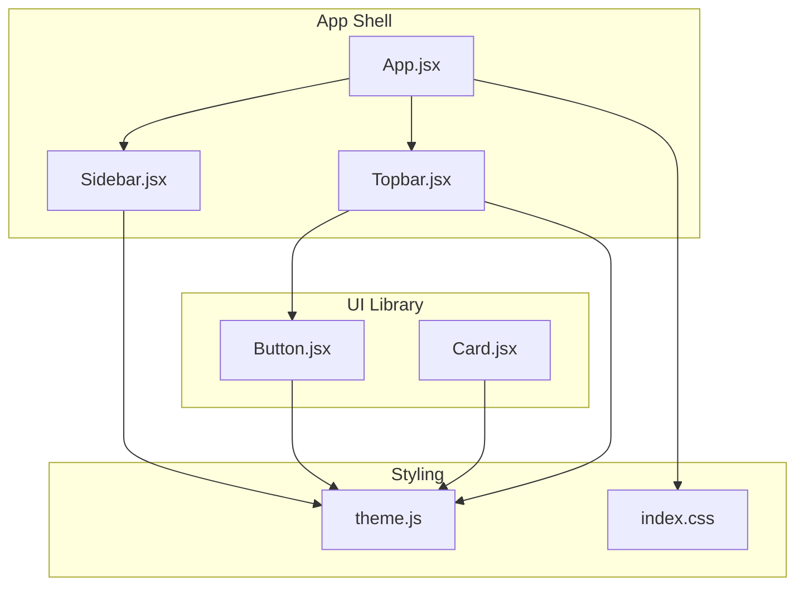
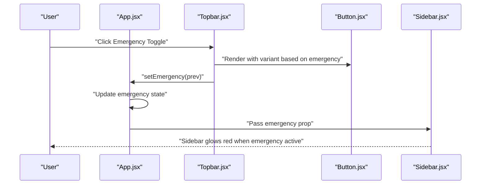
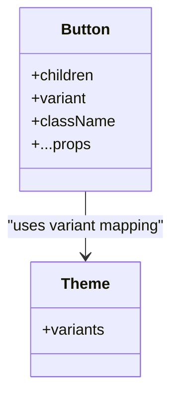
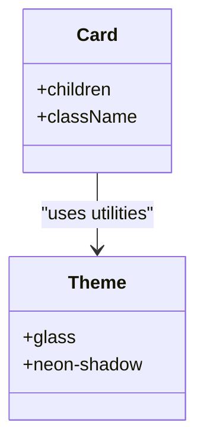
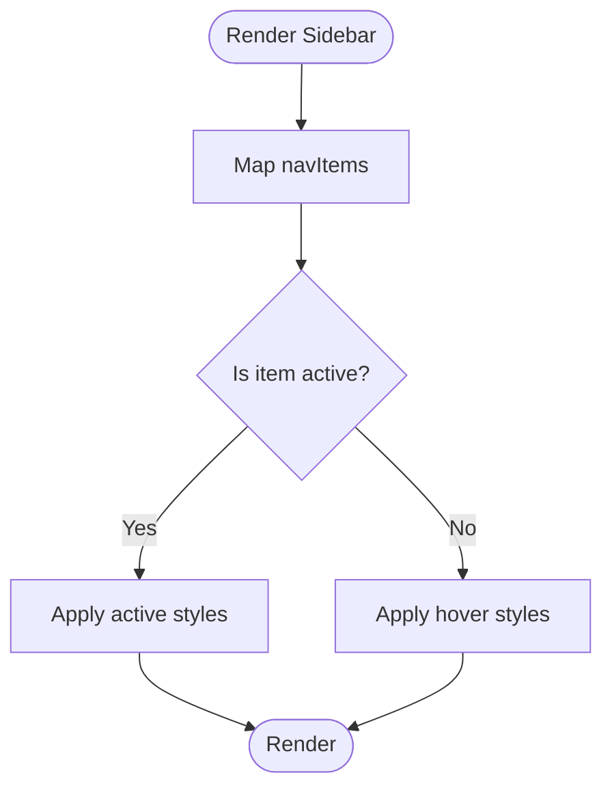
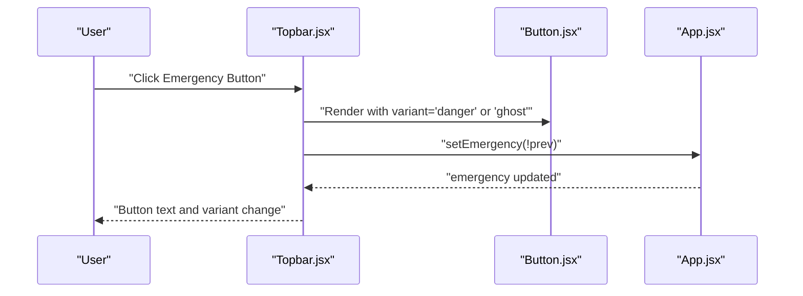
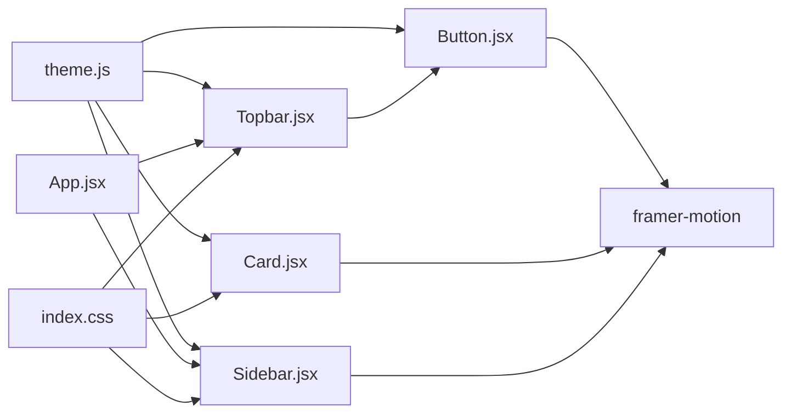

# UI Components

<cite>
**Referenced Files in This Document**
- [Button.jsx](file://src/components/ui/Button.jsx)
- [Card.jsx](file://src/components/ui/Card.jsx)
- [Sidebar.jsx](file://src/components/ui/Sidebar.jsx)
- [Topbar.jsx](file://src/components/ui/Topbar.jsx)
- [theme.js](file://src/styles/theme.js)
- [index.css](file://src/index.css)
- [App.jsx](file://src/App.jsx)
- [main.jsx](file://src/main.jsx)
- [package.json](file://package.json)
</cite>

## Table of Contents
1. [Introduction](#introduction)
2. [Project Structure](#project-structure)
3. [Core Components](#core-components)
4. [Architecture Overview](#architecture-overview)
5. [Detailed Component Analysis](#detailed-component-analysis)
6. [Dependency Analysis](#dependency-analysis)
7. [Performance Considerations](#performance-considerations)
8. [Troubleshooting Guide](#troubleshooting-guide)
9. [Conclusion](#conclusion)
10. [Appendices](#appendices)

## Introduction
This document describes the reusable UI component library used in the application shell. It focuses on four primary UI components: Button, Card, Sidebar, and Topbar. The documentation covers component APIs (props and events), composition patterns, state management integration, responsive design, styling and theming, accessibility considerations, lifecycle and animations, performance optimization, cross-browser compatibility, and testing strategies. It also provides usage guidance and integration notes.

## Project Structure
The UI components are located under the UI module and are composed within the application shell. Styling is centralized via a design tokens and helpers module and Tailwind-based CSS. The app orchestrates navigation, emergency state, and page routing.

**Diagram sources**
- [App.jsx:227-285](file://src/App.jsx#L227-L285)
- [Sidebar.jsx:12-46](file://src/components/ui/Sidebar.jsx#L12-L46)
- [Topbar.jsx:4-33](file://src/components/ui/Topbar.jsx#L4-L33)
- [Button.jsx:9-22](file://src/components/ui/Button.jsx#L9-L22)
- [Card.jsx:3-15](file://src/components/ui/Card.jsx#L3-L15)
- [theme.js:1-57](file://src/styles/theme.js#L1-L57)
- [index.css:1-53](file://src/index.css#L1-L53)

**Section sources**
- [App.jsx:227-285](file://src/App.jsx#L227-L285)
- [index.css:1-53](file://src/index.css#L1-L53)

## Core Components
This section documents the props, events, customization options, and behavior of each UI component.

### Button
- Purpose: Interactive button with gradient backgrounds, hover and press animations, and optional variants.
- Props
  - children: Node | string
  - variant: "primary" | "danger" | "ghost"
  - className: string
  - Additional button attributes are passed through via spread props
- Events
  - onClick, onMouseEnter, onMouseLeave, onTouchStart, etc., depending on usage
- Variants and styling
  - primary: gradient from a primary hue to a cyan tone with white text
  - danger: gradient from red to a lighter red with white text
  - ghost: dark gradient with light text and translucent overlay
- Animation
  - Hover: slight scale increase and glow effect
  - Press: subtle scale-down for tactile feedback
- Accessibility
  - Inherits native button semantics; ensure visible focus styles and sufficient contrast per theme
- Customization
  - Pass additional className to override styles; variant selection controls gradient and text color

**Section sources**
- [Button.jsx:3-22](file://src/components/ui/Button.jsx#L3-L22)
- [theme.js:30-56](file://src/styles/theme.js#L30-L56)

### Card
- Purpose: Content container with a glass-like appearance and subtle 3D hover lift.
- Props
  - children: Node
  - className: string
- Animation
  - Hover: slight lift and subtle 3D rotation for depth perception
- Customization
  - Extend with className for layout and spacing; relies on shared glass and shadow utilities

**Section sources**
- [Card.jsx:1-15](file://src/components/ui/Card.jsx#L1-L15)
- [theme.js:30-56](file://src/styles/theme.js#L30-L56)

### Sidebar
- Purpose: Navigation sidebar with brand identity, navigation items, and emergency highlight.
- Props
  - active: string (current active route id)
  - onChange: (id: string) => void
  - emergency: boolean
- Nav Items
  - Dashboard, Live Map, Volunteers, Insights, AI Center
- Behavior
  - Highlights active item with a cyan glow and subtle shadow
  - Hover effects on buttons for interactive feedback
- Emergency Mode
  - Adds a red glow shadow around the sidebar when emergency is active
- Accessibility
  - Buttons are keyboard focusable; ensure visible focus indicators and ARIA roles if extended

**Section sources**
- [Sidebar.jsx:4-46](file://src/components/ui/Sidebar.jsx#L4-L46)
- [theme.js:30-56](file://src/styles/theme.js#L30-L56)

### Topbar
- Purpose: Header bar with search, notifications, emergency toggle, and user profile.
- Props
  - emergency: boolean
  - setEmergency: (prev: boolean) => void
- Composition
  - Contains a search input and notification bell
  - Renders Button component for emergency toggle with dynamic variant based on state
- Interaction
  - Clicking the Button toggles emergency state
- Accessibility
  - Inputs and buttons are native; ensure labels and ARIA attributes if extended

**Section sources**
- [Topbar.jsx:4-33](file://src/components/ui/Topbar.jsx#L4-L33)
- [Button.jsx:9-22](file://src/components/ui/Button.jsx#L9-L22)

## Architecture Overview
The UI components integrate with the application’s state and routing. The App component manages emergency mode, page routing, and real-time signals. The Sidebar and Topbar are composed within the main shell and coordinate with page content.

**Diagram sources**
- [App.jsx:227-285](file://src/App.jsx#L227-L285)
- [Topbar.jsx:18-25](file://src/components/ui/Topbar.jsx#L18-L25)
- [Button.jsx:9-22](file://src/components/ui/Button.jsx#L9-L22)
- [Sidebar.jsx:14-14](file://src/components/ui/Sidebar.jsx#L14-L14)

## Detailed Component Analysis

### Button Analysis
- Implementation highlights
  - Uses Framer Motion for hover and tap animations
  - Variant mapping defines gradient and text color
  - Pseudo-overlay for ripple-like hover effect
- Props and behavior
  - Supports arbitrary button props via spread
  - Variant-driven styling via a mapping object
- Accessibility and UX
  - Ensure sufficient contrast against gradients
  - Provide focus-visible styles if customizing further

**Diagram sources**
- [Button.jsx:9-22](file://src/components/ui/Button.jsx#L9-L22)
- [theme.js:30-56](file://src/styles/theme.js#L30-L56)

**Section sources**
- [Button.jsx:3-22](file://src/components/ui/Button.jsx#L3-L22)
- [theme.js:30-56](file://src/styles/theme.js#L30-L56)

### Card Analysis
- Implementation highlights
  - Framer Motion spring animation for hover lift and subtle 3D rotation
  - Glass and shadow utilities applied via className
- Props and behavior
  - Extensible via className for layout and spacing
- Accessibility and UX
  - Maintain readable text contrast against glass surfaces

**Diagram sources**
- [Card.jsx:3-15](file://src/components/ui/Card.jsx#L3-L15)
- [theme.js:30-56](file://src/styles/theme.js#L30-L56)

**Section sources**
- [Card.jsx:1-15](file://src/components/ui/Card.jsx#L1-L15)
- [theme.js:30-56](file://src/styles/theme.js#L30-L56)

### Sidebar Analysis
- Implementation highlights
  - Navigation items mapped from a static array
  - Active state computed per item
  - Emergency prop drives visual highlight
- Props and behavior
  - onChange callback invoked with item id on click
- Accessibility and UX
  - Ensure keyboard navigation and ARIA-selected state if extended

**Diagram sources**
- [Sidebar.jsx:22-42](file://src/components/ui/Sidebar.jsx#L22-L42)

**Section sources**
- [Sidebar.jsx:4-46](file://src/components/ui/Sidebar.jsx#L4-L46)

### Topbar Analysis
- Implementation highlights
  - Composes Button for emergency toggle
  - Search input and notification button included
- Props and behavior
  - Receives emergency state and setter
  - Button variant switches based on emergency state

**Diagram sources**
- [Topbar.jsx:18-25](file://src/components/ui/Topbar.jsx#L18-L25)
- [Button.jsx:9-22](file://src/components/ui/Button.jsx#L9-L22)
- [App.jsx:35-35](file://src/App.jsx#L35-L35)

**Section sources**
- [Topbar.jsx:4-33](file://src/components/ui/Topbar.jsx#L4-L33)
- [Button.jsx:9-22](file://src/components/ui/Button.jsx#L9-L22)

## Dependency Analysis
The UI components rely on shared design tokens and animations. The app integrates these components and manages state that influences their appearance and behavior.

**Diagram sources**
- [theme.js:1-57](file://src/styles/theme.js#L1-L57)
- [Button.jsx:1-22](file://src/components/ui/Button.jsx#L1-L22)
- [Card.jsx:1-15](file://src/components/ui/Card.jsx#L1-L15)
- [Sidebar.jsx:1-46](file://src/components/ui/Sidebar.jsx#L1-L46)
- [Topbar.jsx:1-33](file://src/components/ui/Topbar.jsx#L1-L33)
- [App.jsx:227-285](file://src/App.jsx#L227-L285)
- [index.css:1-53](file://src/index.css#L1-L53)

**Section sources**
- [theme.js:1-57](file://src/styles/theme.js#L1-L57)
- [package.json:12-29](file://package.json#L12-L29)

## Performance Considerations
- Animations
  - Prefer hardware-accelerated properties (transform, opacity) used by Framer Motion
  - Keep animation durations reasonable to avoid jank on lower-end devices
- Rendering
  - Use memoization for expensive computations derived from props/state
  - Avoid unnecessary re-renders by passing stable callbacks and avoiding inline prop objects
- Styling
  - Leverage CSS variables and shared utilities to minimize style recalculation
  - Use Tailwind utilities for consistent, optimized class combinations
- Bundle size
  - Tree-shake unused variants and icons
  - Keep animation libraries minimal and scoped

## Troubleshooting Guide
- Button appears low contrast
  - Verify variant text color against the gradient; adjust theme tokens if needed
- Card hover feels sluggish
  - Ensure transform and opacity are used for animations; avoid layout-affecting properties
- Sidebar active item not highlighted
  - Confirm active prop matches the expected id and onChange updates state
- Topbar emergency toggle not switching
  - Check that setEmergency is bound correctly and emergency prop reflects current state
- Scrollbars not styled
  - Ensure global CSS imports are present and browser supports custom scrollbar pseudo-elements

**Section sources**
- [index.css:24-36](file://src/index.css#L24-L36)
- [theme.js:30-56](file://src/styles/theme.js#L30-L56)

## Conclusion
The UI component library provides a cohesive, animated, and themable foundation for the application. By centralizing design tokens and leveraging Framer Motion, the components deliver smooth interactions while maintaining accessibility and performance. Integrating these components with the app’s state enables dynamic behaviors such as emergency highlighting and state-driven variants.

## Appendices

### Props Reference Summary
- Button
  - children: Node | string
  - variant: "primary" | "danger" | "ghost"
  - className: string
  - Additional button attributes pass-through
- Card
  - children: Node
  - className: string
- Sidebar
  - active: string
  - onChange: (id: string) => void
  - emergency: boolean
- Topbar
  - emergency: boolean
  - setEmergency: (prev: boolean) => void

### Theming and Styling
- Design tokens and helpers are exported from the theme module and consumed by components
- Global CSS provides glass and neon-shadow utilities and scrollbar styling
- Fonts and base styles are imported globally

**Section sources**
- [theme.js:1-57](file://src/styles/theme.js#L1-L57)
- [index.css:1-53](file://src/index.css#L1-L53)

### Accessibility Checklist
- Ensure all interactive elements have visible focus states
- Provide meaningful labels for buttons and inputs
- Test keyboard navigation and screen reader compatibility
- Maintain sufficient color contrast against themed backgrounds

### Cross-Browser Compatibility
- Framer Motion and Tailwind are widely supported; test on target browsers
- Verify CSS custom properties and backdrop-filter behavior on older browsers
- Validate scrollbar styling across platforms

### Testing Strategies
- Unit tests for component rendering with different props and variants
- Integration tests for event handlers (e.g., emergency toggle)
- Snapshot tests for visual regressions
- Accessibility tests using automated tools and manual checks