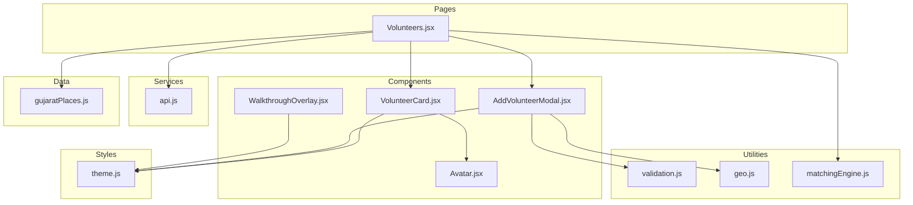
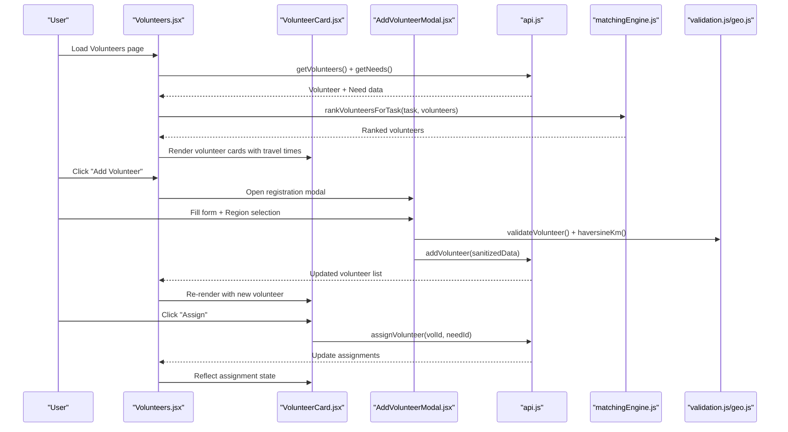
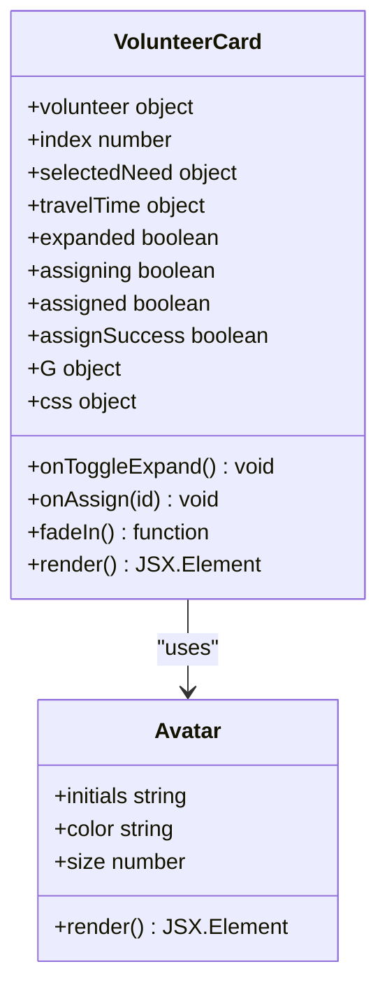
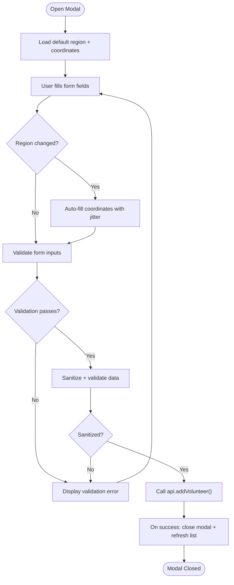
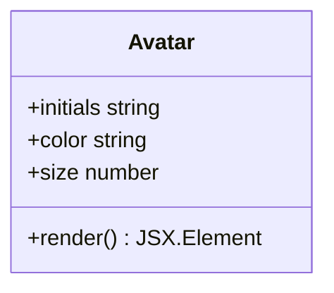
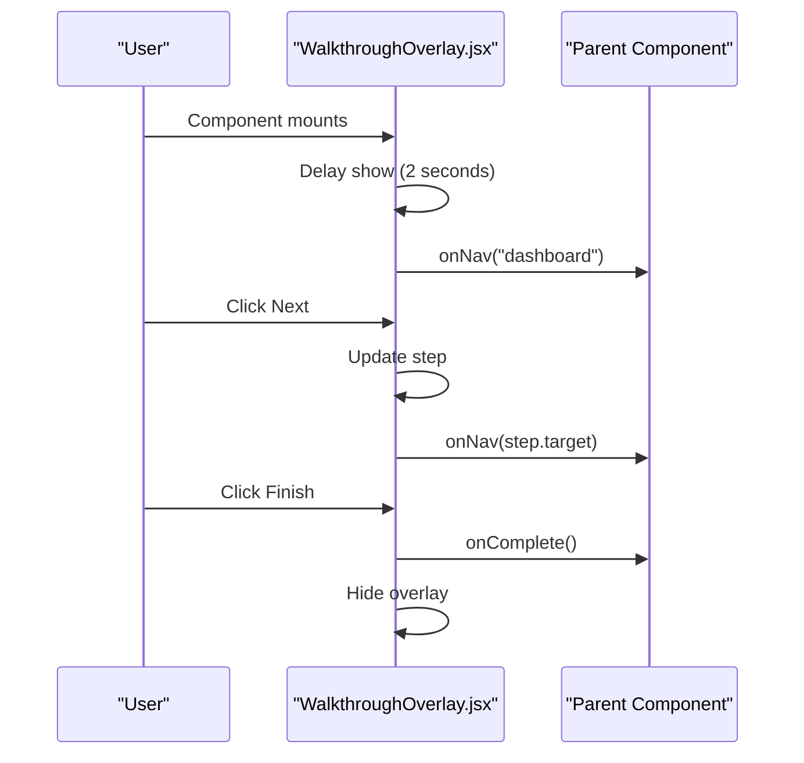
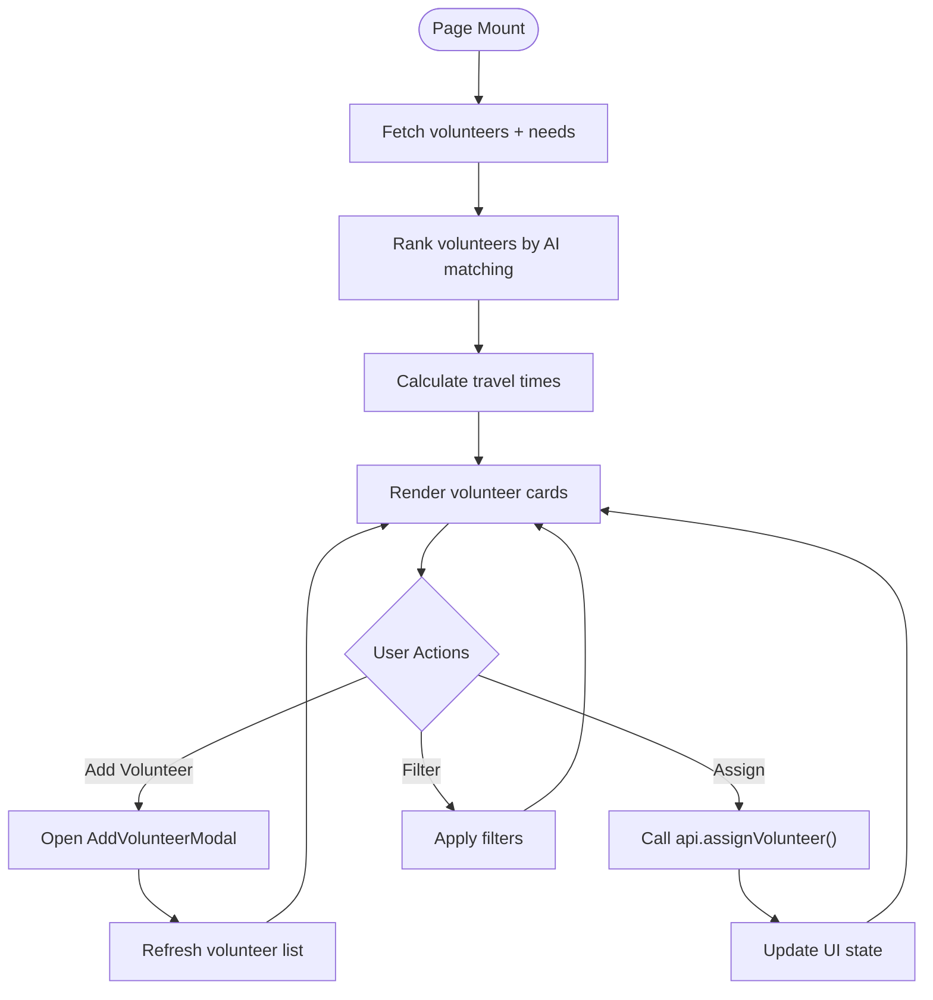
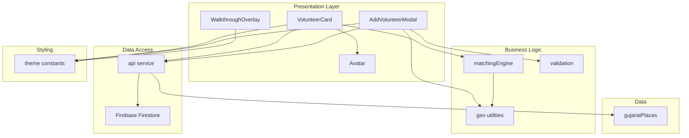

# Volunteer Management Components

<cite>
**Referenced Files in This Document**
- [VolunteerCard.jsx](file://src/components/volunteers/VolunteerCard.jsx)
- [AddVolunteerModal.jsx](file://src/components/AddVolunteerModal.jsx)
- [Avatar.jsx](file://src/components/Avatar.jsx)
- [WalkthroughOverlay.jsx](file://src/components/WalkthroughOverlay.jsx)
- [Volunteers.jsx](file://src/pages/Volunteers.jsx)
- [validation.js](file://src/utils/validation.js)
- [geo.js](file://src/utils/geo.js)
- [matchingEngine.js](file://src/engine/matchingEngine.js)
- [api.js](file://src/services/api.js)
- [theme.js](file://src/styles/theme.js)
- [gujaratPlaces.js](file://src/data/gujaratPlaces.js)
</cite>

## Table of Contents
1. [Introduction](#introduction)
2. [Project Structure](#project-structure)
3. [Core Components](#core-components)
4. [Architecture Overview](#architecture-overview)
5. [Detailed Component Analysis](#detailed-component-analysis)
6. [Dependency Analysis](#dependency-analysis)
7. [Performance Considerations](#performance-considerations)
8. [Troubleshooting Guide](#troubleshooting-guide)
9. [Conclusion](#conclusion)

## Introduction
This document provides comprehensive documentation for the volunteer management interface components in the NeedLink platform. It covers the VolunteerCard for displaying volunteer profiles, AddVolunteerModal for registration, Avatar for user representation, and WalkthroughOverlay for onboarding guidance. The documentation explains volunteer data display patterns, form validation for volunteer registration, avatar customization options, and interactive walkthrough functionality. It also details the integration with volunteer data models, image handling, and user onboarding flows, including examples of volunteer profile management, registration workflows, and progress tracking, along with accessibility features for volunteer data presentation and form usability patterns.

## Project Structure
The volunteer management system is organized around several key components and supporting utilities:

- **Components**: VolunteerCard, AddVolunteerModal, Avatar, WalkthroughOverlay
- **Pages**: Volunteers page orchestrating volunteer display and assignment
- **Utilities**: Validation, Geo calculations, Matching engine
- **Services**: API integration with Firebase
- **Data**: Gujarat places for coordinate resolution
- **Styles**: Theme constants and CSS helpers

**Diagram sources**
- [VolunteerCard.jsx:1-269](file://src/components/volunteers/VolunteerCard.jsx#L1-L269)
- [AddVolunteerModal.jsx:1-206](file://src/components/AddVolunteerModal.jsx#L1-L206)
- [Avatar.jsx:1-8](file://src/components/Avatar.jsx#L1-L8)
- [WalkthroughOverlay.jsx:1-159](file://src/components/WalkthroughOverlay.jsx#L1-L159)
- [Volunteers.jsx:1-328](file://src/pages/Volunteers.jsx#L1-L328)
- [validation.js:1-123](file://src/utils/validation.js#L1-L123)
- [geo.js:1-37](file://src/utils/geo.js#L1-L37)
- [matchingEngine.js:1-174](file://src/engine/matchingEngine.js#L1-L174)
- [api.js:1-599](file://src/services/api.js#L1-L599)
- [gujaratPlaces.js:1-116](file://src/data/gujaratPlaces.js#L1-L116)
- [theme.js:1-57](file://src/styles/theme.js#L1-L57)

**Section sources**
- [VolunteerCard.jsx:1-269](file://src/components/volunteers/VolunteerCard.jsx#L1-L269)
- [AddVolunteerModal.jsx:1-206](file://src/components/AddVolunteerModal.jsx#L1-L206)
- [Avatar.jsx:1-8](file://src/components/Avatar.jsx#L1-L8)
- [WalkthroughOverlay.jsx:1-159](file://src/components/WalkthroughOverlay.jsx#L1-L159)
- [Volunteers.jsx:1-328](file://src/pages/Volunteers.jsx#L1-L328)
- [validation.js:1-123](file://src/utils/validation.js#L1-L123)
- [geo.js:1-37](file://src/utils/geo.js#L1-L37)
- [matchingEngine.js:1-174](file://src/engine/matchingEngine.js#L1-L174)
- [api.js:1-599](file://src/services/api.js#L1-L599)
- [gujaratPlaces.js:1-116](file://src/data/gujaratPlaces.js#L1-L116)
- [theme.js:1-57](file://src/styles/theme.js#L1-L57)

## Core Components
This section documents the primary volunteer management components and their responsibilities:

- **VolunteerCard**: Displays individual volunteer profiles with AI match scores, availability indicators, skill ratings, and action buttons for assignment and expansion.
- **AddVolunteerModal**: Provides a form for registering new volunteers with validation, region-based coordinate auto-fill, and live distance preview.
- **Avatar**: Renders user initials with customizable colors for visual identification.
- **WalkthroughOverlay**: Guides users through key platform features with animated steps and navigation hints.

Key implementation patterns:
- Data-driven rendering with theme-aware styling
- Real-time validation and sanitization
- Interactive state management for assignment workflows
- Accessibility considerations in form controls and visual indicators

**Section sources**
- [VolunteerCard.jsx:16-269](file://src/components/volunteers/VolunteerCard.jsx#L16-L269)
- [AddVolunteerModal.jsx:25-206](file://src/components/AddVolunteerModal.jsx#L25-L206)
- [Avatar.jsx:1-8](file://src/components/Avatar.jsx#L1-L8)
- [WalkthroughOverlay.jsx:33-159](file://src/components/WalkthroughOverlay.jsx#L33-L159)

## Architecture Overview
The volunteer management architecture integrates UI components with backend services and data utilities:

**Diagram sources**
- [Volunteers.jsx:24-328](file://src/pages/Volunteers.jsx#L24-L328)
- [VolunteerCard.jsx:16-269](file://src/components/volunteers/VolunteerCard.jsx#L16-L269)
- [AddVolunteerModal.jsx:25-206](file://src/components/AddVolunteerModal.jsx#L25-L206)
- [api.js:396-410](file://src/services/api.js#L396-L410)
- [matchingEngine.js:143-147](file://src/engine/matchingEngine.js#L143-L147)
- [validation.js:82-122](file://src/utils/validation.js#L82-L122)
- [geo.js:31-36](file://src/utils/geo.js#L31-L36)

## Detailed Component Analysis

### VolunteerCard Component
The VolunteerCard displays comprehensive volunteer information with interactive elements:

**Diagram sources**
- [VolunteerCard.jsx:16-269](file://src/components/volunteers/VolunteerCard.jsx#L16-L269)
- [Avatar.jsx:1-8](file://src/components/Avatar.jsx#L1-L8)

Key features:
- AI match score visualization with gradient bars and percentage display
- Availability badge with green indicator
- Skill radar chart for compatibility matrix
- Travel time and distance metrics
- Action buttons for assignment and expansion
- Responsive grid layout with animation transitions

**Section sources**
- [VolunteerCard.jsx:16-269](file://src/components/volunteers/VolunteerCard.jsx#L16-L269)

### AddVolunteerModal Component
The AddVolunteerModal provides a comprehensive registration form with validation and region-based auto-fill:

**Diagram sources**
- [AddVolunteerModal.jsx:25-206](file://src/components/AddVolunteerModal.jsx#L25-L206)
- [validation.js:82-122](file://src/utils/validation.js#L82-L122)
- [geo.js:31-36](file://src/utils/geo.js#L31-L36)

Registration workflow highlights:
- Region selection triggers coordinate auto-fill with random jitter for realistic distribution
- Live distance preview calculated using haversine formula
- Comprehensive validation for name, skill, region, phone, and coordinates
- Sanitization to prevent XSS and malformed data
- Integration with backend API for persistent storage

**Section sources**
- [AddVolunteerModal.jsx:25-206](file://src/components/AddVolunteerModal.jsx#L25-L206)
- [validation.js:82-122](file://src/utils/validation.js#L82-L122)
- [geo.js:31-36](file://src/utils/geo.js#L31-L36)

### Avatar Component
The Avatar component provides consistent user representation:

**Diagram sources**
- [Avatar.jsx:1-8](file://src/components/Avatar.jsx#L1-L8)

Implementation details:
- Circular container with bold white initials
- Configurable size and color
- Consistent visual identity across the application
- Used within VolunteerCard for volunteer identification

**Section sources**
- [Avatar.jsx:1-8](file://src/components/Avatar.jsx#L1-L8)

### WalkthroughOverlay Component
The WalkthroughOverlay provides guided onboarding:

**Diagram sources**
- [WalkthroughOverlay.jsx:33-159](file://src/components/WalkthroughOverlay.jsx#L33-L159)

Onboarding features:
- Four-step guided tour covering dashboard, maps, volunteer matching, and AI assistant
- Automatic navigation to relevant sections during walkthrough
- Smooth animations using Framer Motion
- Progress indicators and navigation controls

**Section sources**
- [WalkthroughOverlay.jsx:33-159](file://src/components/WalkthroughOverlay.jsx#L33-L159)

### Volunteers Page Integration
The Volunteers page orchestrates the complete volunteer management experience:

**Diagram sources**
- [Volunteers.jsx:24-328](file://src/pages/Volunteers.jsx#L24-L328)
- [matchingEngine.js:143-147](file://src/engine/matchingEngine.js#L143-L147)
- [api.js:316-324](file://src/services/api.js#L316-L324)

Key integrations:
- Real-time volunteer ranking using matchingEngine
- Precise travel time calculation via API
- Assignment workflow with optimistic updates
- Smart filtering and sorting capabilities

**Section sources**
- [Volunteers.jsx:24-328](file://src/pages/Volunteers.jsx#L24-L328)

## Dependency Analysis
The volunteer management system exhibits strong modular design with clear separation of concerns:

**Diagram sources**
- [VolunteerCard.jsx:1-269](file://src/components/volunteers/VolunteerCard.jsx#L1-L269)
- [AddVolunteerModal.jsx:1-206](file://src/components/AddVolunteerModal.jsx#L1-L206)
- [Avatar.jsx:1-8](file://src/components/Avatar.jsx#L1-L8)
- [WalkthroughOverlay.jsx:1-159](file://src/components/WalkthroughOverlay.jsx#L1-L159)
- [matchingEngine.js:1-174](file://src/engine/matchingEngine.js#L1-L174)
- [validation.js:1-123](file://src/utils/validation.js#L1-L123)
- [geo.js:1-37](file://src/utils/geo.js#L1-L37)
- [api.js:1-599](file://src/services/api.js#L1-L599)
- [gujaratPlaces.js:1-116](file://src/data/gujaratPlaces.js#L1-L116)
- [theme.js:1-57](file://src/styles/theme.js#L1-L57)

Key dependency patterns:
- Components depend on shared utilities for validation and calculations
- Business logic encapsulated in dedicated modules
- Data access abstracted through API service layer
- Styling centralized in theme constants

**Section sources**
- [VolunteerCard.jsx:1-269](file://src/components/volunteers/VolunteerCard.jsx#L1-L269)
- [AddVolunteerModal.jsx:1-206](file://src/components/AddVolunteerModal.jsx#L1-L206)
- [matchingEngine.js:1-174](file://src/engine/matchingEngine.js#L1-L174)
- [validation.js:1-123](file://src/utils/validation.js#L1-L123)
- [geo.js:1-37](file://src/utils/geo.js#L1-L37)
- [api.js:1-599](file://src/services/api.js#L1-L599)
- [theme.js:1-57](file://src/styles/theme.js#L1-L57)

## Performance Considerations
The volunteer management system implements several performance optimizations:

- **Lazy loading**: Volunteers page only renders when data is available
- **Caching**: Travel time calculations cached in memory for reuse
- **Batch operations**: Assignment operations performed in sequence with minimal re-renders
- **Efficient ranking**: Matching engine uses optimized scoring algorithms
- **Virtualization**: Large lists handled efficiently with React's rendering optimizations

Recommendations for further optimization:
- Implement pagination for large volunteer datasets
- Add debounced search for improved responsiveness
- Consider Web Workers for heavy calculations
- Optimize image loading for avatar thumbnails

## Troubleshooting Guide
Common issues and solutions:

**Volunteer Registration Failures**
- Verify form validation passes before submission
- Check coordinate ranges (-90 to 90 latitude, -180 to 180 longitude)
- Ensure region selection has valid coordinates

**Assignment Issues**
- Confirm volunteer availability status
- Verify selected need exists and has sufficient slots
- Check network connectivity for API calls

**Display Problems**
- Validate theme constants are properly loaded
- Ensure required props are passed to components
- Check for missing data in volunteer records

**Accessibility Features**
- All interactive elements support keyboard navigation
- Color contrast maintained for accessibility compliance
- Screen reader friendly labels and descriptions
- Focus management for modals and overlays

**Section sources**
- [validation.js:82-122](file://src/utils/validation.js#L82-L122)
- [AddVolunteerModal.jsx:51-90](file://src/components/AddVolunteerModal.jsx#L51-L90)
- [VolunteerCard.jsx:236-265](file://src/components/volunteers/VolunteerCard.jsx#L236-L265)

## Conclusion
The volunteer management components provide a robust, scalable solution for coordinating community volunteers. The system combines intuitive UI patterns with sophisticated matching algorithms, comprehensive validation, and seamless integration with backend services. The modular architecture ensures maintainability and extensibility, while performance optimizations support smooth user experiences even with large datasets. The accessibility-focused design and comprehensive onboarding guide enhance usability for diverse user groups.